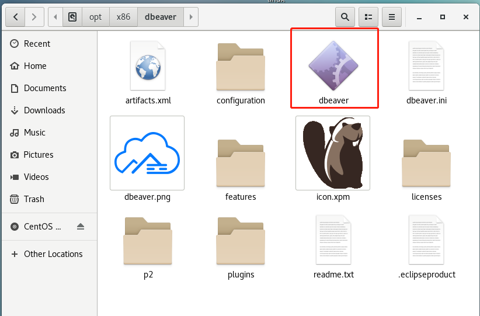
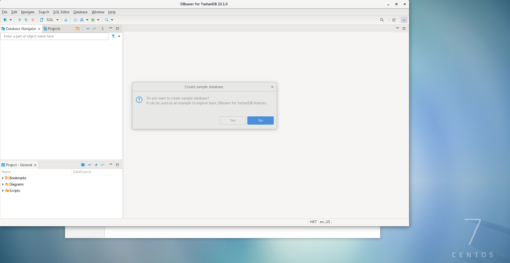
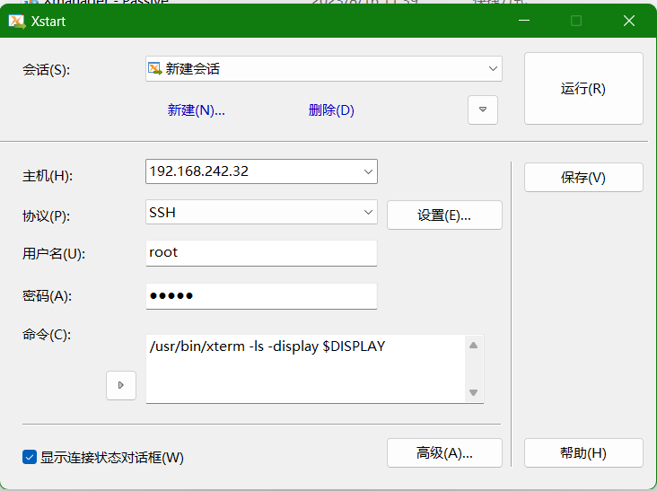
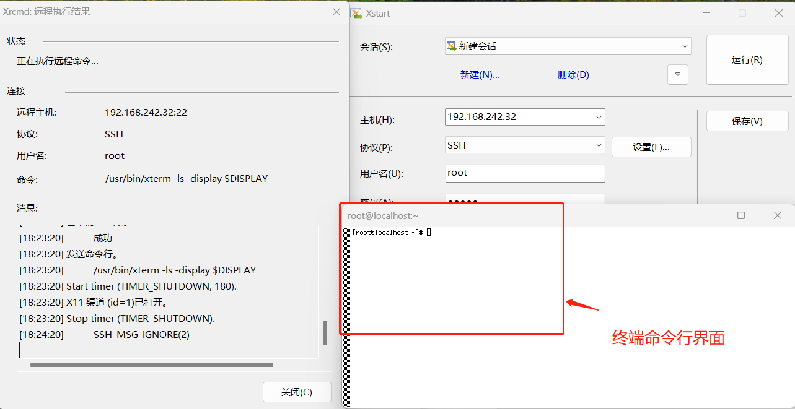
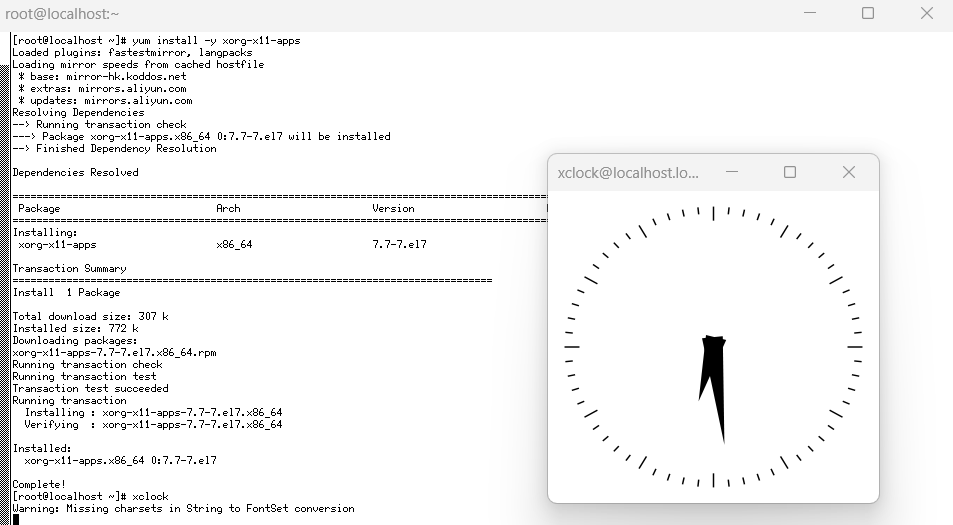
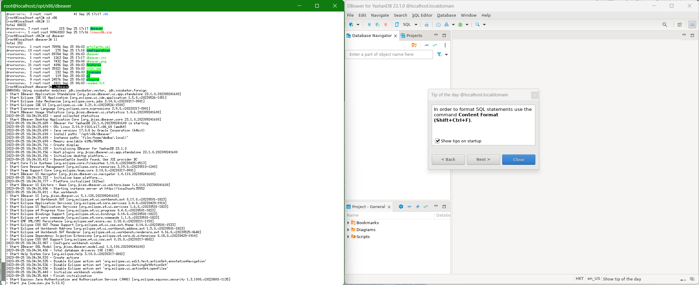

*本文档介绍了如何在Linux系统安装DBeaver*

## 前置条件
DBeaver的运行依赖于Java环境，本文档中介绍的DBeaver版本为V23.1，依赖于JDK17及以上版本的Java环境。如果系统尚未配置Java环境，可以[下载JDK](https://learn.microsoft.com/zh-cn/java/openjdk/download)并安装后再配置相应环境。
同时，系统当前登录用户需要拥有对DBeaver软件所在文件夹的完全控制权限才能运行软件。此外，还需要为DBeaver软件所在文件夹的初始化文件配置JDK相关参数，才能正确识别到Java环境。   
下面分别介绍如何在Linux系统下安装配置JDK以及为登录用户授予文件夹权限。

### Linux下JDK的安装与配置
#### 1.解压
下载JDK压缩包后，定位到压缩包所在路径。以文件名为*microsoft-jdk-17.0.8.1-linux-x64.tar.gz*的JDK压缩包为例，通过如下命令新建Java环境目录，并解压tar包到此目录：
``` java
mkdir -p /usr/local/java    #新建Java环境目录
tar zxvf microsoft-jdk-17.0.8.1-linux-x64.tar.gz -C /usr/local/java   #解压
```

#### 2.配置环境变量
通过如下命令配置全局的环境变量。
``` java
vi /etc/profile
```
**注意**：如果修改当前用户的环境变量 编辑~/.profile或~/.bashrc文件即可，而不是/etc/profile  

在文件最后添加如下配置并保存：
``` java
JAVA_HOME=/usr/local/java/jdk-17.0.8.1  #示例，这里的路径以本地解压的jdk路径为准
export CLASSPATH=$:CLASSPATH:$JAVA_HOME/lib/ 
export PATH=$PATH:$JAVA_HOME/bin 
```
重新加载配置文件，使配置生效(su root)：
``` java
source ~/.bash_profile
```

#### 3.查看是否安装成功
键入如下命令：
``` java
java -version
```
输出类似如下参数，则表示配置Java环境成功：
``` java
openjdk version "17.0.8.1" 2023-08-24 LTS
OpenJDK Runtime Environment Microsoft-8297089 (build 17.0.8.1+1-LTS)
OpenJDK 64-Bit Server VM Microsoft-8297089 (build 17.0.8.1+1-LTS, mixed mode, sharing)
```
<br>

### 对登录用户授予文件权限
从YashanDB官网下载定制Linux版本的DBeaver并解压后，先确定当前登录用户是否有对DBeaver软件所在dbeaver文件夹完全的操作权限。进入到dbeaver文件夹所在的目录，键入*ll*，输出如下信息：
``` java
[dbeaver@localhost x86_64]$ pwd
/opt/dbeaver/linux/gtk/x86_64
[dbeaver@localhost x86_64]$ ll
total 0
drwxr-xr-x. 7 root root 215 Sep 25 00:03 dbeaver  
```

以上输出说明当前用户没有对dbeaver文件夹完全的操作权限，切换root用户对当前用户进行dbeaver文件夹的授权，再切换到当前用户确认是否授权成功。
``` java
[root@localhost x86_64]# chmod -R 777 dbeaver    #将对dbeaver文件夹的rwx权限授予给所有用户
[root@localhost x86_64]# su dbeaver   
[dbeaver@localhost x86_64]$ ll   #切换dbeaver用户，确认当前用户是否有对dbeaver文件夹的rwx权限
total 0
drwxrwxrwx. 7 root root 215 Sep 25 00:03 dbeaver  #授权成功，所有用户均已拥有对dbeaver文件夹的rwx权限
```
<br>

### 初始化文件配置JDK相关参数
进入DBeaver软件所在文件夹，查看文件目录，存在名为*dbeaver.ini*的文件。
``` java
[dbeaver@localhost dbeaver]$ ll
total 252
-rwxrwxrwx.  1 root root 78996 Sep 25 00:03 artifacts.xml
drwxrwxrwx.  4 root root    96 Sep 25 00:03 configuration
-rwxrwxrwx.  1 root root 89784 Sep 25 00:03 dbeaver
-rwxrwxrwx.  1 root root  1233 Sep 25 00:03 dbeaver.ini
-rwxrwxrwx.  1 root root  7432 Sep 25 00:00 dbeaver.png
drwxrwxrwx. 21 root root  4096 Sep 25 00:03 features
-rwxrwxrwx.  1 root root 35021 Sep 25 00:03 icon.xpm
drwxrwxrwx.  2 root root   232 Sep 25 00:03 licenses
drwxrwxrwx.  5 root root   119 Sep 25 00:03 p2
drwxrwxrwx.  9 root root 24576 Sep 25 00:03 plugins
-rwxrwxrwx.  1 root root  1811 Sep 25 00:03 readme.txt
```

编辑*dbeaver.ini*文件，在文件内容头部加入如下内容：
``` java
-vm
/usr/local/java/jdk-17.0.8.1/bin  #此为示例，具体路径以本地解压的jdk目录为准，定位到bin目录即可
```

编辑完成后，保存文件内容。  
<br>


## DBeaver的安装与启动
DBeaver的运行需要图形化相关的支持，这里介绍两种运行DBeaver的方式，分别对应有Linux可视化界面和通过Xshell远程连接虚拟机的情况。

### 在Linux可视化界面启动DBeaver
在可视化界面中打开DBeaver软件所在文件夹，有如下内容：
<div align="left">

</div>

双击上图中框出的DBeaver文件，即可启动DBeaver，初始的主界面如下图所示：
<div align="left">

</div>
<br>

### Xshell远程连接虚拟机启动DBeaver
*前置条件：远程连接的主机系统中已经安装Xshell、Xmanager。* 

以下文档以Windows系统通过Xshell远程连接虚拟机，并在Windows系统下启动虚拟机中的DBeaver作为示例。

#### 1.修改虚拟机ssh配置
登录root用户，在终端键入*vi /etc/ssh/sshd_config*并回车，打开编辑界面。键入*i*进入编辑模式，将文件中X11Forwarding、X11UseLocalhost、AddressFamily三个属性的值修改为以下配置并保存（如果属性被注释需要放开注释）：
``` java
X11Forwarding yes
X11UseLocalhost no -- 禁止将X11转发请求绑定到本地回环地址上
AddressFamily inet -- 强制使用IPv4通道
```

然后在终端命令行窗口键入*systemctl restart sshd.service*重启ssh服务。

#### 2.配置xstart并启动
打开xmanager下的Xstart工具，配置好各项参数。其中主机填写远程连接的主机名称，协议使用SSH（系统默认已经开启了SSH，无需额外设置），用户名和密码需要正确填写。

命令中不能为空，需要填写：
``` java
/usr/bin/xterm -ls -display $DISPLAY
```
配置好的界面如下图所示：
<div align="left">

</div>

此时点击运行按钮，如果出现类似“拒绝 X11 转移申请”的错误提示，说明缺少X11的相关组件：xorg-x11-xauth。  
在Xshell终端命令行键入*yum install –y xorg-x11-xauth*安装相应组件，然后重新运行。  

如果出现类似“bash: /usr/bin/xterm: No such file or directory”的错误，说明没有安装xterm终端模拟器。  
在Xshell终端命令行键入*yum install –y xterm*安装相应组件，然后重新运行。这时会成功弹出终端命令行界面：
<div align="left">

</div>

#### 3.测试图形界面
在弹出的终端命令行界面执行*yum install –y xorg-x11-apps*安装时钟应用，然后输入*xclock*命令并回车，如果弹出以下时钟图形，说明图形化界面正常。
<div align="left">

</div>

#### 4.启动dbeaver
DBeaver的启动依赖于第三方组件，在Xshell终端命令行执行*yum install gtk2.i686 gtk2-engines.i686 PackageKit-gtk-module.i686 PackageKit-gtk-module.x86_64 libcanberra-gtk2.x86_64 libcanberra-gtk2.i686*安装所需依赖。  
然后在弹出的终端命令行界面进入DBeaver软件所在文件夹，键入./*dbeaver*即可在Windows下启动远程虚拟机的DBeaver。
<div align="left">

</div>
