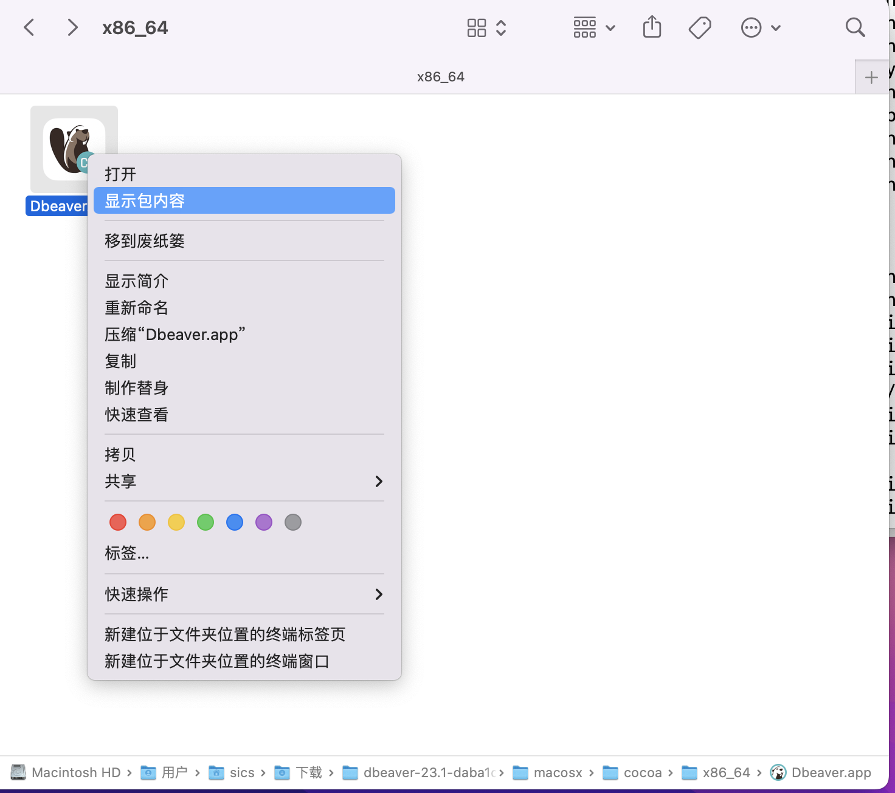
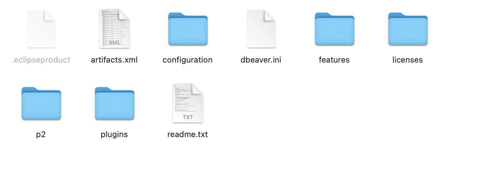
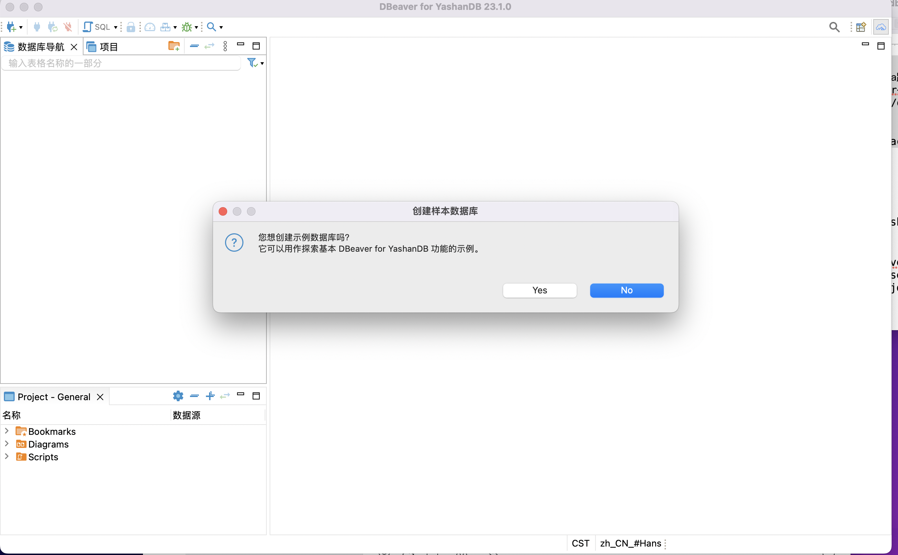

*本文档介绍了如何在Mac系统安装DBeaver*

## 前置条件
DBeaver的运行依赖于Java环境，本文档中介绍的DBeaver版本为V23.1，依赖于JDK17及以上版本的Java环境。  
如果系统尚未配置Java环境，可以[下载JDK](https://learn.microsoft.com/zh-cn/java/openjdk/download)并安装后再配置相应环境。

### Mac下JDK的安装
下载macOS平台下X64体系结构JDK的pkg安装包，双击进行图形化安装。安装成功后，在系统中会存在类似*Library/Java/JavaVirtualMachines/jdk-17.jdk*的路径。

## DBeaver的安装启动
从YashanDB官网下载Mac版本的DBeaver并解压，例如将DBeaver解压至/*Users/sics/Downloads*目录，在/*Users/sics/Downloads/dbeaver/macosx/cocoa/x86_64*目录存在*Dbeaver.app*文件。右键此文件，点击显示包内容。  


在其中*Contents/Eclipse*目录下存在以下内容：  


修改其中的*dbeaver.ini*文件，在头部加入如下内容然后保存：
``` shell
-vm
/Library/Java/JavaVirtualMachines/jdk-17.jdk/Contents/Home/bin   #这里以本地安装的jdk路径为准，定位到bin目录即可
```

再打开macOS的终端界面，输入如下命令：
``` shell
sudo spctl --master-disable
sudo xattr -r -d com.apple.quarantine /Users/sics/Downloads/dbeaver/macosx/cocoa/x86_64/Dbeaver.app  #这里的路径以本地解压DBeaver的路径为准
```

然后进入/*Users/sics/Downloads/dbeaver/macosx/cocoa/x86_64*目录，双击*Dbeaver.app*图标，即可启动DBeaver。  

