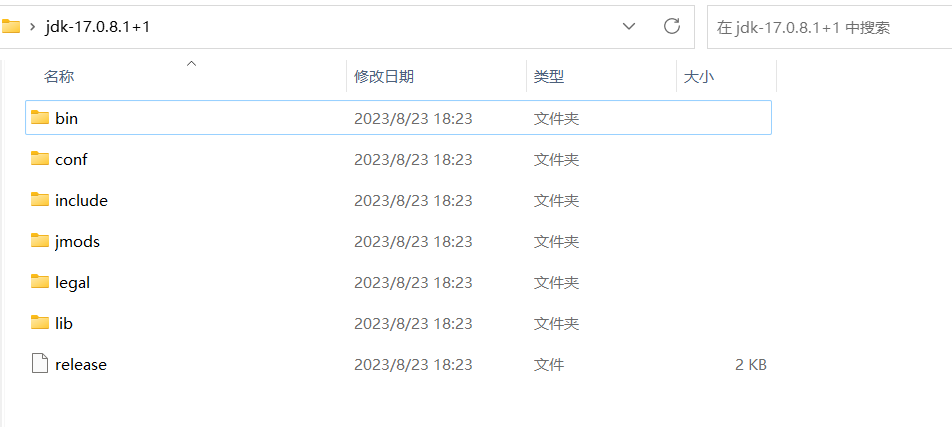
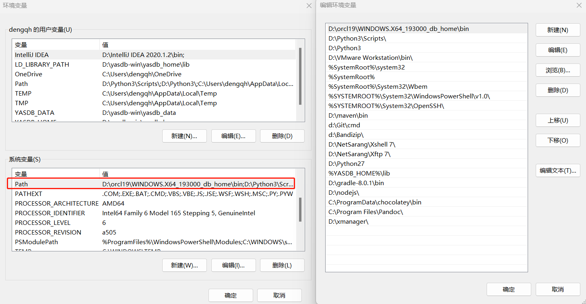
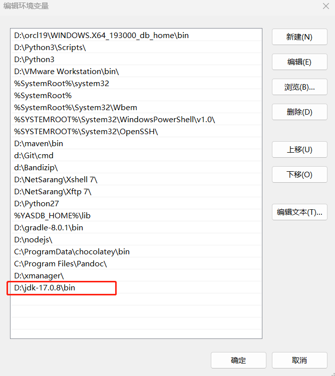
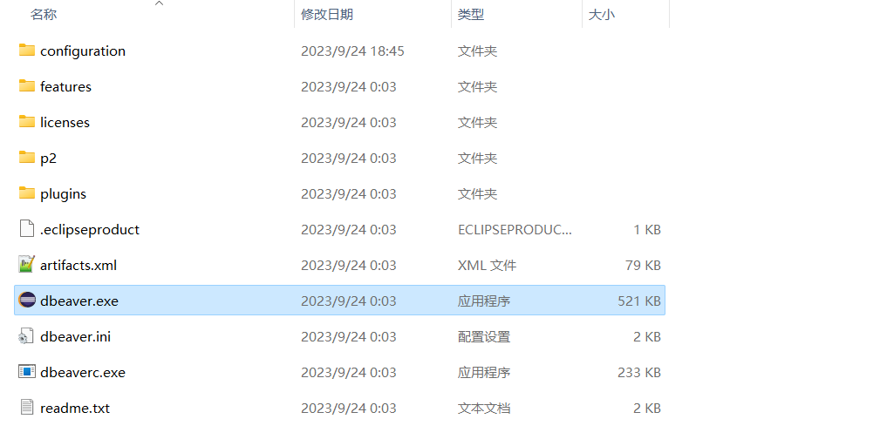
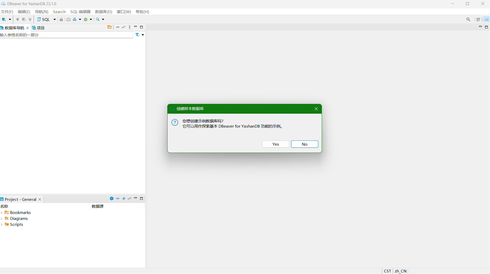

本文档介绍如何在windows系统安装DBeaver。

## 前置条件
DBeaver的运行依赖于Java环境，本文档中介绍的DBeaver版本为V23.1，依赖于JDK17及以上版本的Java环境。  如果系统尚未配置Java环境，可以[下载JDK](https://learn.microsoft.com/zh-cn/java/openjdk/download)并安装后再配置相应环境。  

### Windows下JDK的安装与环境配置
这里使用Windows平台下X64体系结构JDK的zip压缩包作为示例。

下载并解压JDK压缩包到指定位置，可以得到如下目录的文件：  


在系统中搜索**环境变量**并打开**编辑系统环境变量**：  


选中系统环境变量中的**Path**变量并点击编辑按钮，弹出编辑环境变量的编辑框：  


在编辑框中点击**新建**按钮，新增Java环境变量值。例如，本地解压的JDK路径为：*D:\jdk-17.0.8*,在新建变量值时定位到此路径下的*bin*目录即可。  


配置完成后点击确定，关闭环境变量窗口，以应用修改。然后使用`Win+R`组合键调出运行窗口，在窗口输入框输入`cmd`，点击确定，弹出cmd命令窗口。在命令窗口中输入`Java -version`，会输出Java版本号，说明Java环境变量配置成功。
``` shell
C:\Users\dengqh>java -version
openjdk version "17.0.8.1" 2023-08-24 LTS
OpenJDK Runtime Environment Microsoft-8297089 (build 17.0.8.1+1-LTS)
OpenJDK 64-Bit Server VM Microsoft-8297089 (build 17.0.8.1+1-LTS, mixed mode, sharing)
```


## DBeaver的安装启动
从YashanDB官网下载Windows版本的DBeaver并解压，得到如下图所示的文件目录：  


双击DBeaver.exe应用程序文件，即可启动DBeaver，初始界面如下图所示：  
