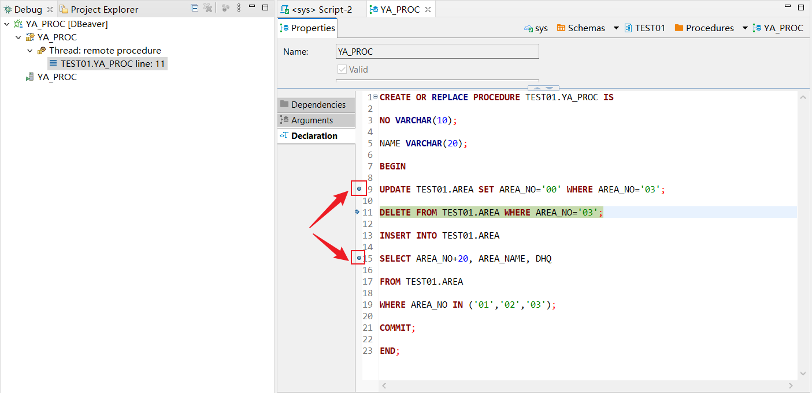
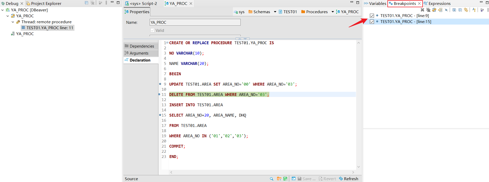
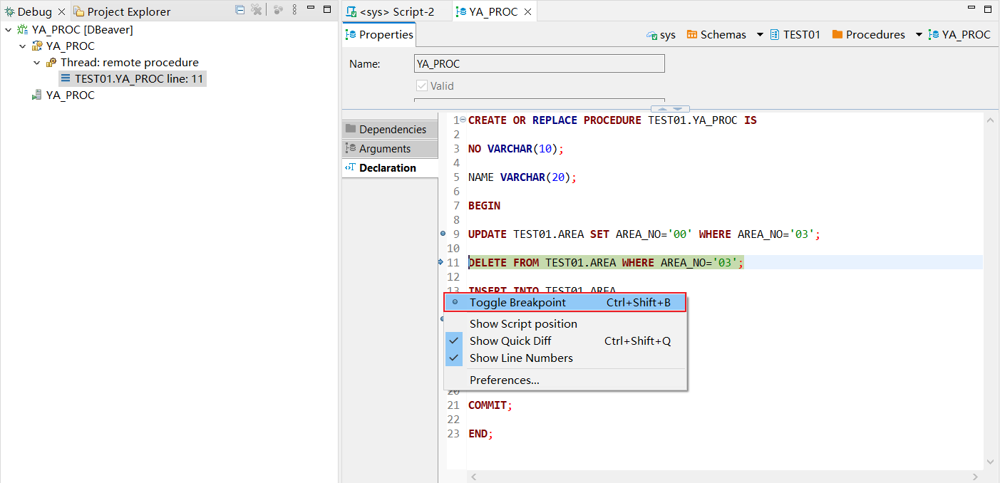
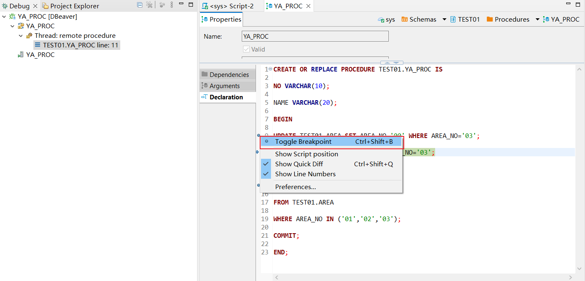
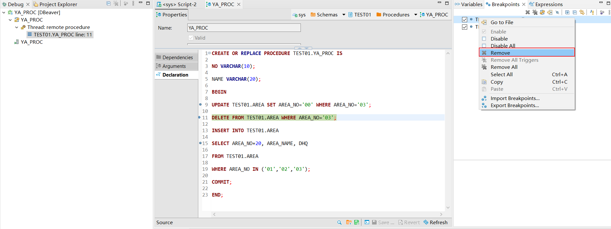
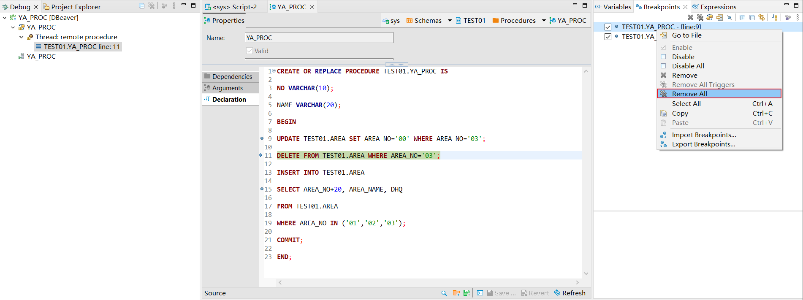
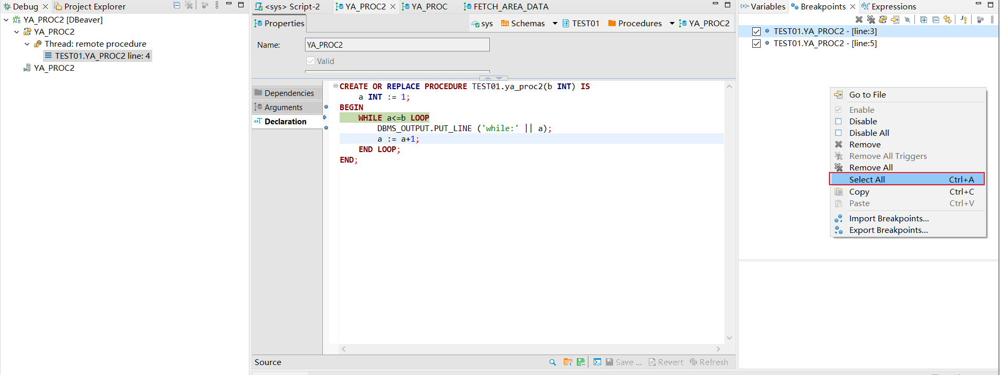

## GRANT SESSION
使用DBeaver For YashanDB断点管理功能，对用户权限无要求。

## 查看断点
通过sql语句左侧空白部分查看断点位置。

通过**Breakpoints页面**查看断点及对应存储过程和行数。

## 添加断点
双击sql左侧空白部分或右键点击**Toggle Breakpoint**添加断点。

## 删除断点
双击已有断点的sql左侧空白部分或右键点击**Toggle Breakpoint**添加断点。

右键选择对应断点，点击**remove**。

右键选择对应断点，点击**remove all**。

## 选择全部断点
在Breakpoints页面空白处右键，点击**Select All**。

