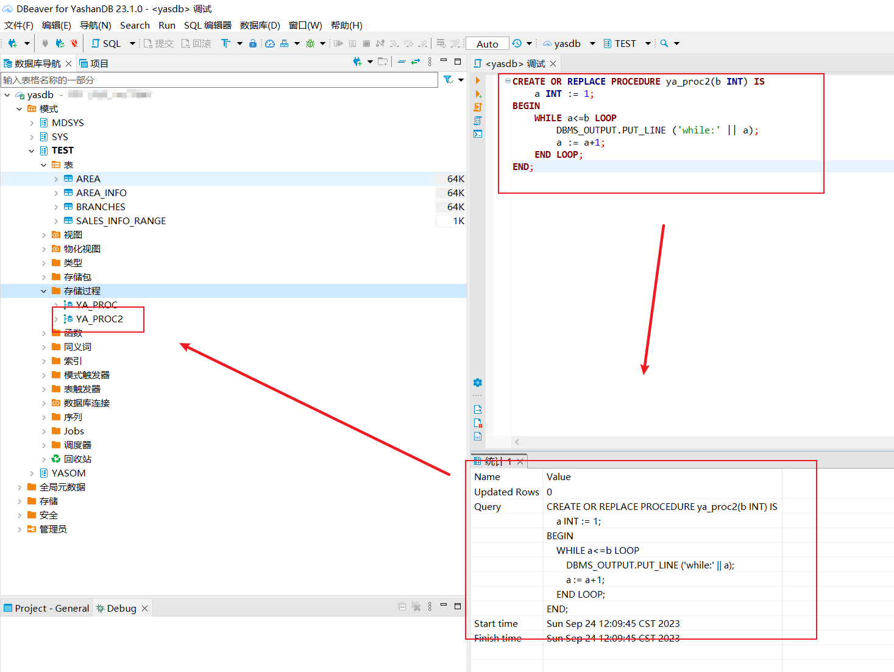

## 调试模式


while循环 [YashanDB Doc (yasdb.com)](https://cod-doc.yasdb.com/yashandb/alpha/zh/开发手册/PLSQL参考手册/PLSQL语句/WHILE Statement.html#WHILE Statement) 

```sql
CREATE OR REPLACE PROCEDURE ya_proc2(b INT) IS
    a INT := 1;
BEGIN
    WHILE a<=b LOOP
        DBMS_OUTPUT.PUT_LINE ('while:' || a);
        a := a+1;
    END LOOP;
END;
```




动态游标 [YashanDB Doc (yasdb.com)](https://cod-doc.yasdb.com/yashandb/alpha/zh/开发手册/PLSQL参考手册/PLSQL语句/OPEN Statement.html#打开动态游标) 