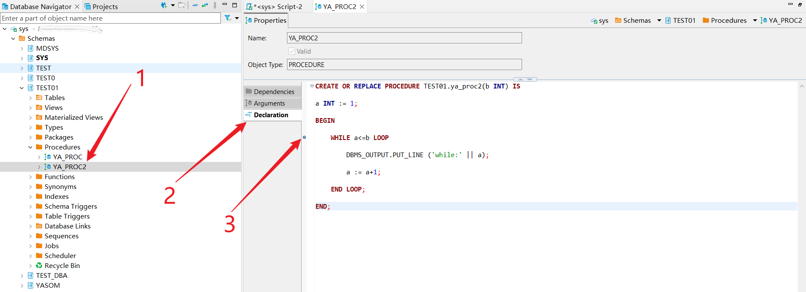
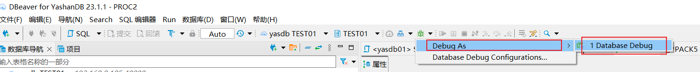
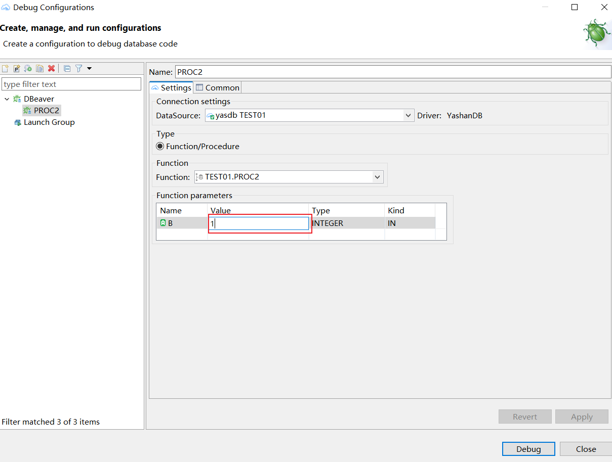
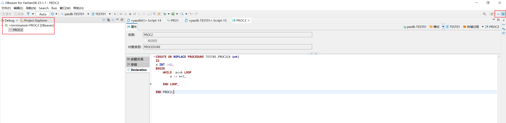
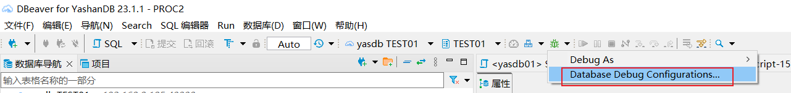
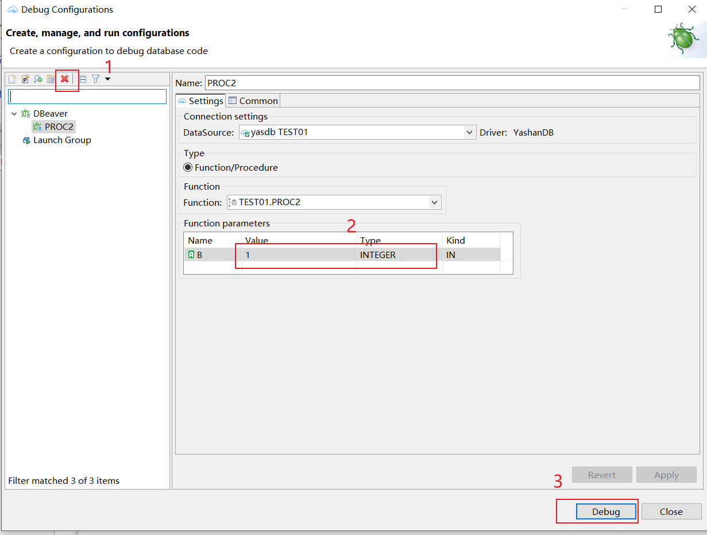
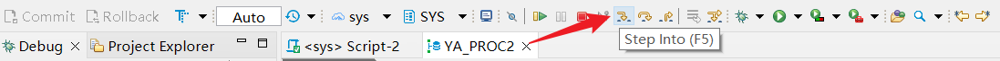
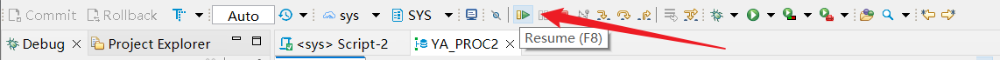

本文档介绍如何在DBeaver中进行PLSQL的调试。

## 权限需求
使用PLSQL调试功能需要的权限依照所调试的存储过程中对不同对象的操作而改变。

## 调试流程
1.选择需要的调试的存储过程，点击**Declaration**，添加对应断点。

2.点击绿色按钮旁的下拉按钮，选择Debug入口为**Debug As**。
当前版本有两种Debug入口，每个存储过程第一次进行调试都需要先从Debug As进入。

3.填写存储过程需要的参数值和类型。某些存储过程有出入参数，在**Function parameters**进行填写。

注意填写时文本框未关闭的情况下，值没有生效，需要鼠标点击其他位置，确保值生效。

4.开始调试，界面切换成Debug界面。右上角的debug图标转为高亮，代表处于Debug界面；点击左侧的YashanDB图标即可切回原界面。

箭头位置表示当前执行的代码。

5.在右侧选择**Variables**或**Breakpoints**查看调试过程中变量([变量信息查询](./变量信息查询))或断点([断点管理](./断点管理))信息。

6.点击**Terminate**按钮终止调试。

7.存储过程参数配置修改和删除。点击导航栏的下拉框，选择**Database Debug Configurations**。

在配置界面，可以选择删除此配置，修改参数以及直接Debug。

## 调试方式
dbeaver提供四种调试方式：

1.**step into**：跳入函数内部在其内部单步执行。

2.**step over**：不会跳入函数内部，直接执行函数。

3.**step return**：返回调用当前代码的函数处。

4.**resume**：执行到下一个断点处，若后续代码无断点则执行全部并结束。

## 限制说明
1.不支持console输出调试过程中的打印信息。

2.变量的动态设置。

3.变量表达式的计算。

4.仅支持对函数和存储过程进行调试，参数现在支持整数，浮点，字符串，date，boolean，rowid以及clob类型。

5.不支持suspend，disconnect。

6.不支持条件断点。

7.不支持屏蔽所有断点。

8.不支持表达式计算。

9.不支持类似PLSQL Developer 13 的运行到下一个异常处。

10.不支持在debug configuration页面修改debug对象。

