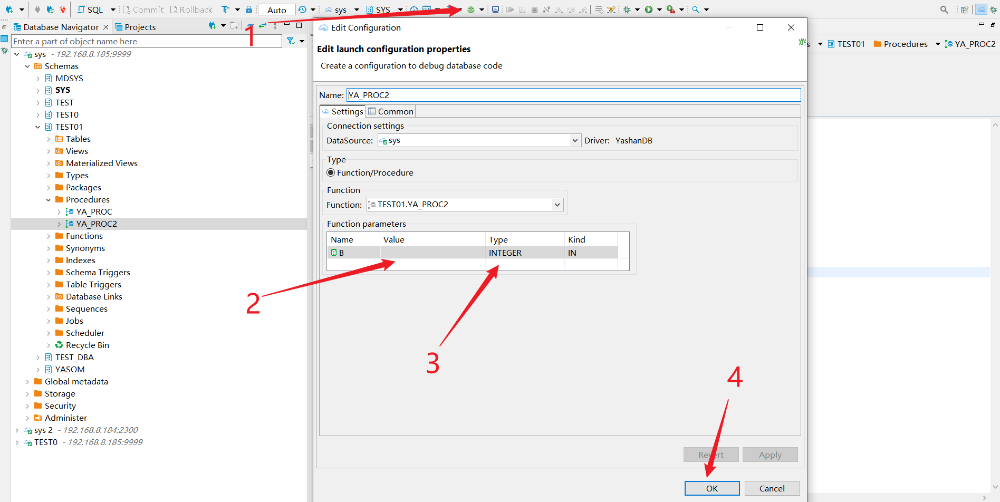
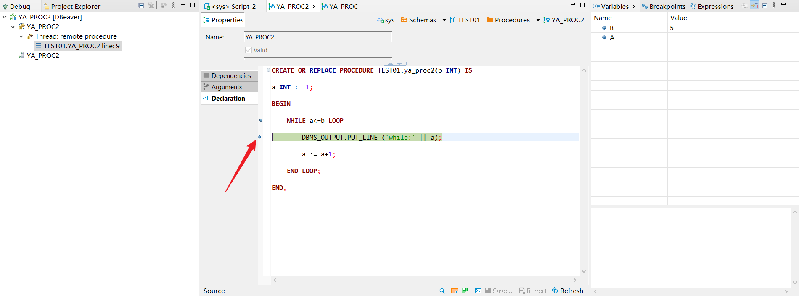
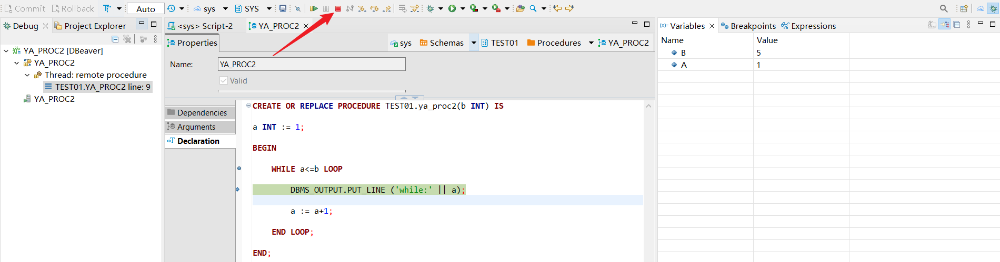

## GRANT SESSION
使用PLSQL调试功能需要的权限依照所调试的存储过程中对不同对象的操作而改变。

## 调试流程
1.选择需要的调试的存储过程，点击**Declaration**，添加对应断点。

2.点击**debug**按钮，输入变量值与数据类型，点击**OK**，进入debug模式。

3.开始调试，箭头位置表示当前执行的代码。

4.在右侧选择**Variables**或**Breakpoints**查看调试过程中变量([变量信息查询](./变量信息查询))或断点([断点管理](./断点管理))信息。

5.点击**Terminate**按钮终止调试。

## 调试方式
dbeaver提供四种调试方式：

1.**step into**：跳入函数内部在其内部单步执行。

2.**step over**：不会跳入函数内部，直接执行函数。

3.**step return**：返回调用当前代码的函数处。

4.**resume**：执行到下一个断点处，若后续代码无断点则执行全部并结束。

## 限制说明
1.不支持console输出调试过程中的打印信息。

2.变量的动态设置。

3.变量表达式的计算。

4.仅支持对函数和存储过程进行调试，参数现在支持整数，浮点，字符串，date，boolean，rowid以及clob类型。

5.不支持suspend，disconnect。

6.不支持条件断点。

7.不支持屏蔽所有断点。

8.不支持表达式计算。

9.不支持类似PLSQL Developer 13 的运行到下一个异常处。

10.不支持在debug configuration页面修改debug对象。

