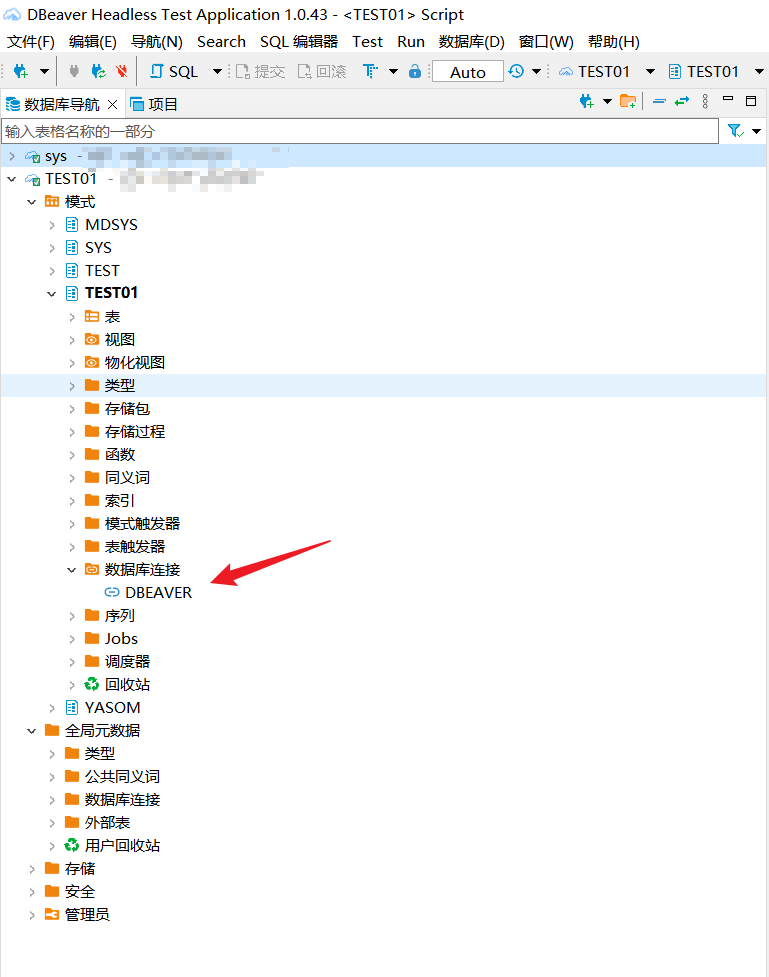
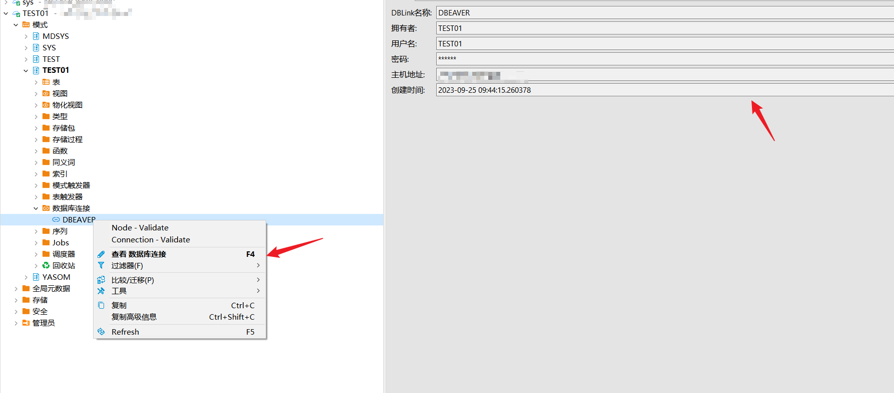
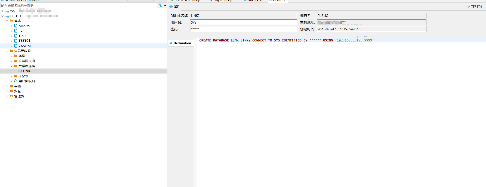

## 权限需求
使用DBeaver For YashanDB管理DBLink，请确保当前用户具有以下权限。

| 权限                          | 说明        |
|-----------------------------|-----------|
| CREATE PUBLIC DATABASE LINK | 创建公有数据库链接 |
| CREATE DATABASE LINK        | 创建数据库连接   |
| ALTER DATABASE LINK         | 修改私有数据库链接 |
| ALTER PUBLIC DATABASE LINK  | 修改公有数据库链接 |
| DROP DATABASE LINK          | 删除私有数据库链接 |
| DROP PUBLIC DATABASE LINK   | 删除公有数据库链接 |


## 创建数据库连接
创建示例SQL语句
```sql
CREATE DATABASE LINK dbeaver CONNECT TO TEST01 IDENTIFIED BY ****** USING '***.***.**.***:****'
```

在左侧点击模式，点击schema，点击数据库连接，将展示创建的连接。




点击查看数据库连接，或双击连接查看数据库连接详情。



在全局元数据中数据库连接查看public数据库连接。

