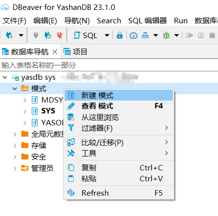
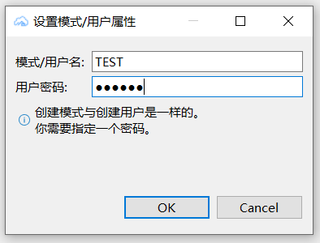
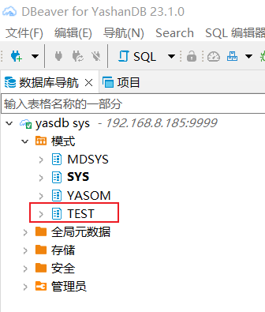
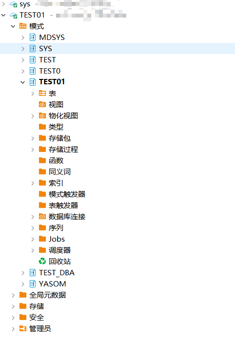

本文档介绍如何在DBeaver中创建，查看YashanDB的schema。

## 权限需求
使用DBeaver For YashanDB管理Schema，请确保当前用户具有以下权限。

| 权限          | 说明     |
|-------------|--------|
| CREATE USER | 创建用户权限 |

## 创建Schema

选择**数据库连接**，右键**模式**，选择**创建模式**。

填写**Schema名称**和**密码**，点击**OK**。

创建成功，可以在**左侧数据库导航**看到新建的Schema。

## 查看Schema属性
**双击**选中的Schema，**右侧窗口**显示其**属性**，包括**表、视图**等对象信息。

