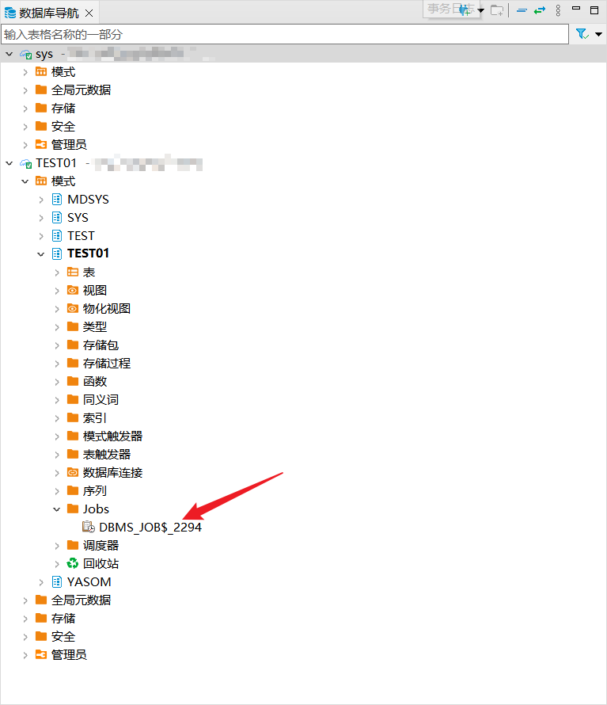
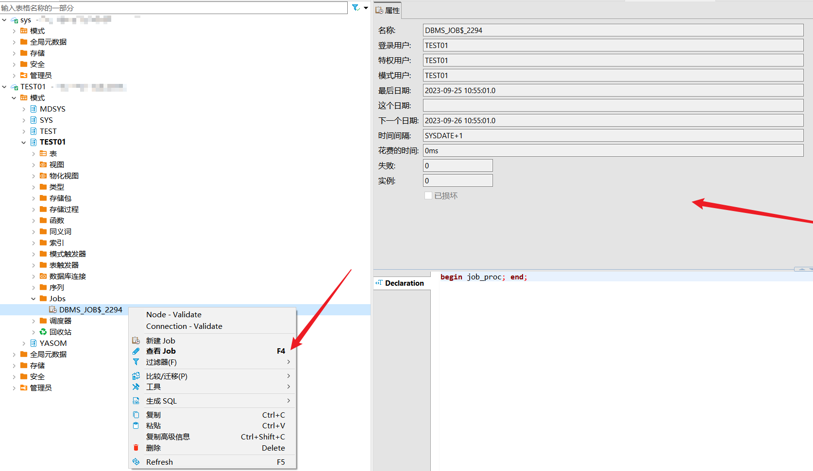
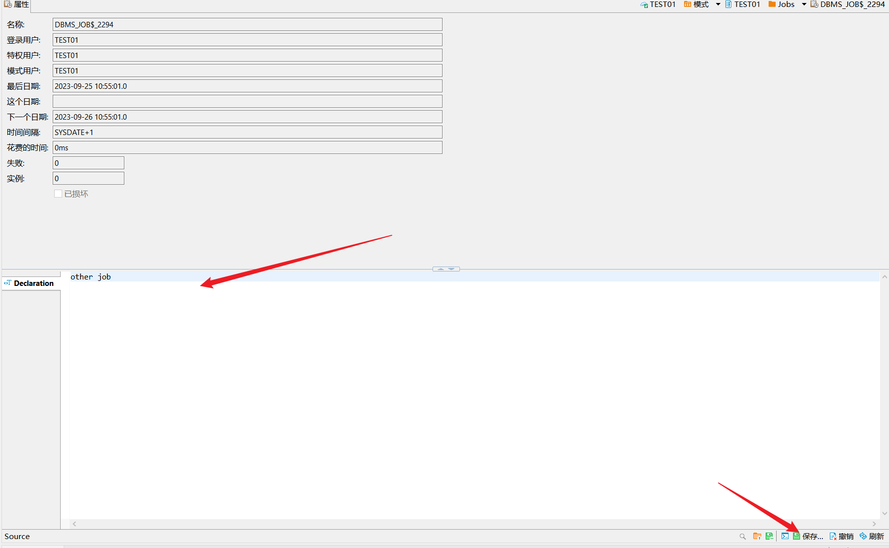
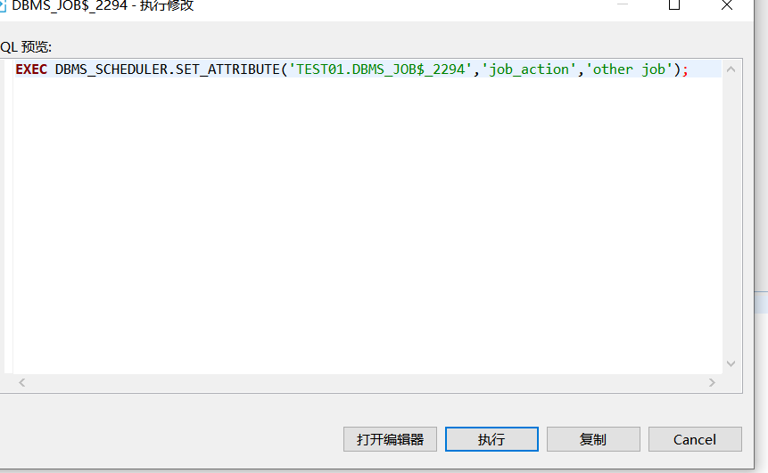
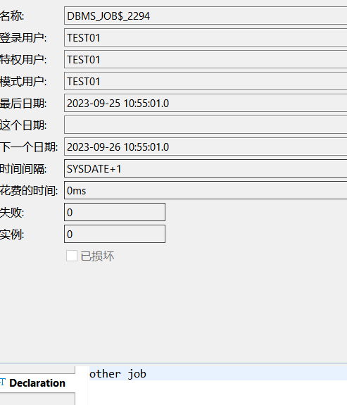
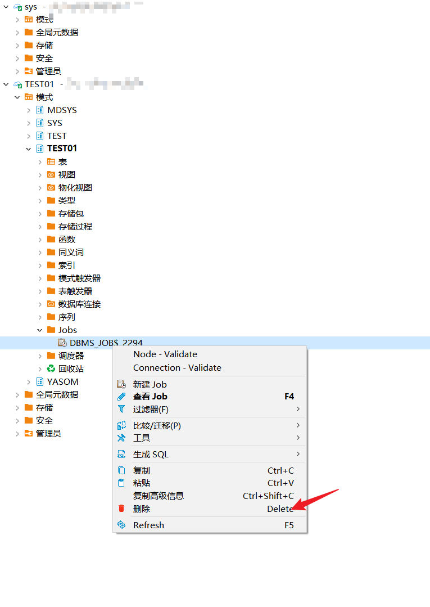
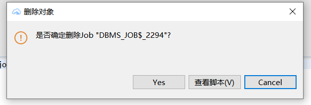

## 权限需求
使用DBeaver For YashanDB管理任务，请确保当前用户具有以下权限。


| 权限                    | 说明     |
|-----------------------|--------|
| CREATE TABLE          | 创建表    |
| CREATE PROCEDURE      | 创建存储过程 |
| SELECT ON DBA_OBJECTS | 查看对象视图 |

## 创建任务
创建示例SQL语句
```sql
CREATE TABLE TEST01.area
(area_no CHAR(2) NOT NULL PRIMARY KEY,
 area_name VARCHAR2(60),
 DHQ VARCHAR2(20) DEFAULT 'ShenZhen' NOT NULL);
 
 CREATE OR REPLACE
PROCEDURE
	job_proc IS
BEGIN
		INSERT
	INTO
	area
VALUES (
  	TO_CHAR(SYSDATE, 'SS'),
  	'job',
  	'job example'
  	);
COMMIT;
END;

DECLARE
	jobid BIGINT;
BEGIN
	DBMS_JOB.SUBMIT(jobid,
	'begin job_proc; end;',
	SYSDATE,
	'SYSDATE+1'
  	);
COMMIT;
DBMS_OUTPUT.PUT_LINE('Job:' || jobid || ' is created!');
END;

```

在左侧点击模式，点击schema，点击Jobs，将展示创建的任务。



点击查看job，或双击job查看job详情。



## 编辑任务

在job属性文本编辑框中，编辑执行任务语句，点击右下角保存。



点击执行进行保存。





## 删除任务 

双击job点击delete按钮。



点击弹框 YES进行删除。


