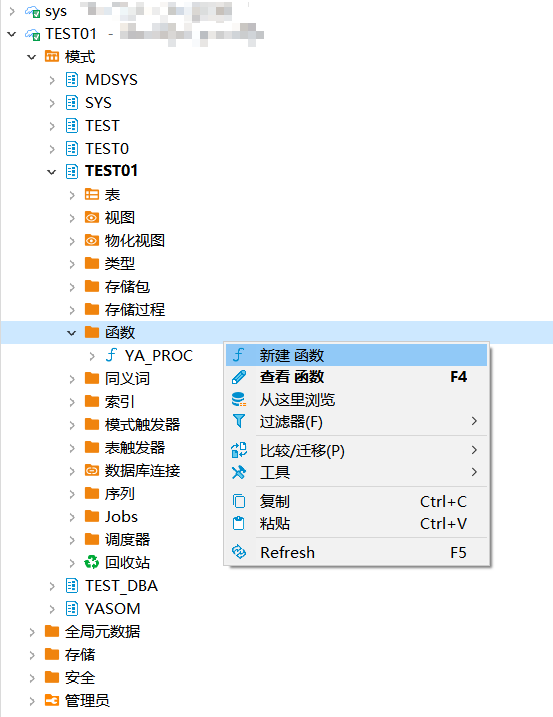
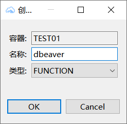
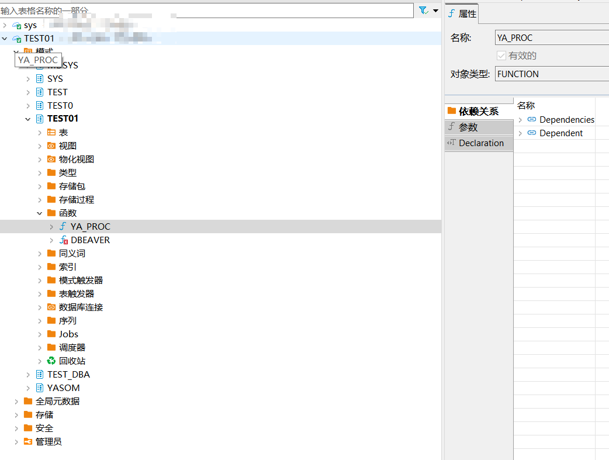
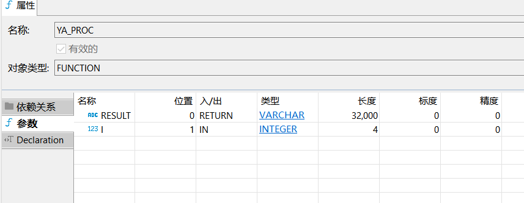
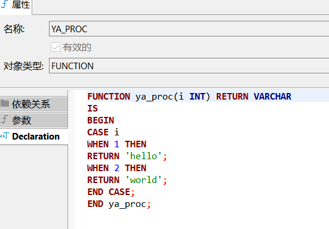
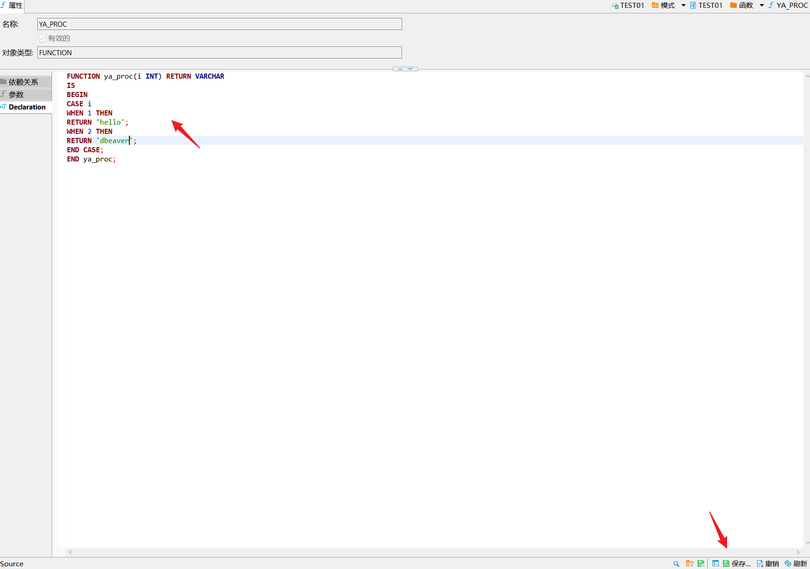
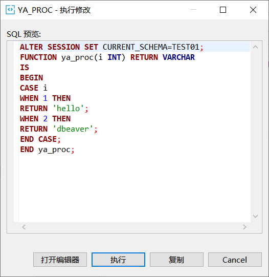
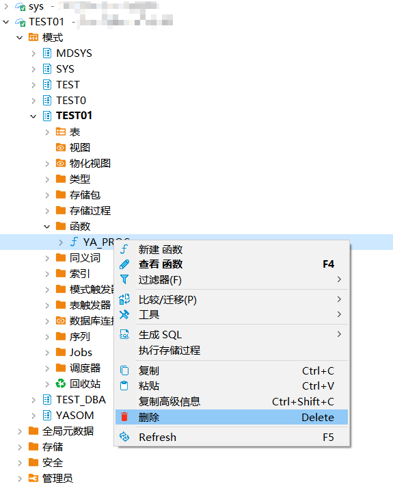

本文档介绍如何在DBeaver中创建，查看，编辑，删除YashanDB的函数。
## 权限需求
使用DBeaver For YashanDB管理函数，请确保当前用户具有以下权限。


| 权限              | 说明       |
|-----------------|----------|
| CREATE FUNCTION | 创建函数权限   |
| ALTER FUNCTION  | 修改函数权限   |
| DROP FUNCTION   | 删除函数权限   |


## 创建函数
创建示例SQL语句
```sql
CREATE OR REPLACE FUNCTION ya_proc(i INT) RETURN VARCHAR
IS
BEGIN
CASE i
WHEN 1 THEN
RETURN 'hello';
WHEN 2 THEN
RETURN 'world';
END CASE;
END ya_proc;
```

在左侧点击**模式**，点击**schema**，点击**函数**，点击**新建函数**，选择类型**FUNCTION**，输入**名称**。





点击**函数**查看当前schema下的函数，点击**具体函数**查看详情。







## 编辑函数

点击函数下**declaration**，**编辑**内容，点击**保存**。



点击**执行**进行编辑。



## 删除函数

在左侧点击**模式**，点击**schema**，点击**函数**，点击**删除**。


