本文档介绍如何在DBeaver中创建，查看，编辑，删除YashanDB的存储包。
## 权限需求
使用DBeaver For YashanDB管理存储包，请确保当前用户具有以下权限。

| 权限                  | 说明                                                 |
| --------------------- | ---------------------------------------------------- |
| CREATE PROCEDURE      | 在用户自己的schema下创建过程体或函数                 |
| CREATE ANY PROCEDURE  | 在任意schema下创建过程体或函数（sys schema除外）     |
| ALTER ANY PROCEDURE   | 修改任意schema下过程体或函数的属性（sys schema除外） |
| DROP ANY PROCEDURE    | 删除任意过程体或函数（sys schema除外）               |
| EXECUTE ANY PROCEDURE | 执行任意过程体或函数（sys schema除外）               |

## 创建存储包
创建示例SQL语句
```sql
--PACKAGE HEAD
CREATE OR REPLACE PACKAGE calc_fee
AS
c NUMBER := 100;
PROCEDURE branch_quantity(date_from date);
END;

--PACKAGE BODY
CREATE OR REPLACE PACKAGE BODY calc_fee AS
PROCEDURE branch_quantity(date_from DATE) IS
BEGIN
 DBMS_OUTPUT.PUT_LINE(c);
 c := c+1;
 DBMS_OUTPUT.PUT_LINE(c);
END;
END calc_fee;
```

在左侧点击**模式**，点击**schema**，点击**包**，点击**新建存储包**，输入**名称**。

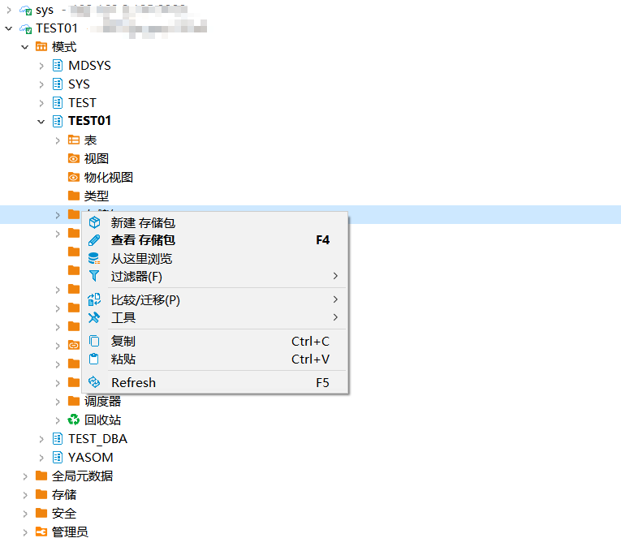

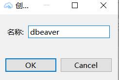

点击**存储包**查看当前schema下的包，点击**具体包**查看详情。

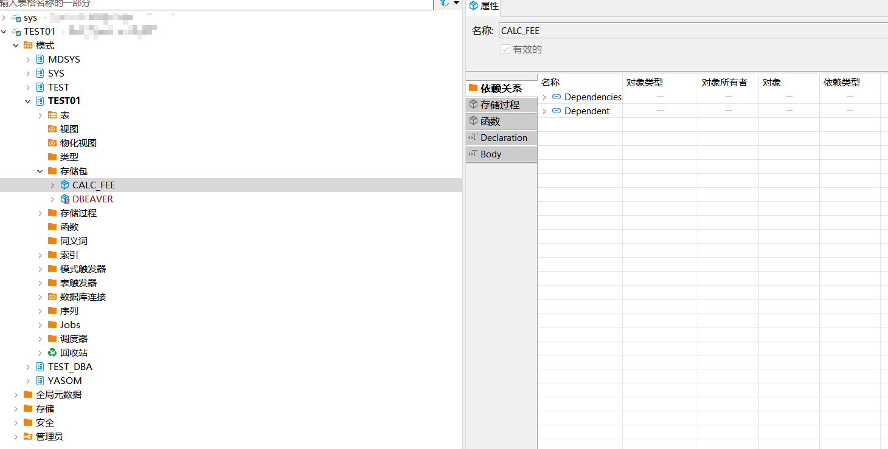

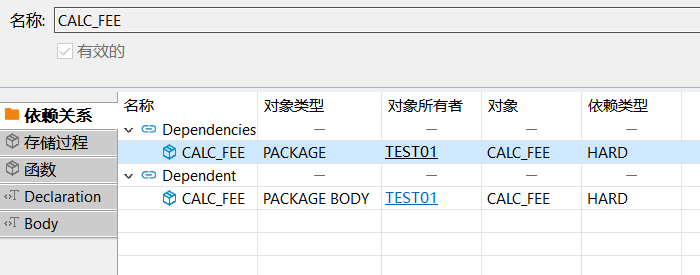
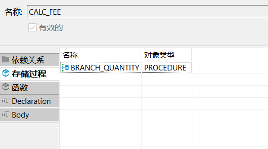
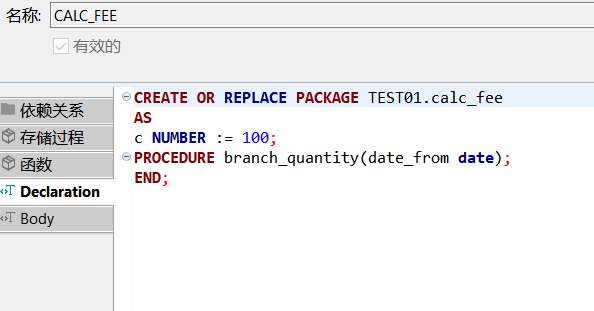
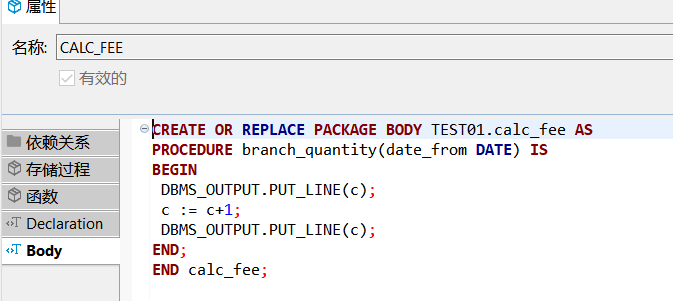

## 编辑存储包

点击包下**declaration**，编辑**内容**，点击**保存**。

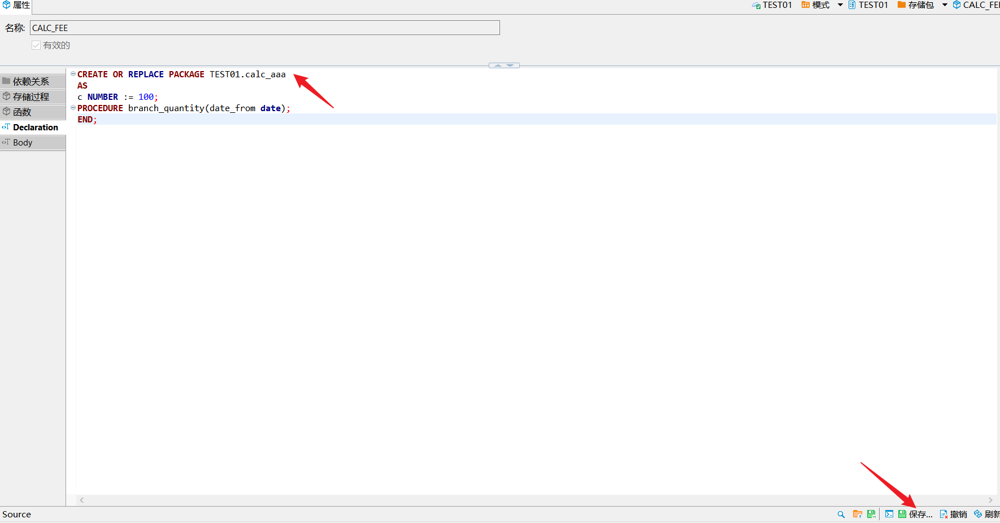

点击**执行**进行**编辑**。

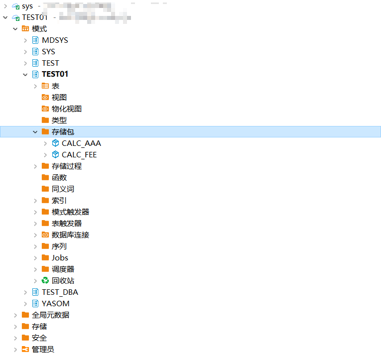

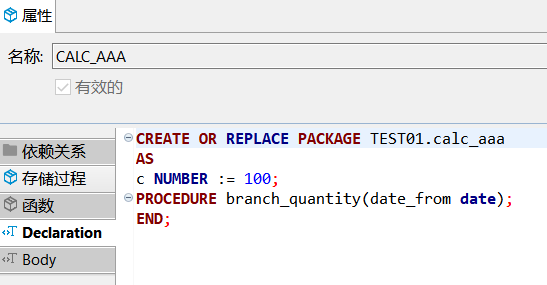

## 删除存储包

在左侧点击**模式**，点击**schema**，点击**包**，点击**删除**。

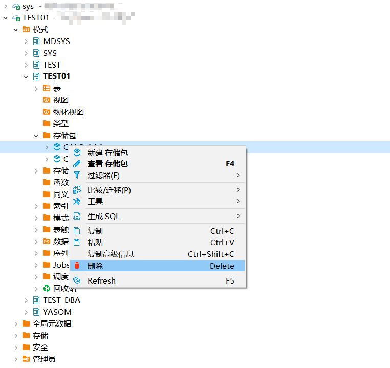