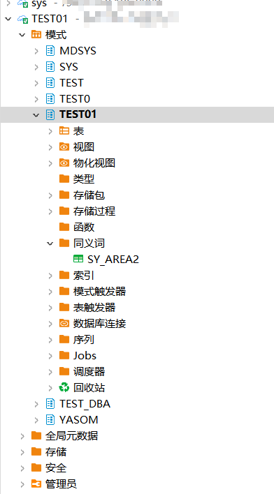
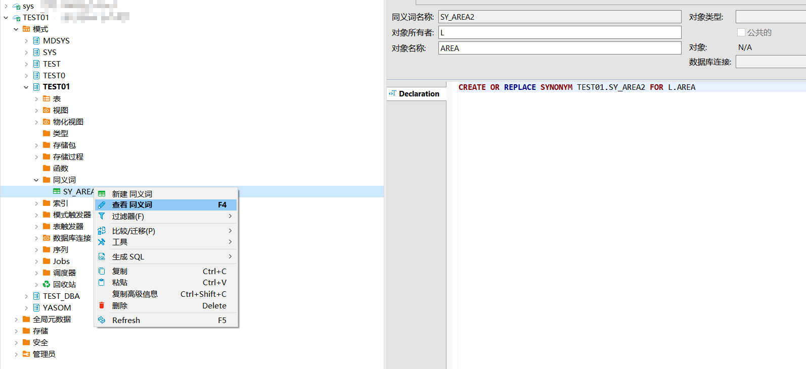

本文档介绍如何在DBeaver中创建，查看YashanDB的同义词。

## 权限需求
使用DBeaver For YashanDB管理同义词，请确保当前用户具有以下权限。

| 权限                    | 说明                                  |
|-----------------------|-------------------------------------|
| CREATE SYNONYM        | 在用户自己的schema下创建私有synonym            |
| CREATE ANY SYNONYM    | 在任意schema下创建私有synonym（sys schema除外） |
| CREATE PUBLIC SYNONYM | 创建public synonym                    |
| DROP ANY SYNONYM      | 删除任意私有synonym（sys schema除外）         |
| DROP PUBLIC SYNONYM   | 删除public synonym                    |


## 创建同义词
创建示例SQL语句
```sql
CREATE SYNONYM sy_area2 FOR L.area;
```

在左侧点击**模式**，点击**schema**，点击**同义词**。




点击**目标同义词**，点击**查看同义词**，或**双击**同义词查看详情。

