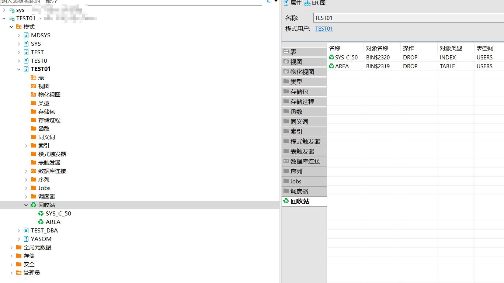

本文档介绍如何在DBeaver中打开，查看YashanDB的回收站。

## 权限需求
回收站建议用系统用户打开，打开语句如下。
````sql
SELECT * FROM v$SYSTEM_PARAMETER WHERE NAME LIKE '%RECYCLEBIN%';
alter system set RECYCLEBIN_ENABLED = ON;
````

## 查看回收站

在左侧点击**模式**，点击**schema**，点击**回收站**。


