本文档介绍如何在DBeaver中创建，查看，编辑，删除YashanDB的存储过程。

## 权限需求
使用DBeaver For YashanDB管理存储过程，请确保当前用户具有以下权限。


| 权限                       | 说明                                 |
|--------------------------|------------------------------------|
| SELECT ON DBA_PROCEDURES | 查看系统存储过程视图                         |
| CREATE PROCEDURE         | 在用户自己的schema下创建过程体或函数              |
| CREATE ANY PROCEDURE     | 在任意schema下创建过程体或函数（sys schema除外）   |
| ALTER ANY PROCEDURE      | 修改任意schema下过程体或函数的属性（sys schema除外） |
| DROP ANY PROCEDURE       | 删除任意过程体或函数（sys schema除外）           |
| EXECUTE ANY PROCEDURE    | 执行任意过程体或函数（sys schema除外）           |

## 创建存储过程
创建示例SQL语句
```sql
CREATE TABLE TEST01.area
(area_no CHAR(2) NOT NULL PRIMARY KEY,
 area_name VARCHAR2(60),
 DHQ VARCHAR2(20) DEFAULT 'ShenZhen' NOT NULL);
 
  CREATE OR REPLACE
PROCEDURE
	pro1 IS
BEGIN
		INSERT
	INTO
	area
VALUES (
  	TO_CHAR(SYSDATE, 'SS'),
  	'pro',
  	'pro example'
  	);
COMMIT;
END;
```

在左侧点击**模式**，点击**schema**，右键点击**存储过程**，点击**新建存储过程**。

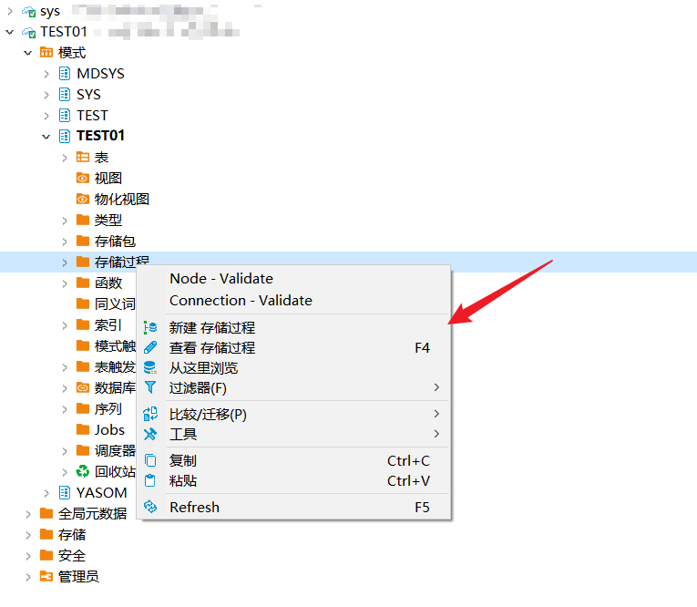

输入**名称**，选择**类型**再点击**OK**。

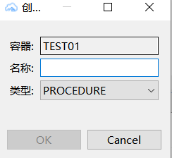

创建成功后，打开**存储过程**查看。

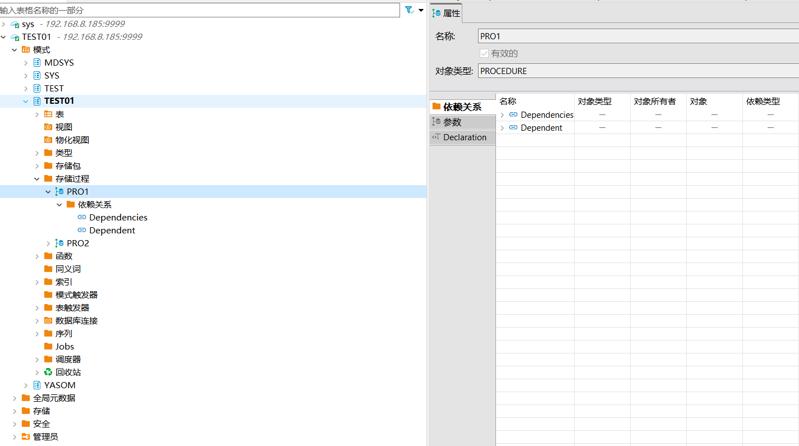

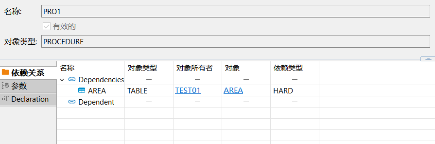

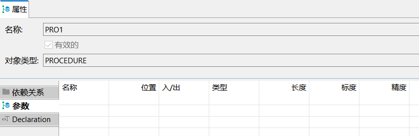

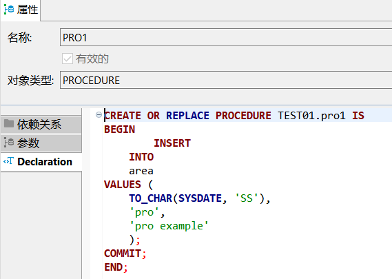

## 编辑存储过程

在存储过程属性**文本编辑框**中，编辑**执行DDL**语句，点击右下角**保存**。

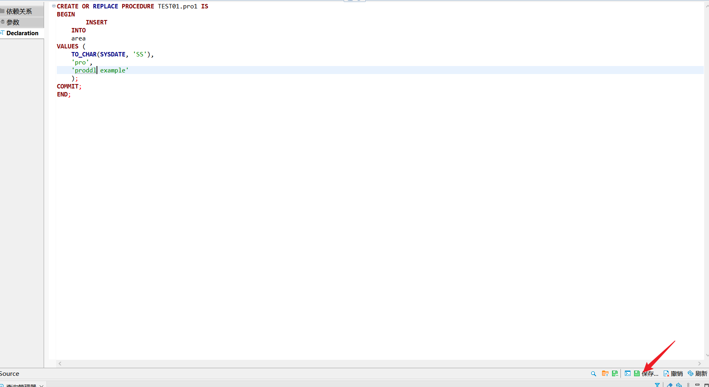

点击**执行**进行**保存**。

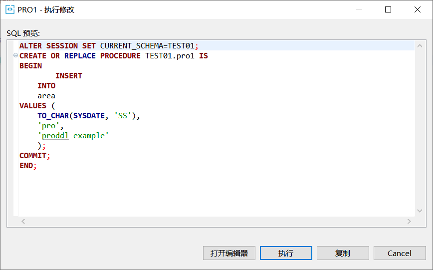

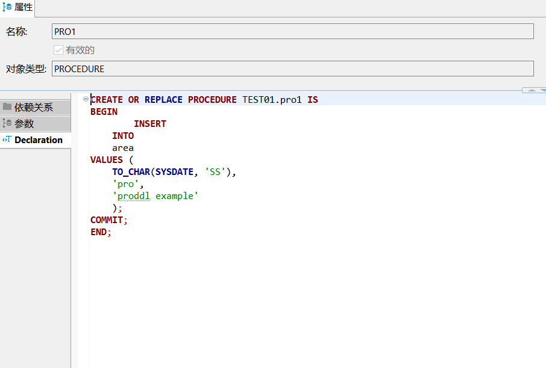

## 删除存储过程

**双击**存储过程点击**delete**按钮。

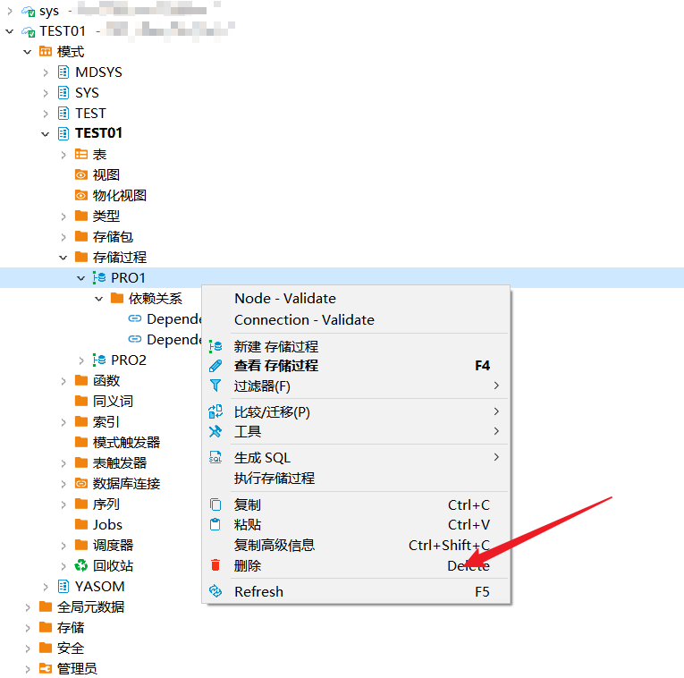

点击弹框**YES**进行删除。

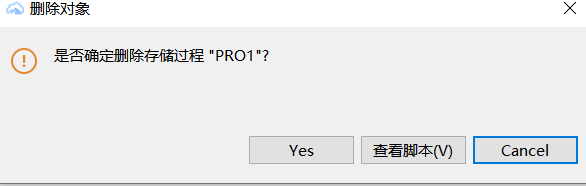