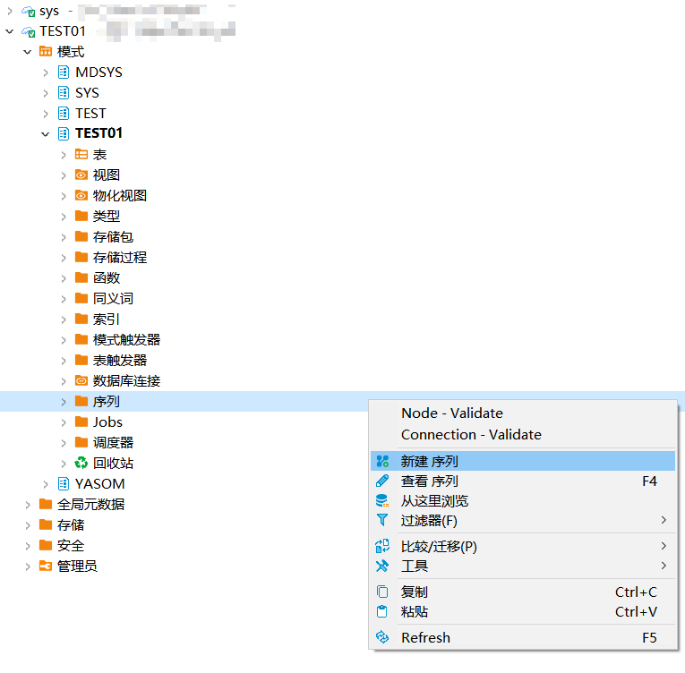
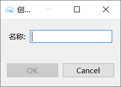
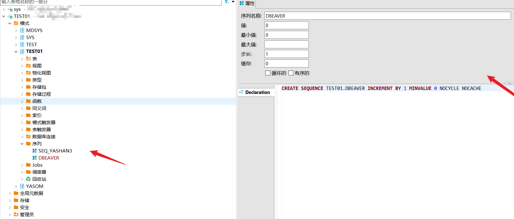
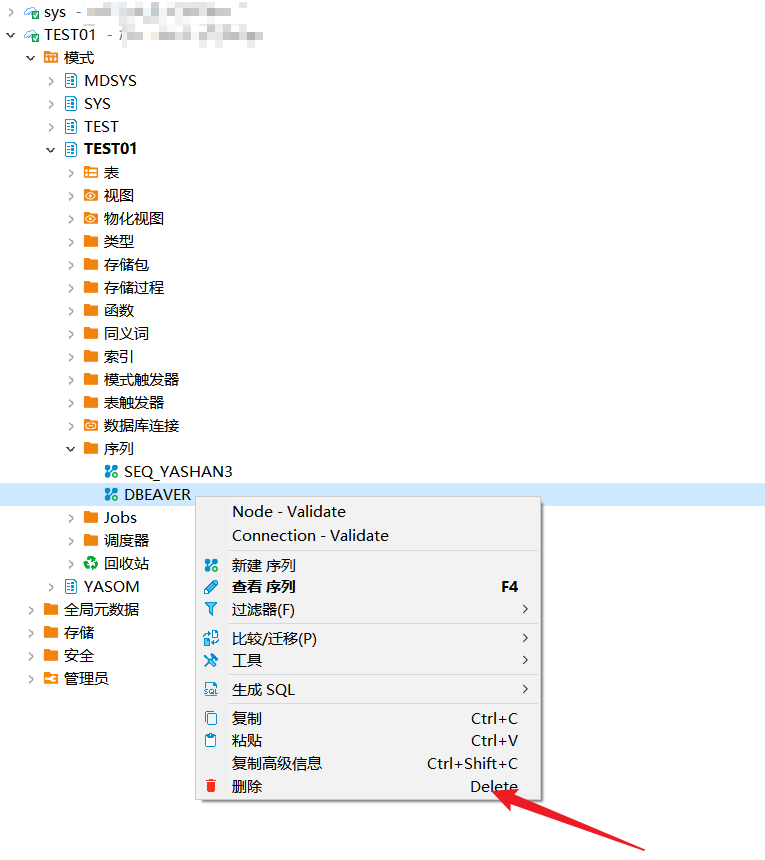
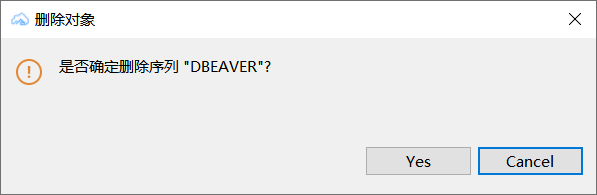

本文档介绍如何在DBeaver中创建，查看，删除YashanDB的序列。

## 权限需求

使用DBeaver for YashanDB管理序列，请确保当前用户具有以下权限。

| 权限                  | 说明                                 |
|---------------------|------------------------------------|
| CREATE SEQUENCE     | 在用户自己的schema下创建sequence            |
| CREATE ANY SEQUENCE | 在任意schema下创建sequence（sys schema除外） |
| ALTER ANY SEQUENCE  | 对数据库中任意sequence修改属性（sys schema除外）  |
| DROP ANY SEQUENCE   | 删除数据库中任意sequence（sys schema除外）     |
| SELECT ANY SEQUENCE | 对数据库中任意sequence发起查询（sys schema除外）  |

## 创建序列

创建示例SQL语句

```sql
CREATE SEQUENCE seq_yashan3 INCREMENT BY 10 MAXVALUE 20 CYCLE NOCACHE;
```

在左侧点击**模式**，点击**schema**，右键点击**序列**，点击**新建序列**。



输入**名称**，点击**OK**。



创建成功后，打开**序列**查看。



## 删除序列

双击**序列**点击**delete**按钮。



点击弹框**YES**进行删除。


