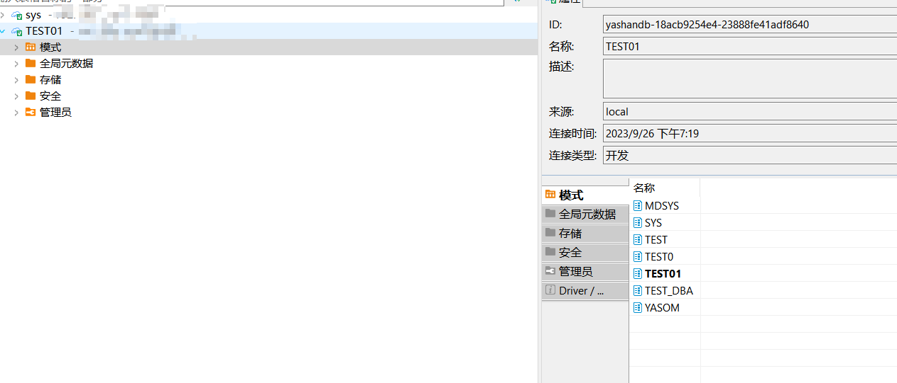

本文档介绍如何在DBeaver中实现YashanDB的数据库管理。

## 权限需求

使用DBeaver for YashanDB管理数据库，请确保当前用户具有以下权限。

| 权限                 | 说明       |
|--------------------|----------|
| SELECT ALL_OBJECTS | 查询所有对象权限 |
| SELECT ALL_TABLES  | 查询所有表权限  |

## 展示schema

**双击模式**或右键点击**模式**，点击**查看模式**，在**右侧**查看。

