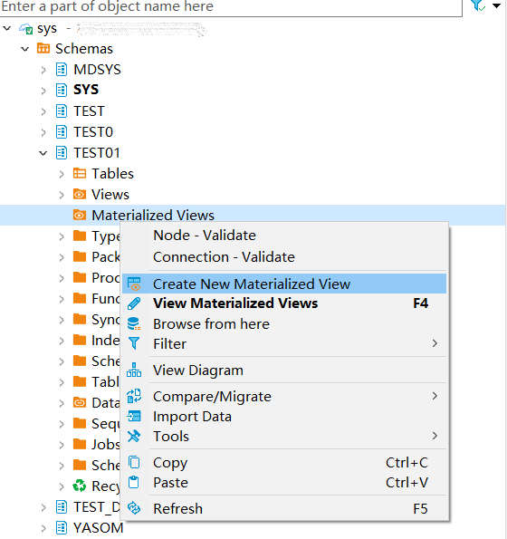
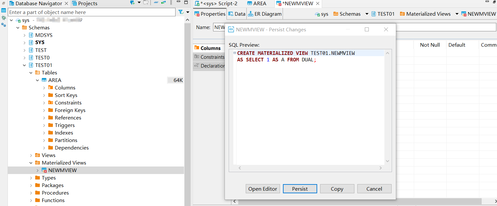
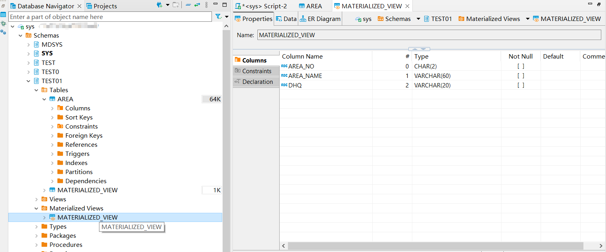
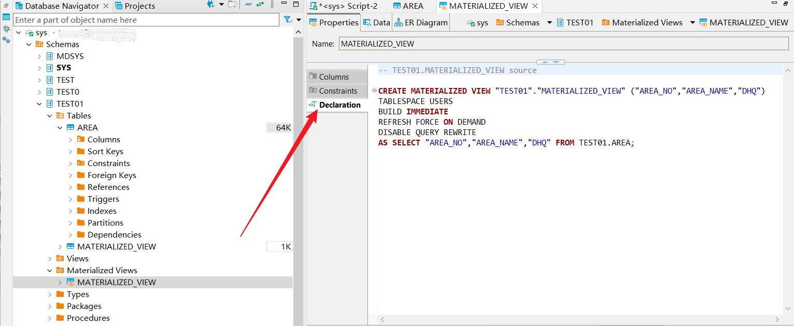
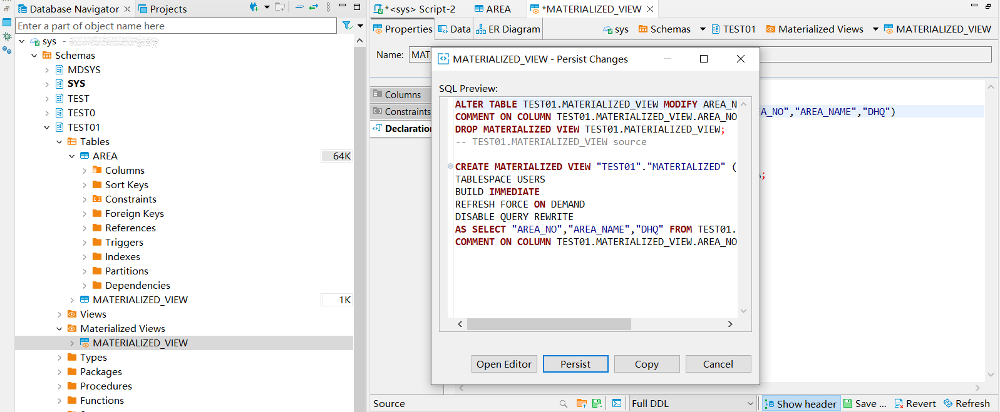
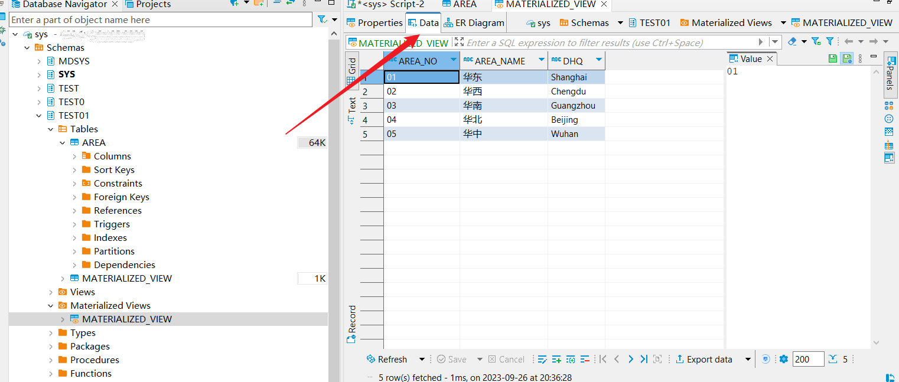

本文档介绍如何在DBeaver中创建，查看YashanDB的物化视图。

## 权限需求

使用DBeaver for YashanDB管理物化视图，请确保当前用户具有以下权限。

| 权限                         | 说明                                                   |
| ---------------------------- | ------------------------------------------------------ |
| CREATE MATERIALIZED VIEW     | 在用户自己的schema下创建物化视图                       |
| CREATE ANY MATERIALIZED VIEW | 在任意schema下创建物化视图 （sys schema除外）          |
| ALTER ANY MATERIALIZED VIEW  | 对数据库中任意物化视图发起ALTER操作 （sys schema除外） |
| DROP ANY MATERIALIZED VIEW   | 在任意schema下删除物化视图 （sys schema除外）          |

## 创建物化视图

创建示例SQL语句

```sql
CREATE MATERIALIZED VIEW TEST01.MATERIALIZED_VIEW BUILD IMMEDIATE AS SELECT * FROM TEST01.AREA;
```

在左侧点击**模式**，点击**schema**，右键点击**物化视图**，点击**新建物化视图**。



输入名称，创建列，点击**Save**，再点击**Persist**，创建成功。



## 查看及修改物化视图

双击对应物化视图名称查看名称、注释、相关属性及字段信息。



点击**Declaration**，查看物化视图DDL。



修改DDL后点击**Save**，再点击**Persist**，修改成功。



点击**Data**，查看物化视图的数据。


