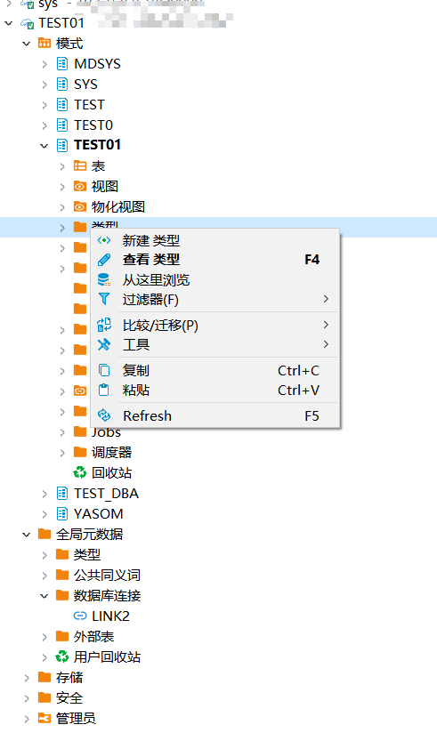
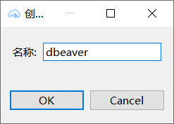
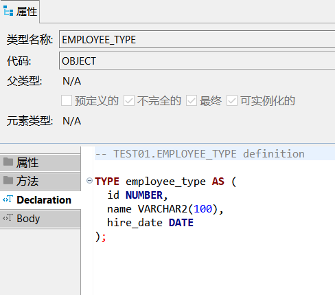
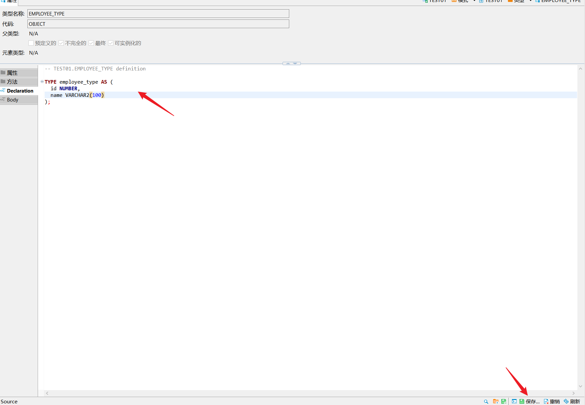
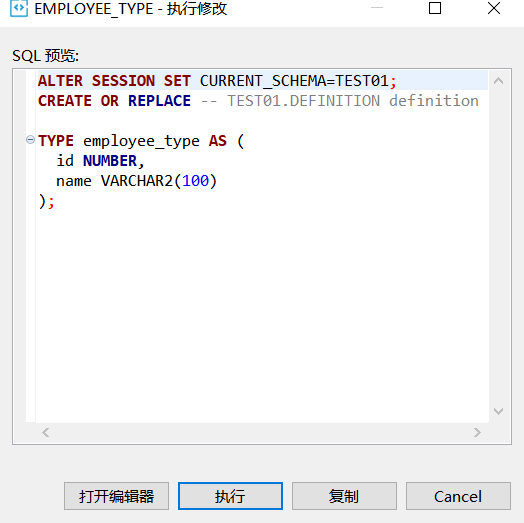
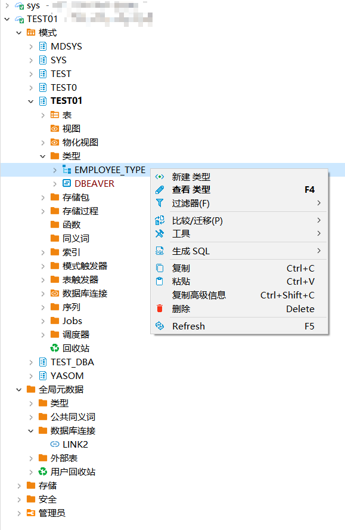
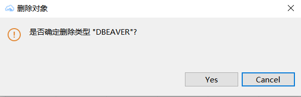

本文档介绍如何在DBeaver中创建，查看，编辑，删除YashanDB的类型。
## 权限需求
使用DBeaver For YashanDB管理类型，请确保当前用户具有以下权限。


| 权限               | 说明                                |
|------------------|-----------------------------------|
| CREATE TYPE      | 在用户自己的schema下创建自定义类型              |
| CREATE ANY TYPE  | 在任意schema下创建自定义类型（sys schema除外）   |
| ALTER ANY TYPE   | 修改任意schema下自定义类型的属性（sys schema除外） |
| DROP ANY TYPE    | 删除任意schema下自定义类型（sys schema除外）    |
| EXECUTE ANY TYPE | 执行任意自定义类型（sys schema除外）           |
| UNDER ANY TYPE   | 在非最终的OBJECT类型下创建子类型               |

## 创建类型
创建示例SQL语句
```sql
CREATE TYPE employee_type AS (
  id NUMBER,
  name VARCHAR2(100),
  hire_date DATE
);
```

在左侧点击**模式**，点击**schema**，点击**类型**，点击**新建类型**，输入**名称**。





点击**类型**查看当前schema下的类型，点击**具体类型**查看详情。



## 编辑类型

在类型**属性文本编辑框**中，编辑**类型DDL**语句，点击右下角**保存**。



点击**执行**进行**保存**。



## 删除类型

右键想要**删除**类型点击**删除**按钮。



点击弹框**YES**进行删除。

