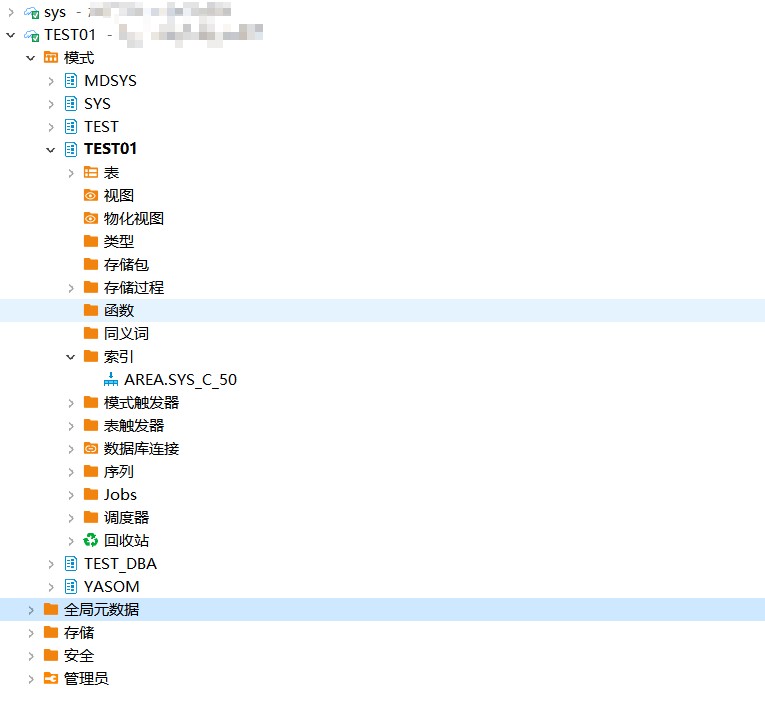
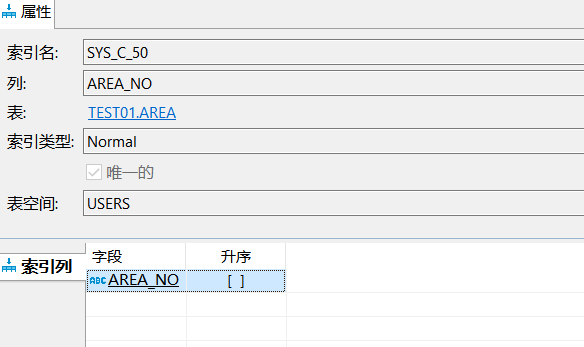
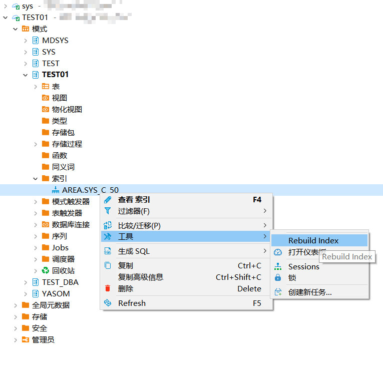
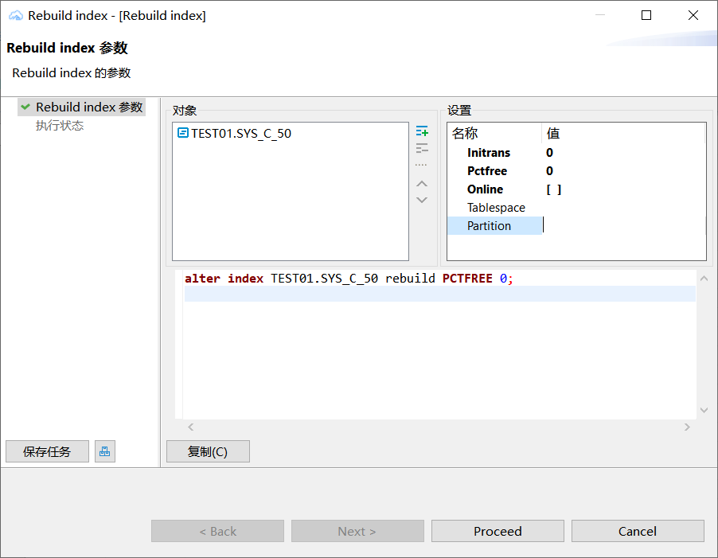
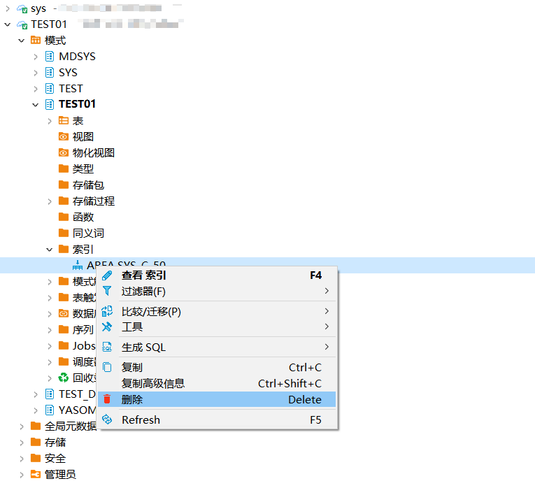

## 权限需求
使用DBeaver For YashanDB管理索引，请确保当前用户具有以下权限。


| 权限               | 说明                          |
|------------------|-----------------------------|
| CREATE ANY INDEX | 对数据库中任意表创建索引（sys schema除外）  |
| ALTER ANY INDEX  | 对数据库中任意索引修改属性（sys schema除外） |
| DROP ANY INDEX   | 删除数据库中任意索引（sys schema除外）    |

## 创建索引
创建示例SQL语句
```sql
CREATE TABLE TEST01.area
(area_no CHAR(2) NOT NULL PRIMARY KEY,
 area_name VARCHAR2(60),
 DHQ VARCHAR2(20) DEFAULT 'ShenZhen' NOT NULL);
```

在左侧点击模式，点击schema，点击索引，将展示创建的索引。



双击索引，查看索引详情。



## 编辑索引

在左侧点击模式，点击schema，点击索引，点击工具，点击rebuild index。



在上方修改内容，点击process进行保存。




## 删除索引

在左侧点击模式，点击schema，点击索引，点击delete。


