本文档介绍如何在DBeaver中创建，查看，编辑，删除YashanDB的表。
## 限制

1. 暂不支持通过图形化界面创建二级分区，建议此类复杂语法使用编辑器执行。

2. 不支持直接在表数据界面更新rowid，clob，blob，nclob，json，geometry类型字段值。

3. 暂不支持YashanDB连接源的数据导入导出功能。

## 权限需求
使用DBeaver For YashanDB管理表，请确保当前用户具有以下权限。

| 权限                  | 说明                                               |
|---------------------|--------------------------------------------------|
| INSERT ANY TABLE    | 对数据库中（sys schema除外）任意表插入数据                       |
| SELECT ANY TABLE    | 对数据库中（sys schema除外）任意表、视图、动态视图、物化视图发起查询；动态视图暂不受限 |
| UPDATE ANY TABLE    | 对数据库中（sys schema除外）任意表更新数据                       |
| DELETE ANY TABLE    | 对数据库中（sys schema除外）任意表进行删除数据                     |
| READ ANY TABLE      | 对数据库中（sys schema除外）任意表进行查询，但不能加锁查询               |
| CREATE TABLE        | 在用户自己的schema下创建表                                 |
| CREATE ANY TABLE    | 在任意schema下创建表（sys schema除外）                      |
| ALTER ANY TABLE     | 对数据库中任意表发起ALTER操作（sys schema除外）                  |
| DROP ANY TABLE      | 删除数据库中任意表定义（sys schema除外）                        |
| FLASHBACK ANY TABLE | 对数据库中任意表发起闪回查询（sys schema除外）                     |
| COMMENT ANY TABLE   | 对数据库中任意表进行注释（sys schema除外）                       |

## 创建表

在左侧点击**模式**，点击**schema**，右键点击**表**，点击**新建表**。

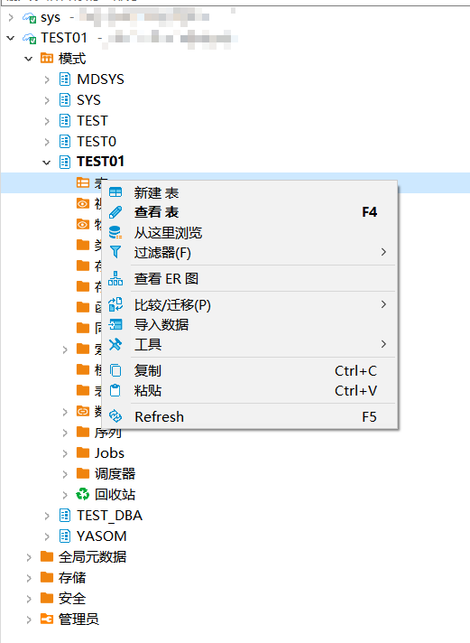

点击**新建表**，在右侧列下**右键**点击，进行**新建列**。

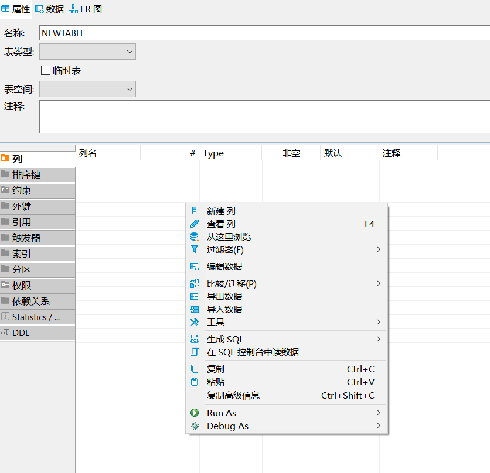

在弹框中**编辑**列的**属性**，点击**ok**，完成新建列。

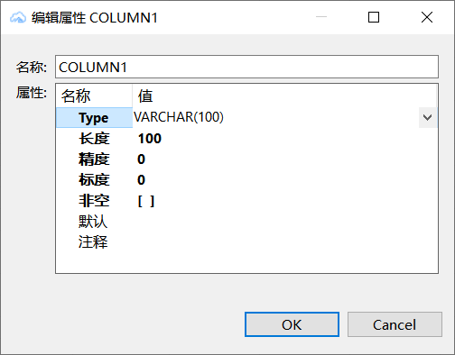

也可在左侧表上**点击**，再点击**创建**，创建如图所示对象。

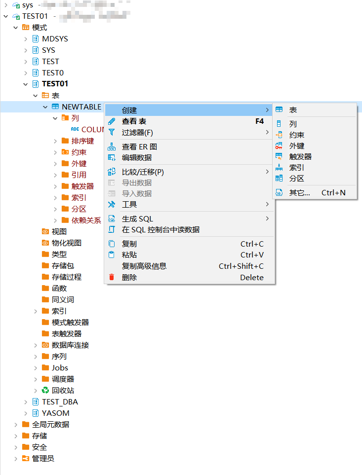

同时可在右侧上方**编辑表类型，表空间**，选择是否为**临时表及表注释**。

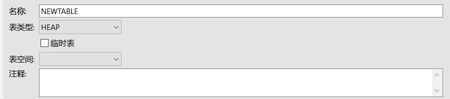

## 删除表

**当打开回收站时，无法删除LSC类型的表**

在左侧点击**模式**，点击**schema**，右键点击**表**，点击**删除**。

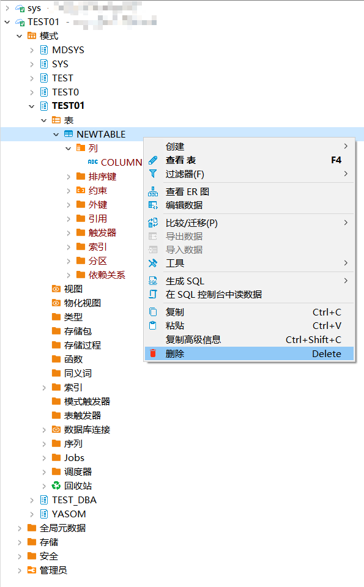

选择是否**级联删除**，点击**Yes**进行删除。
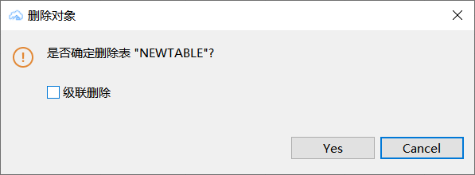

## 编辑表

新建列操作已描述。

在列上可以选择为列**新建索引和约束**。

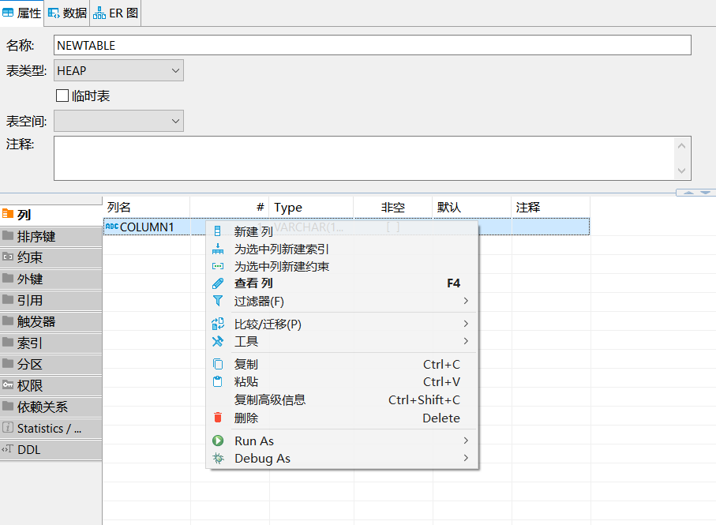

新建的索引与约束**编辑**如图。

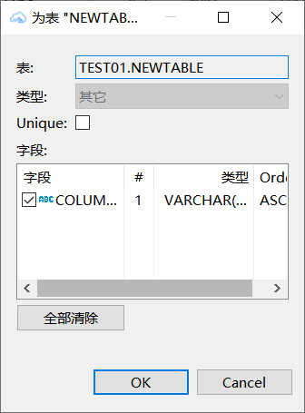

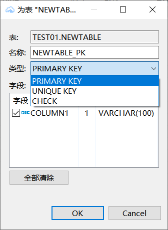

同时可以在**DDL**下**编辑表**的DDL，然后保存。

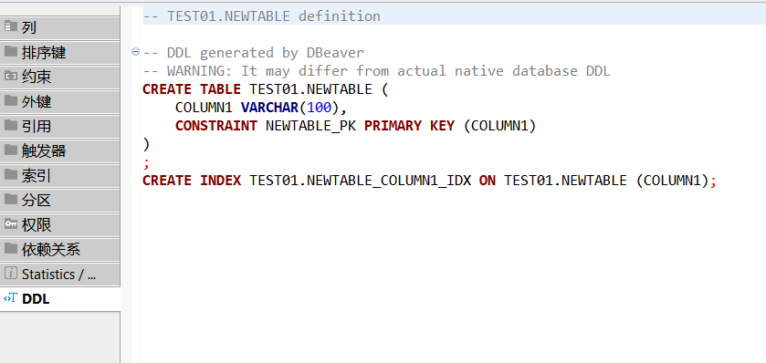
## 查看表

可在**表标签**下，选择**所需信息**查看表信息。

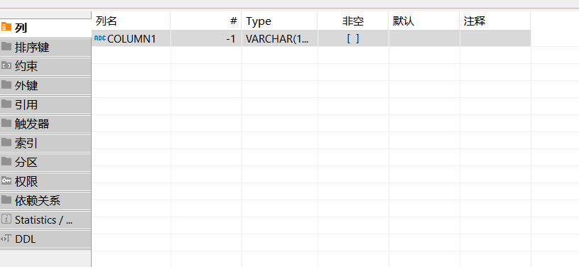

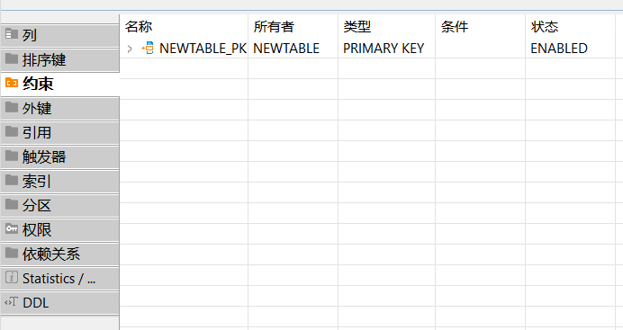

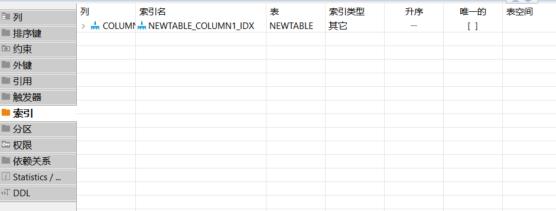

