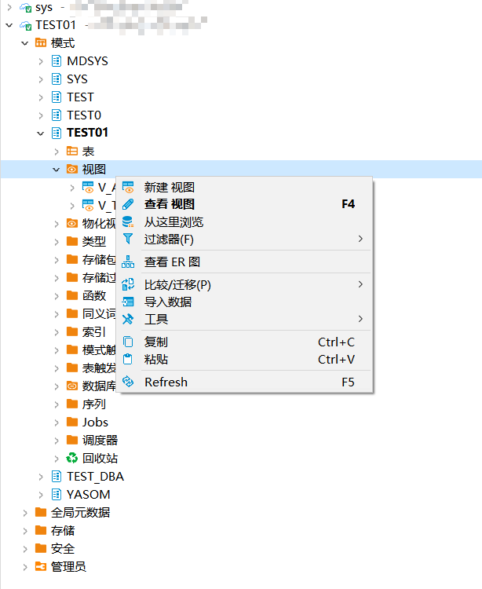
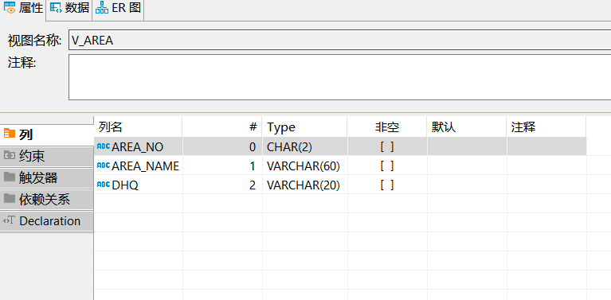
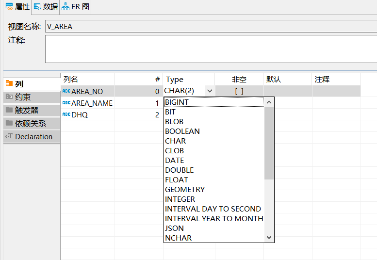
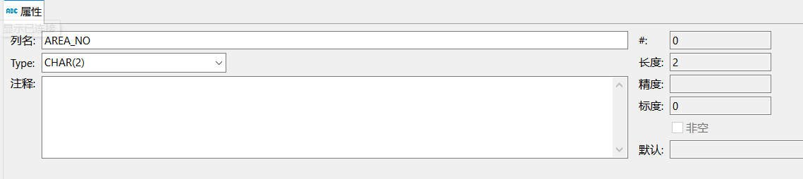
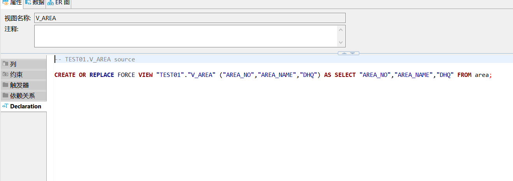
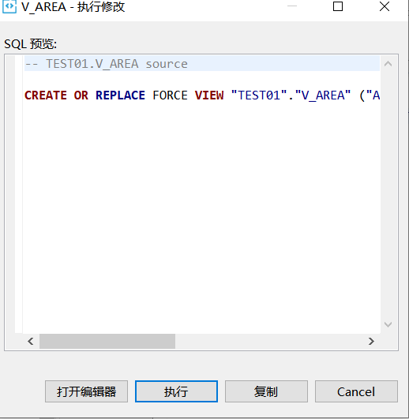
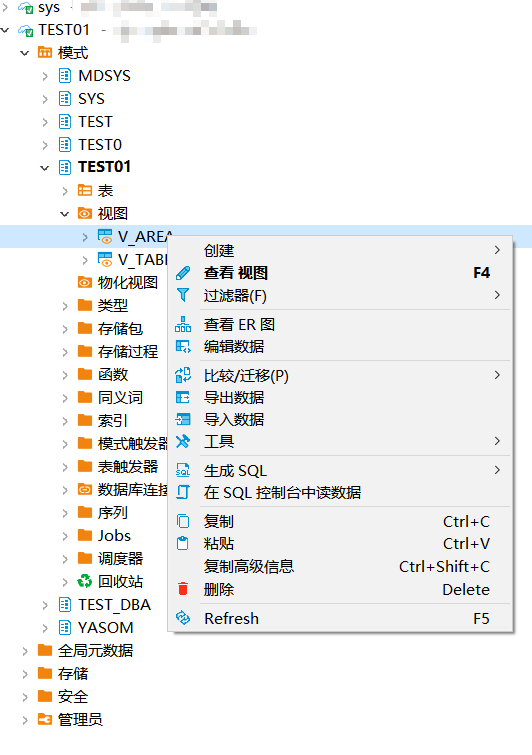
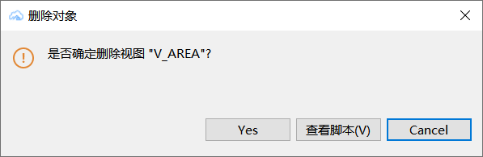

## 权限需求
使用DBeaver For YashanDB管理视图，请确保当前用户具有以下权限。


| 权限              | 说明                           |
|-----------------|------------------------------|
| CREATE VIEW     | 在用户自己的schema下创建视图            |
| CREATE ANY VIEW | 在任意schema下创建视图（sys schema除外） |
| DROP ANY VIEW   | 删除任意视图                       |

## 创建视图
创建示例SQL语句
```sql
CREATE OR REPLACE FORCE VIEW "TEST01"."V_TABLE_NOT_EXSITS" AS SELECT * FROM table_not_exsits;
```

在左侧点击模式，点击schema，点击视图，点击新建视图，输入名称。



点击函数查看当前schema下的视图，点击具体视图查看详情。



## 编辑视图

在视图列中可以进行编辑，同时双击列也可以进行编辑。





在类型属性文本编辑框中，编辑类型DDL语句，点击右下角保存。



点击执行进行保存。



## 删除视图

右键想要删除视图点击删除按钮。



点击弹框 YES进行删除。

