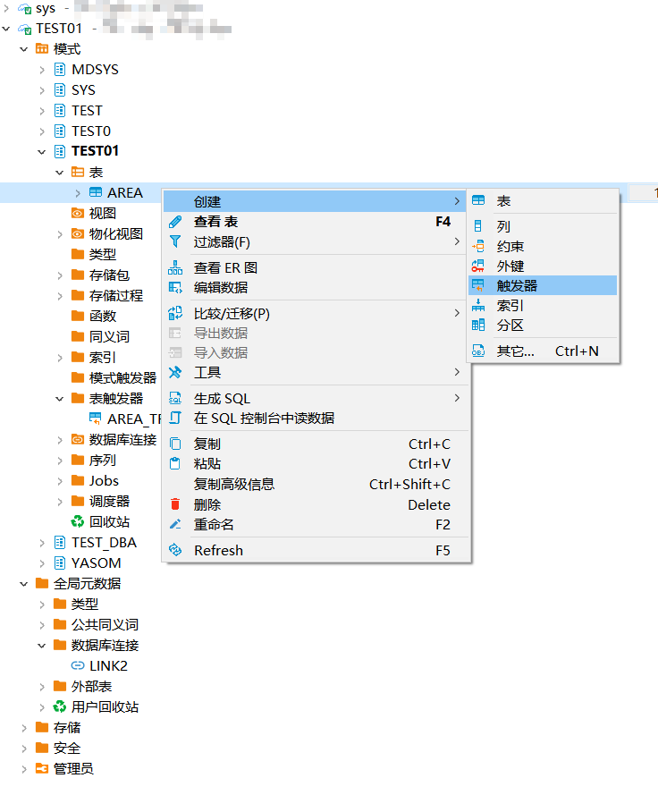
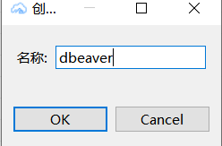
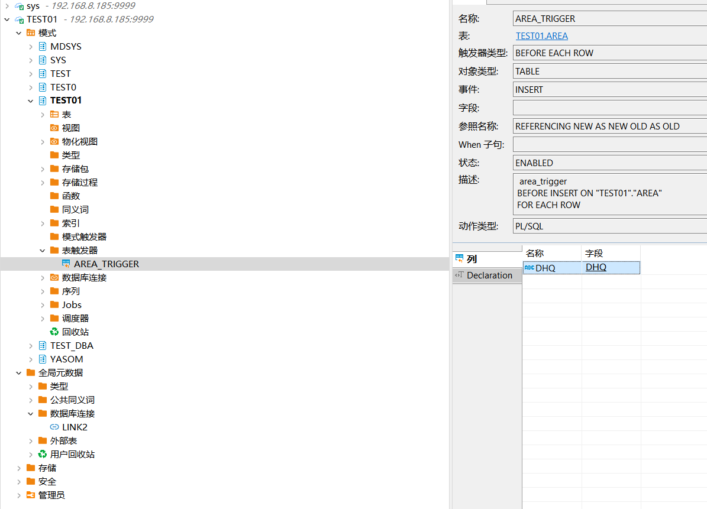
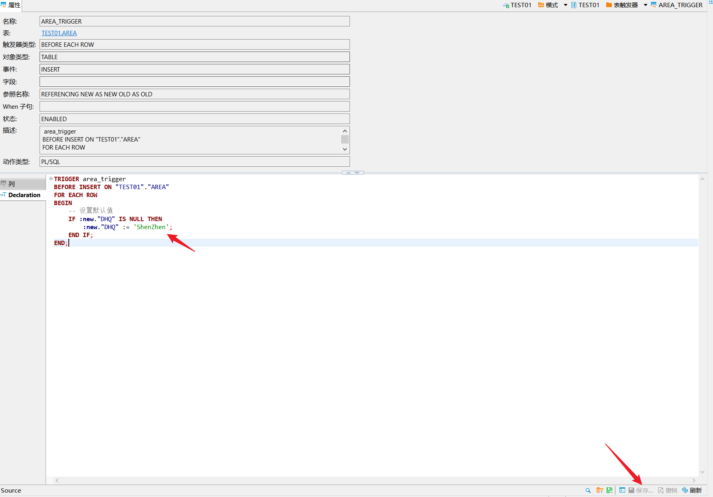
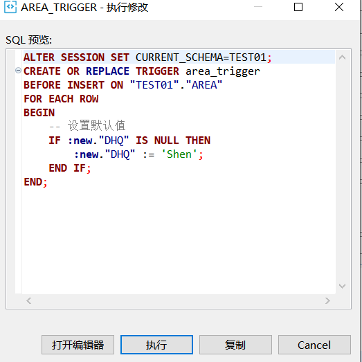
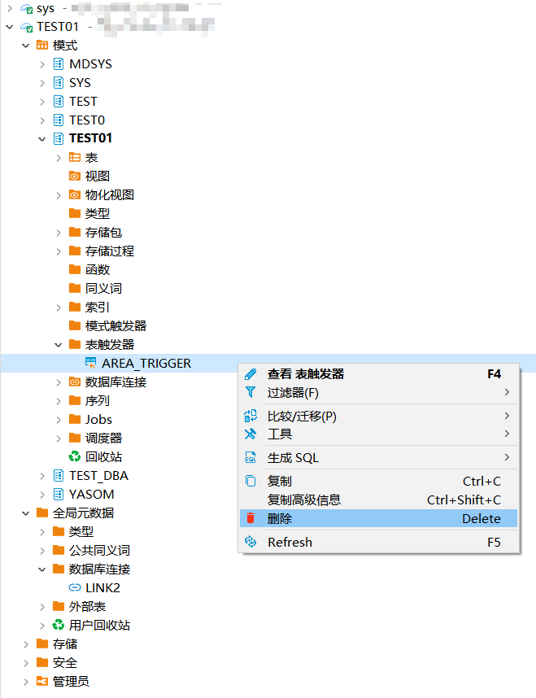
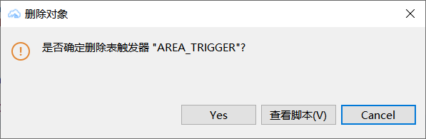

本文档介绍如何在DBeaver中创建，查看，编辑，删除YashanDB的触发器。
## 权限需求
使用DBeaver For YashanDB管理任务，请确保当前用户具有以下权限。


| 权限                          | 说明                                |
|-----------------------------|-----------------------------------|
| CREATE TRIGGER              | 在用户自己的schema下创建触发器                |
| CREATE ANY TRIGGER          | 		在任意schema下创建触发器（sys schema除外）   |
| ALTER ANY TRIGGER           | 		修改任意schema下触发器的属性（sys schema除外） |
| DROP ANY TRIGGER            | 删除任意schema下触发器（sys schema除外）      |
| ADMINISTER DATABASE TRIGGER | 		管理数据库级别触发器                      |


以下操作以表触发器为例。

## 创建触发器
创建示例SQL语句
```sql
CREATE OR REPLACE TRIGGER area_trigger
BEFORE INSERT ON "TEST01"."AREA"
FOR EACH ROW
BEGIN
    IF :new."DHQ" IS NULL THEN
        :new."DHQ" := 'ShenZhen';
    END IF;
END;
```

在左侧点击模式，点击schema，点击表，点击创建，点击触发器，输入名称。





在左侧点击模式，点击schema，点击表触发器查看当前schema下的类型，点击具体触发器查看详情。



## 编辑触发器

在触发器属性文本编辑框中，编辑触发器DDL语句，点击右下角保存。



点击执行进行保存。




## 删除触发器

右键想要删除触发器点击删除按钮。



点击弹框 YES进行删除。

