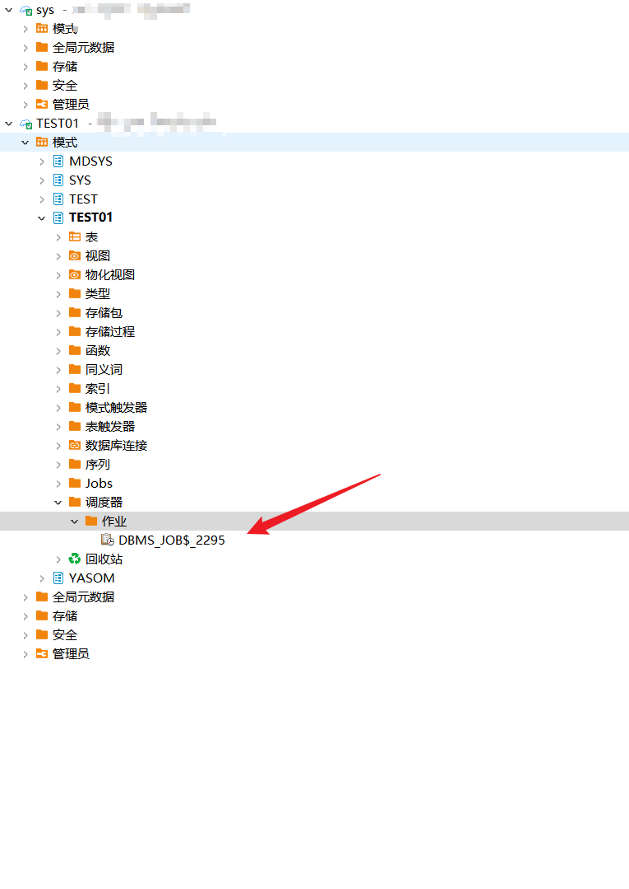
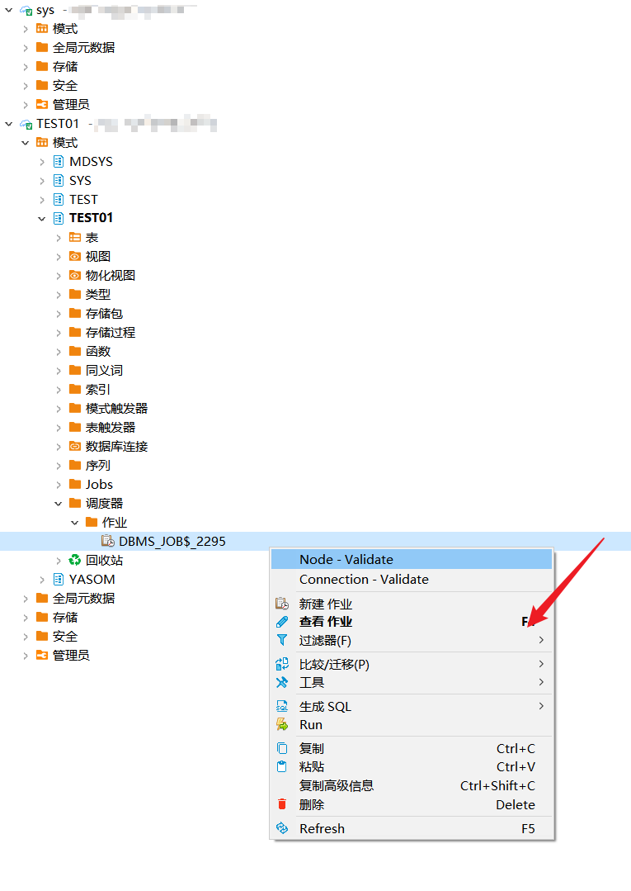
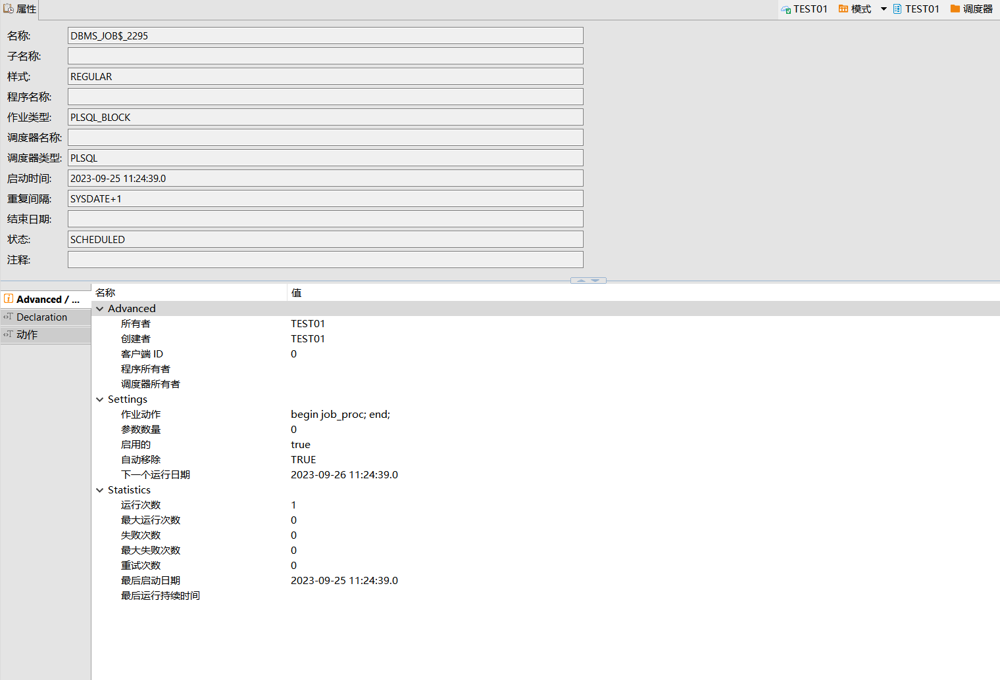
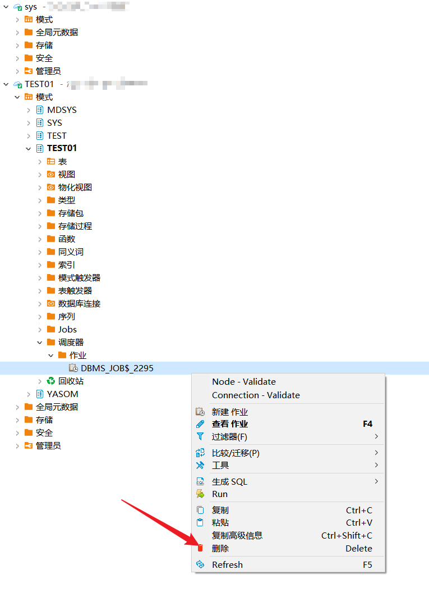
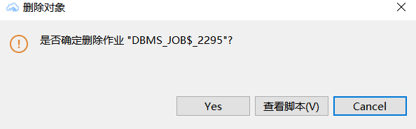

本文档介绍如何在DBeaver中创建，查看，删除YashanDB的调度器任务。

## 权限需求

使用DBeaver for YashanDB管理调度器任务，请确保当前用户具有以下权限。

| 权限                    | 说明     |
|-----------------------|--------|
| CREATE TABLE          | 创建表    |
| CREATE PROCEDURE      | 创建存储过程 |
| SELECT ON DBA_OBJECTS | 查看对象视图 |

## 创建调度任务

创建示例SQL语句

```sql
CREATE TABLE TEST01.area
(area_no CHAR(2) NOT NULL PRIMARY KEY,
 area_name VARCHAR2(60),
 DHQ VARCHAR2(20) DEFAULT 'ShenZhen' NOT NULL);
 
 CREATE OR REPLACE
PROCEDURE
 job_proc IS
BEGIN
  INSERT
 INTO
 area
VALUES (
   TO_CHAR(SYSDATE, 'SS'),
   'job',
   'job example'
   );
COMMIT;
END;

DECLARE
 jobid BIGINT;
BEGIN
 DBMS_JOB.SUBMIT(jobid,
 'begin job_proc; end;',
 SYSDATE,
 'SYSDATE+1'
   );
COMMIT;
DBMS_OUTPUT.PUT_LINE('Job:' || jobid || ' is created!');
END;

```

在左侧点击**模式**，点击**schema**，点击**调度器**，将展示创建的调度器任务。



点击查看**作业**，或**双击**作业查看作业详情。





## 删除调度任务

**双击**作业点击**delete**按钮。



点击弹框**YES**进行删除。


