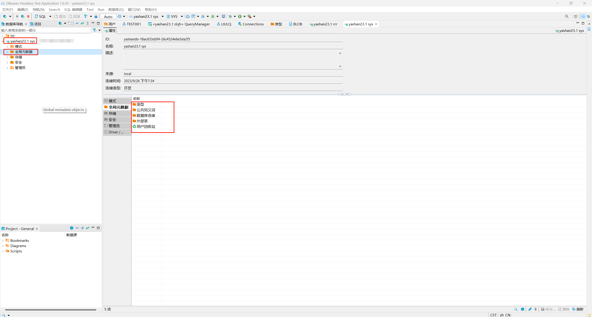
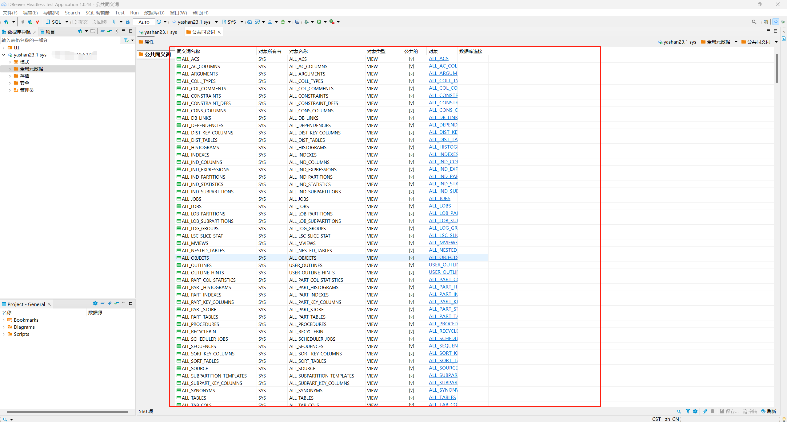
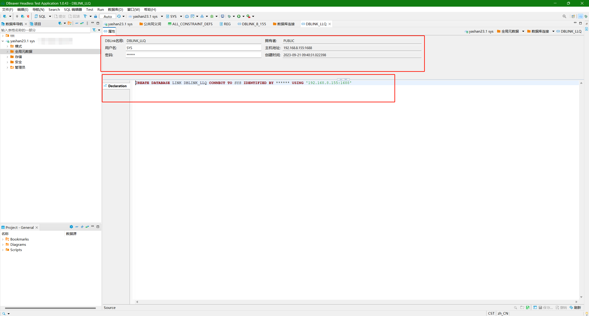
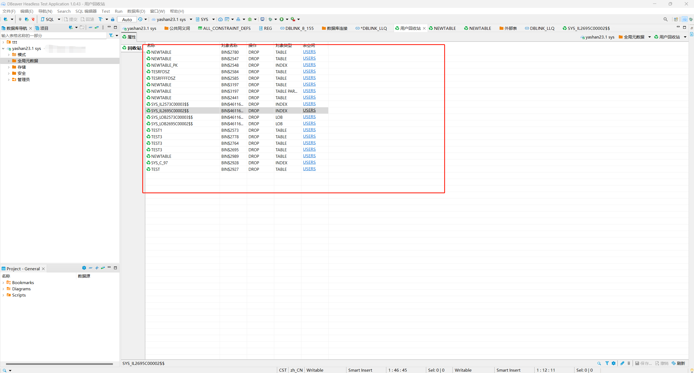
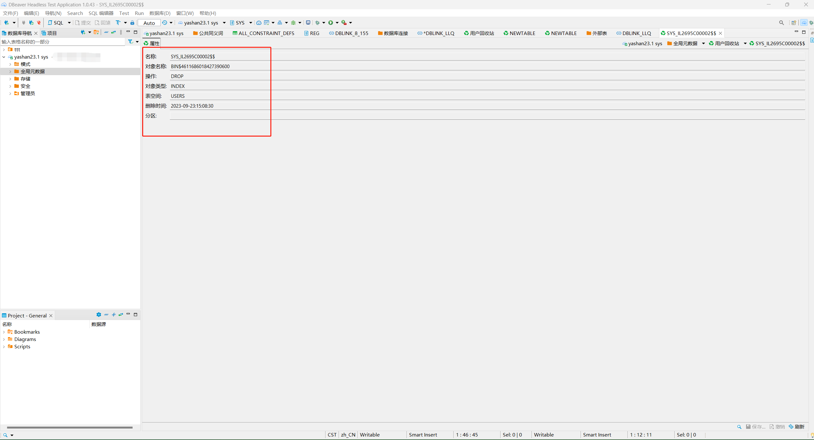

本文档介绍如何在DBeaver中对YashanDB的全局元数据对象进行查询，包括**类型、公共同义词、数据库连接、外部表、用户回收站**五种对象。

在DBeaver左侧数据库导航中找到需要查看全局元数据对象的YashanDB连接，双击此对象展开一级菜单，再双击一级菜单下的**全局元数据**菜单，在右侧弹出新界面，展示全局元数据对象子菜单。

## 类型查询
本节介绍如何在DBeaver中查询YashanDB中的预定义数据类型。

### GRANT PERMISSIONS
使用DBeaver查询YashanDB中的预定义数据类型，无需数据库权限。  

### 类型查询操作
双击全局元数据下**类型**子菜单，弹出新界面展示当前YashanDB中所有预定义数据类型。
  

**限制说明**：在YashanDB单机类型数据库中支持以上所有数据类型。  
&emsp;&emsp;&emsp;&emsp;&emsp; 在YashanDB分布式类型数据库中，不支持BIT/CURSOR/NCHAR/NCLOB/NVARCHAR/RECOED/ROWID。  
&emsp;&emsp;&emsp;&emsp;&emsp; 在YashanDB集群类型数据库中，不支持GEOMETRY。

选中具体的数据类型并双击，弹出新界面，查看此类型的概览信息。

## 公共同义词查询
本节介绍如何在DBeaver中查询YashanDB中的公共同义词对象。

### GRANT PERMISSIONS
使用DBeaver查询YashanDB中的公共同义词对象，无需数据库权限。

### 公共同义词查询操作
双击全局元数据下**公共同义词**子菜单，弹出新界面，展示当前YashanDB中所有公共同义词对象。

选中具体的公共同义词对象并双击，弹出新界面，查看概览信息。

## 数据库连接查询
本节介绍如何在DBeaver中查询YashanDB的公共数据库连接。

### GRANT PERMISSIONS
使用DBeaver查询YashanDB中的公共数据库连接对象，无需数据库权限。

### 数据库连接查询操作
双击全局元数据下**数据库连接**子菜单，弹出新界面，展示当前YashanDB中所有公共的数据库连接对象。

选中具体的数据库连接对象并双击，弹出新界面，查看具体信息。其中上方属性子页面为信息概览，下方文本框展示对象DDL。

## 外部表查询
在YashanDB中，全局元数据目录下的外部表与数据库连接子目录展示相同对象，相关说明可参考数据库连接查询。

## 用户回收站查询
本节介绍如何在DBeaver中查询YashanDB的回收站信息。

### GRANT PERMISSIONS
使用DBeaver查询YashanDB中的回收站对象，请确保当前用户具有对以下视图的查询权限。

| 视图             | 说明             |
|----------------|----------------|
| ALL_RECYCLEBIN | sys用户无需此视图查询权限 |

### 用户回收站查询操作
双击全局元数据下**用户回收站**子菜单，弹出新界面，展示当前YashanDB中所有回收站对象。

选中具体的对象并双击，弹出新界面，查看此对象概览信息。

