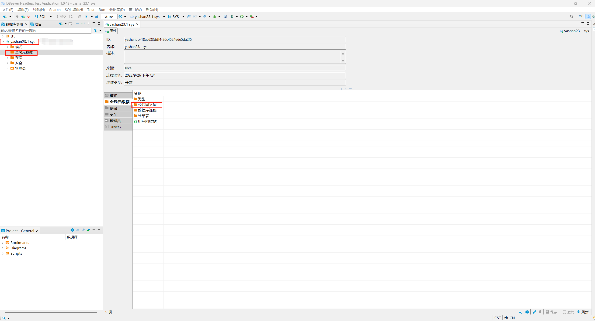
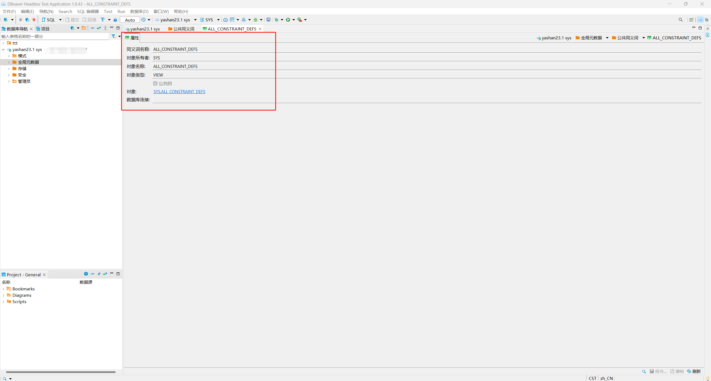

*本文档介绍如何在DBeaver中查看YashanDB的公共同义词*

在DBeaver左侧数据库导航中找到需要查看公共同义词对象的YashanDB连接，双击此对象展开一级菜单，再双击一级菜单下的`全局元数据`菜单，在右侧出现`公共同义词`菜单。

双击`公共同义词`菜单，弹出新界面，展示当前YashanDB中所有公共同义词对象。

选中具体的公共同义词对象并双击，弹出新界面，查看概览信息。

