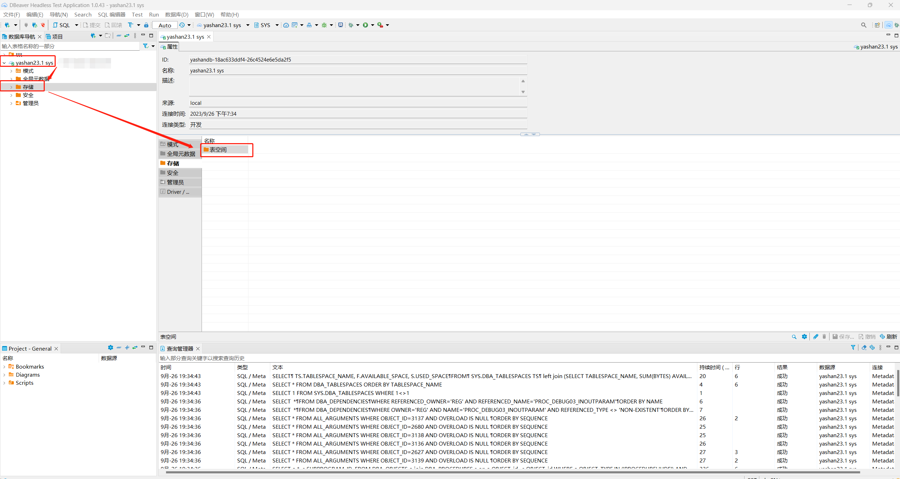
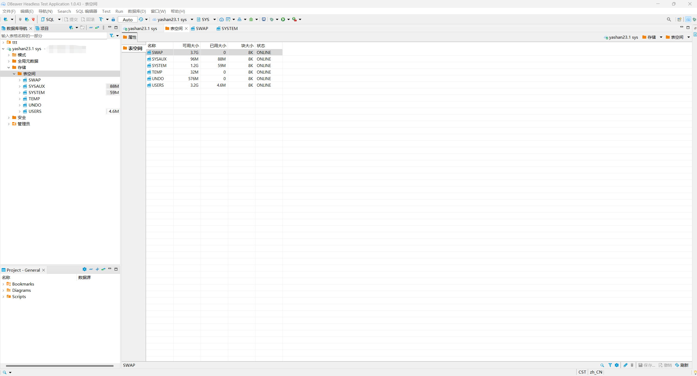
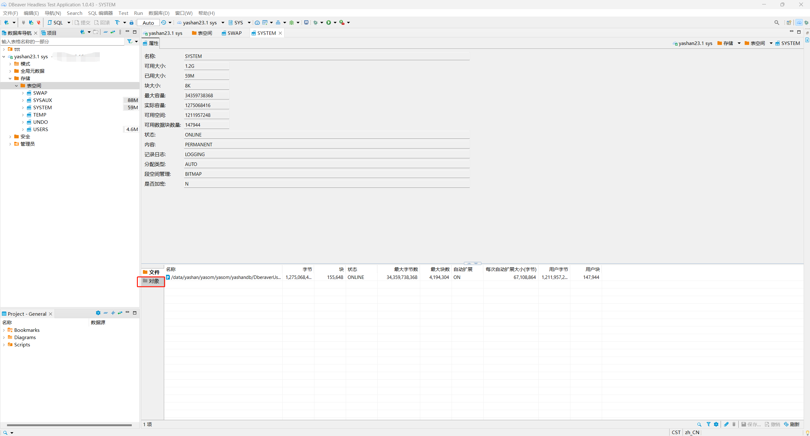
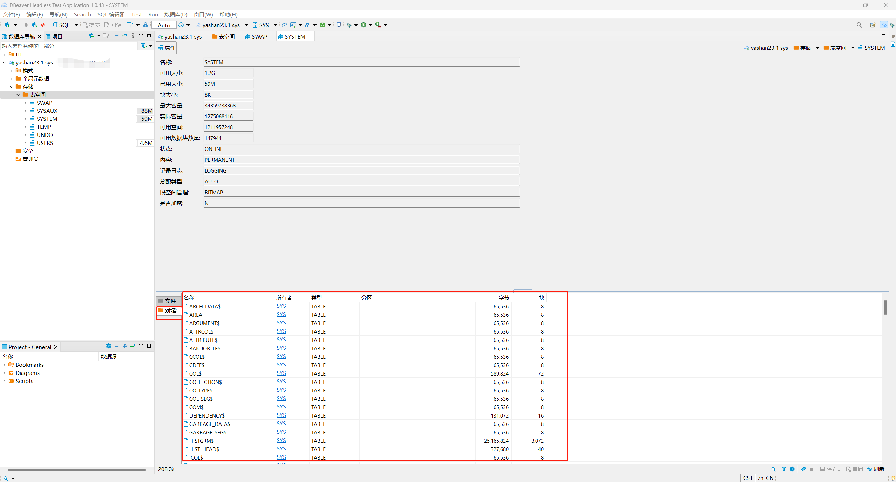

本文档介绍如何在DBeaver中对YashanDB的存储对象进行查询，目前包括**表空间**对象。

在DBeaver左侧数据库导航中找到需要查看表空间对象的YashanDB连接，双击此对象展开一级菜单，再双击一级菜单下的**存储**菜单，在右侧出现**表空间**子菜单。

## 表空间查询
本节介绍如何在DBeaver中查询YashanDB中的表空间对象。

<<<<<<< Updated upstream
### GRANT PERMISSIONS
=======
### 权限需求
>>>>>>> Stashed changes
使用DBeaver查询YashanDB中的表空间对象，请确保当前用户具有对以下视图的查询权限。

| 视图             | 说明             |
|----------------|----------------|
| DBA_DATA_FILES | sys用户已有查询权限    |
| DBA_SEGMENTS | sys用户已有查询权限 |
| DBA_TABLESPACES | sys用户已有查询权限 |

### 表空间查询操作
双击**表空间**子菜单，弹出新界面展示当前YashanDB连接下所有的表空间对象。
<<<<<<< Updated upstream

选中具体的表空间对象并双击，弹出新界面，展示此对象的详细信息，在界面下方有**文件**和**对象**子菜单，默认展示**文件**子菜单内容。

双击**对象**子菜单，如果此表空间对象下存在子对象，则展示所有子对象。
=======

选中具体的表空间对象并双击，弹出新界面，展示此对象的详细信息，在界面下方有**文件**和**对象**子菜单，默认展示**文件**子菜单内容。

双击**对象**子菜单，如果此表空间对象下存在子对象，则展示所有子对象。

>>>>>>> Stashed changes

