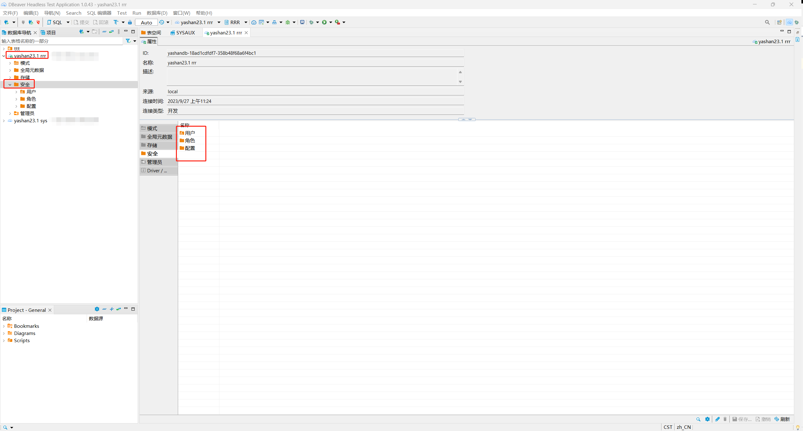
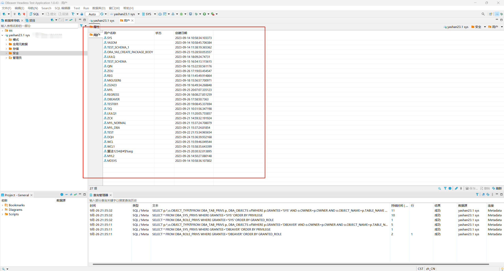
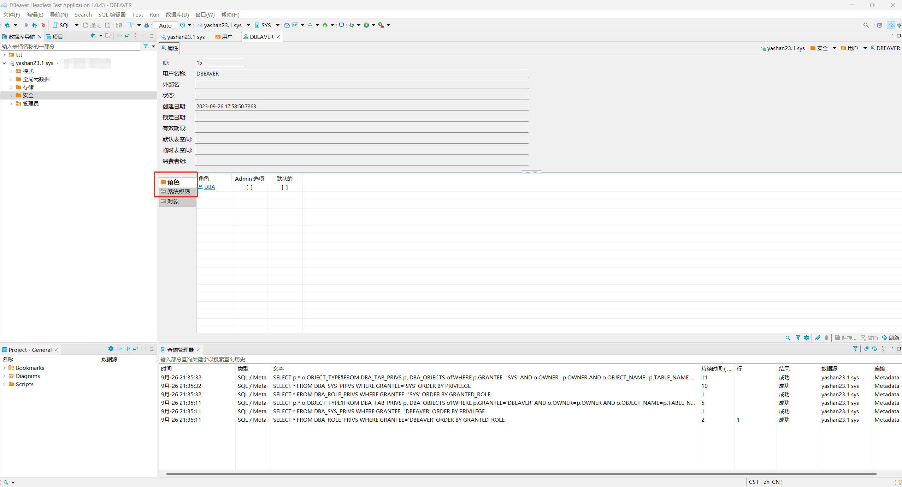
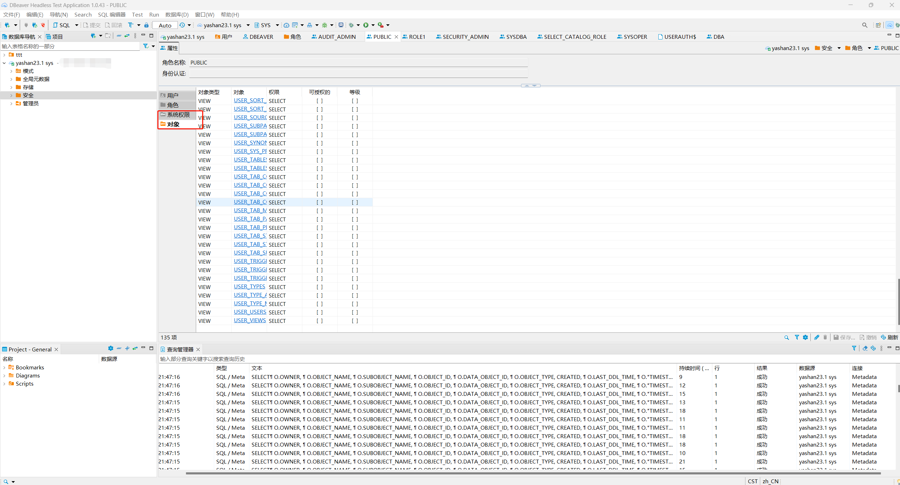
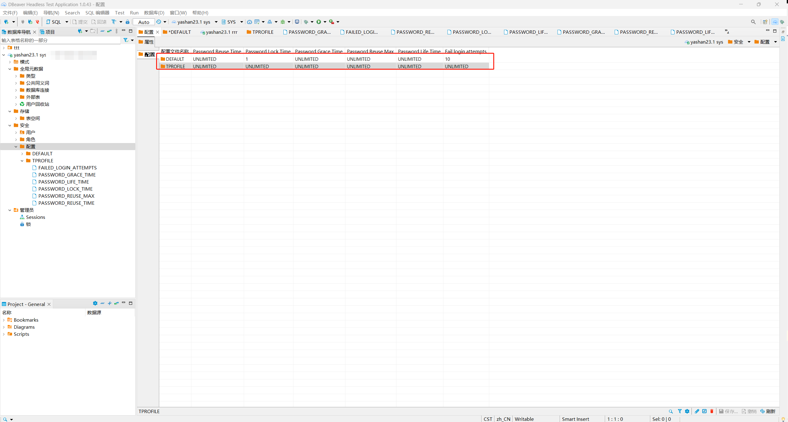
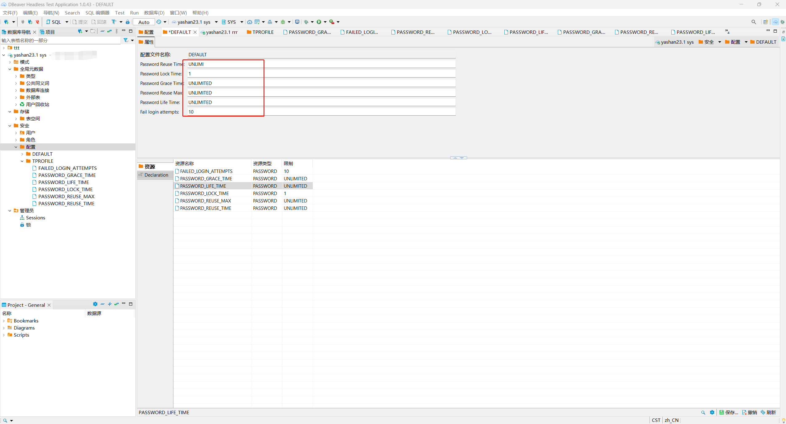
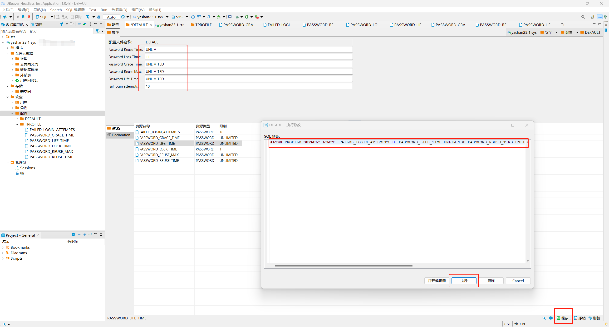

本文档介绍如何在DBeaver中YashanDB的安全目录下对部分子对象进行管理，包括**用户、角色、配置**三种对象。

在DBeaver左侧数据库导航中找到需要查看安全目录下对象的YashanDB连接，双击此对象展开一级菜单，再双击一级菜单下的**安全**菜单，在右侧弹出新界面，展示子菜单。

## 用户查询
本节介绍如何在DBeaver中查询YashanDB的所有用户对象。

### GRANT PERMISSIONS
使用DBeaver查询YashanDB中的用户对象，请确保当前用户具有对以下视图的查询权限。

| 视图             | 说明          |
|----------------|-------------|
| DBA_ROLE_PRIVS | sys用户已有查询权限 |
| DBA_SYS_PRIVS | sys用户已有查询权限 |
| DBA_TAB_PRIVS | sys用户已有查询权限 |
| DBA_OBJECTS | sys用户已有查询权限 |
| ALL_TAB_PRIVS | sys用户已有查询权限 |
| ALL_OBJECTS | sys用户已有查询权限 |

### 用户查询操作
双击安全目录下**用户**菜单，弹出新界面，展示当前YashanDB中所有用户对象。

选中具体的对象并双击，弹出新界面，查看此对象概览信息。点击下方**角色**子菜单，如果为当前用户创建了角色，则展示角色信息；点击下方**系统权限**子菜单，如果为当前用户授予了权限，则会展示所授予的权限。

## 角色查询
本节介绍如何在DBeaver中查询YashanDB中的类Normal类型的角色对象。

### GRANT PERMISSIONS
使用DBeaver查询YashanDB中的角色对象，请确保当前用户具有对以下视图的查询权限。

| 视图             | 说明          |
|----------------|-------------|
| DBA_ROLES      | sys用户已有查询权限 |
| DBA_ROLE_PRIVS | sys用户已有查询权限 |
| DBA_SYS_PRIVS  | sys用户已有查询权限 |
| DBA_TAB_PRIVS  | sys用户已有查询权限 |
| DBA_OBJECTS  | sys用户已有查询权限 |
| DBA_TABLES  | sys用户已有查询权限 |

### 角色查询操作
双击安全目录下**角色**菜单，弹出新界面，展示当前YashanDB中所有类Normal类型的角色对象。

选中具体的对象并双击，弹出新界面，查看此对象概览信息。点击下方**对象**子菜单，可以展示当前角色对视图、表等对象的权限；点击下方**系统权限**子菜单，如果为当前角色授予了权限，则会展示所授予的权限。

## 配置管理
本节介绍如何在DBeaver中对YashanDB的配置对象进行管理。

### GRANT PERMISSIONS
使用DBeaver查询YashanDB中的配置对象，请确保当前用户具有对以下视图的查询权限。

| 视图             | 说明          |
|----------------|-------------|
| DBA_PROFILES      | sys用户已有查询权限 |

使用DBeaver对YashanDB的配置对象进行管理，请确保当前用户具有如下权限：

| 权限            | 说明          |
|---------------|-------------|
| ALTER PROFILE | sys用户已有修改权限 |
| DROP PROFILE  | sys用户已有删除权限 |

### 配置对象管理操作
双击安全目录下**配置**子菜单，弹出新界面，展示当前YashanDB中所有配置对象。

选中具体的配置对象并双击，弹出新界面，查看具体信息。其中上方属性子页面为信息概览，除配置文件名称以外的其他属性值可以在编辑框进行修改；下方资源子菜单展示配置对象属性详细信息，Declaration子菜单展示对象DDL。

如果需要对当前配置对象的属性值进行修改，可以在上方属性子页面输入框设置需要修改的对象值，然后点击保存按钮，弹出修改属性的SQL预览框，确认后点击执行即可执行SQL对属性值进行持久化修改。

