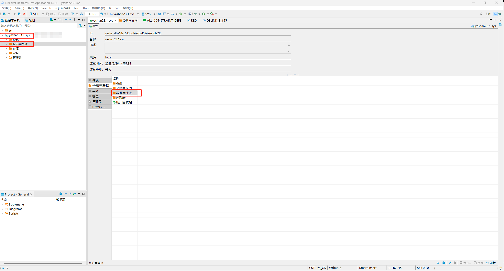
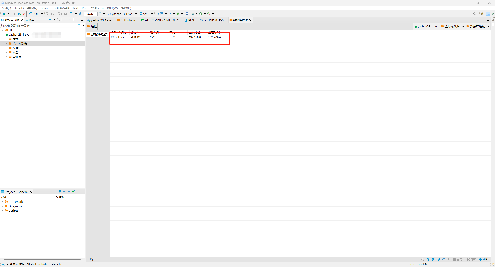

*本文档介绍如何在DBeaver中查看数据库连接对象*

在DBeaver左侧数据库导航中找到需要查看数据库连接对象的YashanDB连接，双击此对象展开一级菜单，再双击一级菜单下的`全局元数据`菜单，在右侧出现`数据库连接`菜单。

双击`数据库连接`菜单，弹出新界面，展示当前YashanDB中所有公共的数据库连接对象。

选中具体的数据库连接对象并双击，弹出新界面，查看具体信息。其中上方属性子页面为信息概览，下方文本框展示对象DDL。

