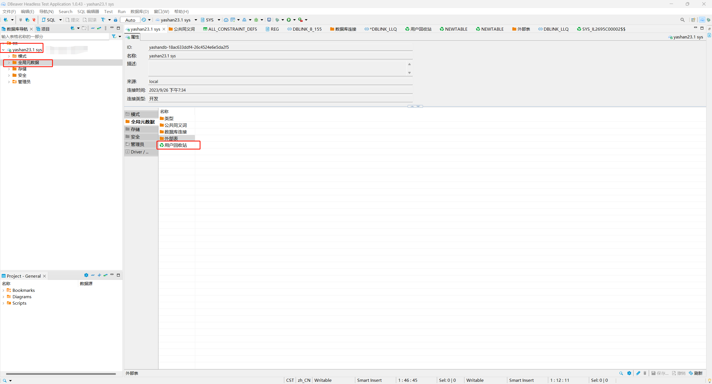

*本文档介绍如何在DBeaver中查看YashanDB的所有回收站对象*

## 普通用户所需权限
普通用户需要有对ALL_RECYCLEBIN视图的查询权限。

在DBeaver左侧数据库导航中找到需要查看回收站对象的YashanDB连接，双击此对象展开一级菜单，再双击一级菜单下的`全局元数据`菜单，在右侧出现`用户回收站`菜单。

双击`用户回收站`菜单，弹出新界面，展示当前YashanDB中所有回收站对象。

选中具体的对象并双击，弹出新界面，查看此对象概览信息。

