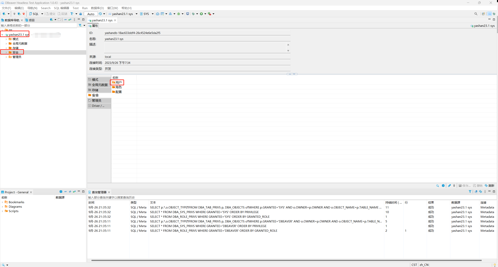

*本文档介绍如何在DBeaver中查看YashanDB的所有用户对象*

在DBeaver左侧数据库导航中找到需要查看用户对象的YashanDB连接，双击此对象展开一级菜单，再双击一级菜单下的`安全`菜单，在右侧出现`用户`菜单。

双击`用户`菜单，弹出新界面，展示当前YashanDB中所有用户对象。

选中具体的对象并双击，弹出新界面，查看此对象概览信息。点击下方`角色`子菜单，如果为当前用户创建了角色，则展示角色信息；点击下方`系统权限`子菜单，如果为当前用户授予了权限，则会展示所授予的权限。

