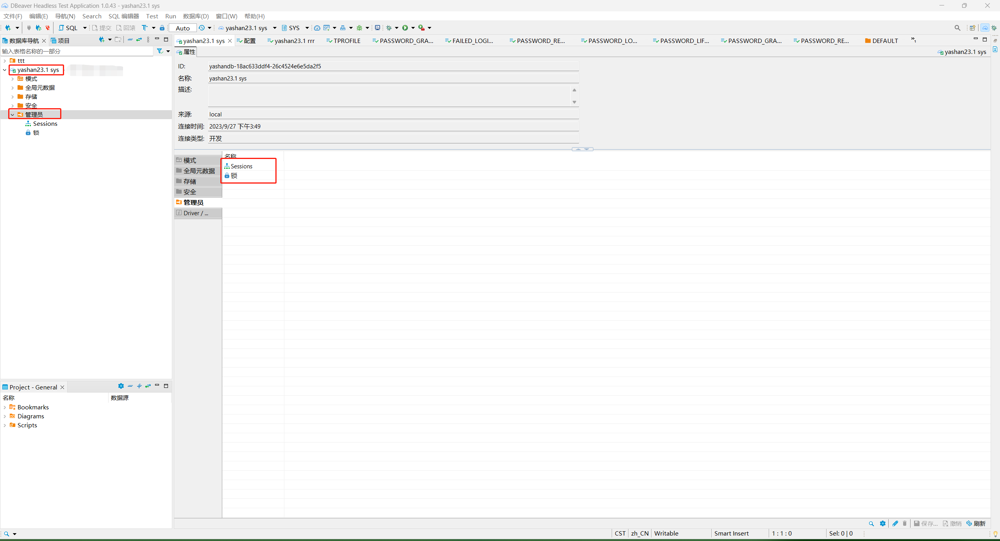
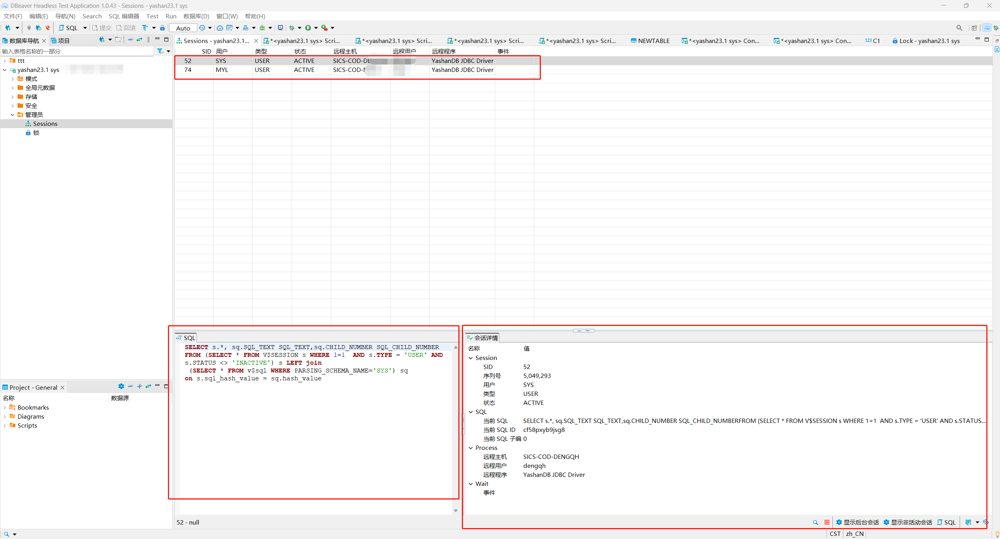
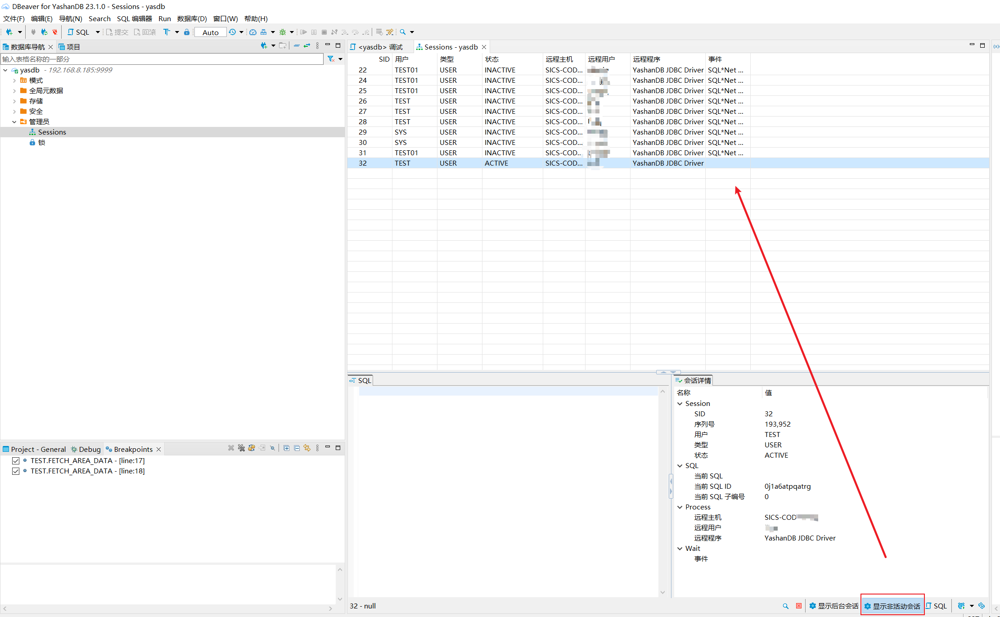
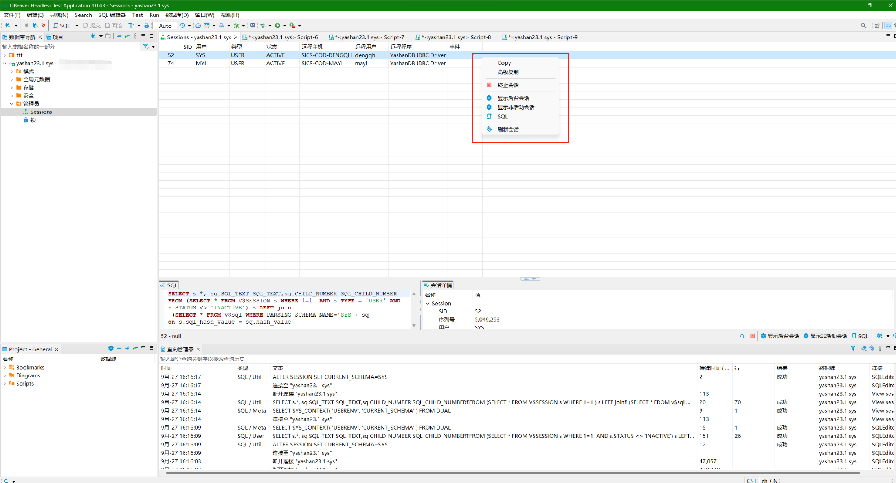
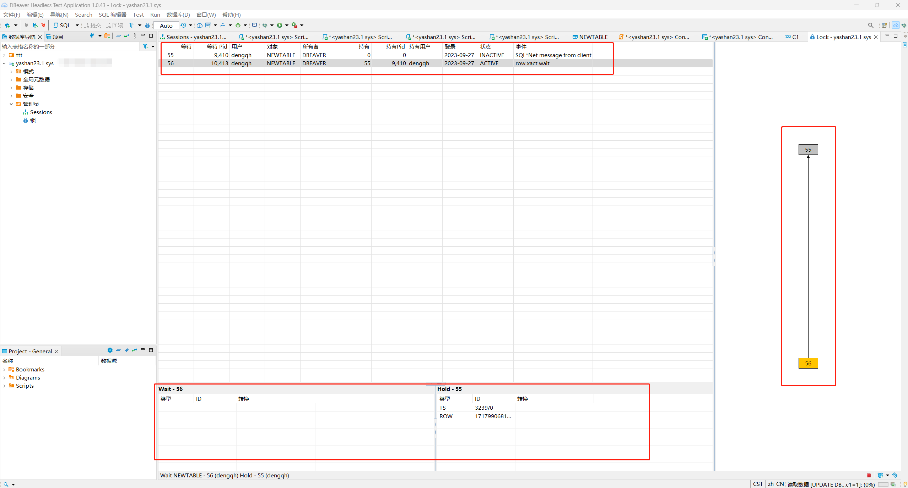
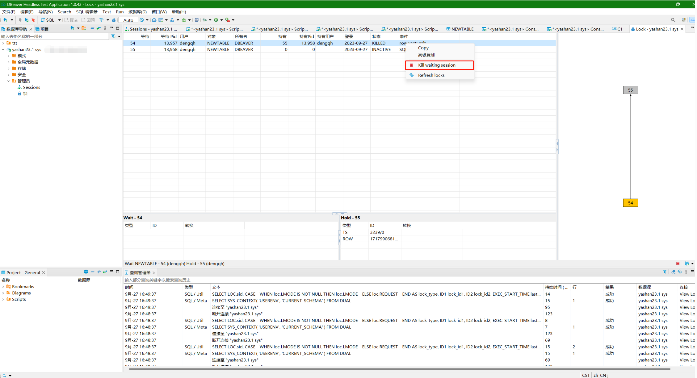

本文档介绍如何在DBeaver中YashanDB的管理员目录下对部分子对象进行管理，包括**锁、会话**两种对象。

在DBeaver左侧数据库导航中找到需要查看管理员目录下对象的YashanDB连接，双击此对象展开一级菜单，再双击一级菜单下的**管理员**菜单，在右侧弹出新界面，展示子菜单。
<<<<<<< Updated upstream
=======

>>>>>>> Stashed changes

## 会话管理
本节介绍如何在DBeaver中管理YashanDB的会话对象。

<<<<<<< Updated upstream
### GRANT PERMISSIONS
=======
### 权限需求
>>>>>>> Stashed changes
使用DBeaver查询YashanDB中的会话对象，请确保当前用户具有对以下视图的查询权限。

| 视图            | 说明          |
|---------------|-------------|
| V$SQL         | sys用户已有查询权限 |
| V$SESSION | sys用户已有查询权限 |

使用DBeaver管理会话，请确保当前用户具有以下权限：

| 权限           | 说明          |
|--------------|-------------|
| ALTER SYSTEM | sys用户已有此权限  |

### 会话管理操作
双击管理员目录下**Sessions**菜单，弹出新界面，展示当前活跃的会话，鼠标点击通过当前DBeaver连接数据库的会话，会在左下侧**SQL**子菜单展示该会话的查询SQL（**注意**：仅有此会话对象展示查询SQL，点击其他会话对象无此效果），右下侧**会话详情**子菜单则展示当前选中会话的统计信息（此子菜单点击所有会话均会输出统计信息）。
<<<<<<< Updated upstream

点击右下角按钮可以显示后台会话。

点击右下角按钮显示非活动会话。

选中具体的对象，右键弹出菜单，点击高级复制可以复制该会话在界面上展示的所有属性值和对应的字段名；点击终止会话可以结束该会话；点击SQL会在新窗口中执行对应SQL查询出当前界面展示的所有会话对象详细信息。
=======

点击右下角按钮可以显示后台会话。

点击右下角按钮显示非活动会话。

选中具体的对象，右键弹出菜单，点击高级复制可以复制该会话在界面上展示的所有属性值和对应的字段名；点击终止会话可以结束该会话；点击SQL会在新窗口中执行对应SQL查询出当前界面展示的所有会话对象详细信息。

>>>>>>> Stashed changes

## 锁管理
本节介绍如何在DBeaver中管理YashanDB中的锁对象。

<<<<<<< Updated upstream
### GRANT PERMISSIONS
=======
### 权限需求
>>>>>>> Stashed changes
使用DBeaver查询锁，请确保当前用户具有以下视图查询权限：

| 视图             | 说明          |
|----------------|-------------|
| v$session      | sys用户已有查询权限 |
| v$lock | sys用户已有查询权限 |
| v$process  | sys用户已有查询权限 |
| v$transaction  | sys用户已有查询权限 |
| v$locked_object  | sys用户已有查询权限 |
| dba_objects  | sys用户已有查询权限 |
| DV$LOCK  | sys用户已有查询权限 |
| DV$SESSION  | sys用户已有查询权限 |
| DV$PROCESS  | sys用户已有查询权限 |

使用DBeaver管理锁，请确保当前用户具有以下权限：

| 权限           | 说明          |
|--------------|-------------|
| ALTER SYSTEM | sys用户已有此权限  |

### 锁管理操作
双击管理员目录下**锁**菜单，弹出新界面，展示当前YashanDB中所有锁对象详细信息。下方展示锁对象的持有、等待对象以及锁类型，右侧可视化展示持有、等待的情况。
<<<<<<< Updated upstream

选中具体的对象并点击右键，弹出菜单界面。点击**kill waiting session**选项，可以结束当前正在等待锁的会话。
=======

选中具体的对象并点击右键，弹出菜单界面。点击**kill waiting session**选项，可以结束当前正在等待锁的会话。

>>>>>>> Stashed changes

