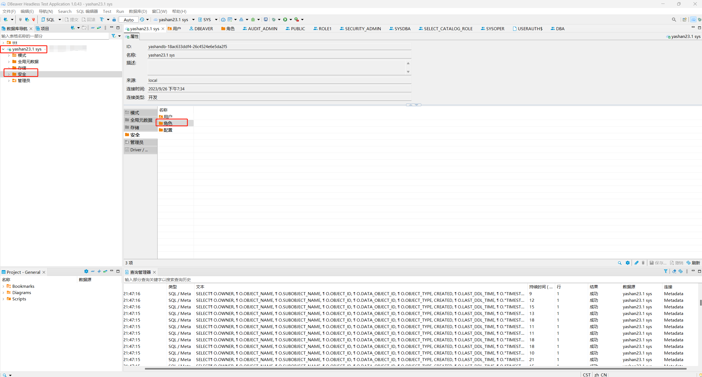
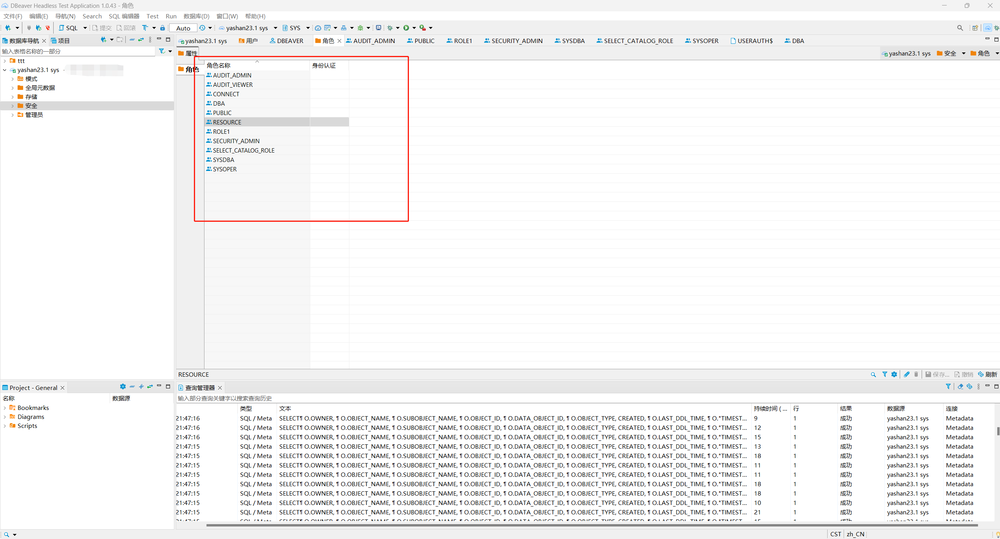

*本文档介绍如何在DBeaver中查看YashanDB的类Normal类型的角色对象*

## 普通用户所需权限
普通用户需要有对DBA_ROLES视图的查询权限。

在DBeaver左侧数据库导航中找到需要查看角色对象的YashanDB连接，双击此对象展开一级菜单，再双击一级菜单下的`安全`菜单，在右侧出现`角色`菜单。

双击`角色`菜单，弹出新界面，展示当前YashanDB中所有类Normal类型的角色对象。

选中具体的对象并双击，弹出新界面，查看此对象概览信息。点击下方`对象`子菜单，可以展示当前角色对视图、表等对象的权限；点击下方`系统权限`子菜单，如果为当前角色授予了权限，则会展示所授予的权限。

