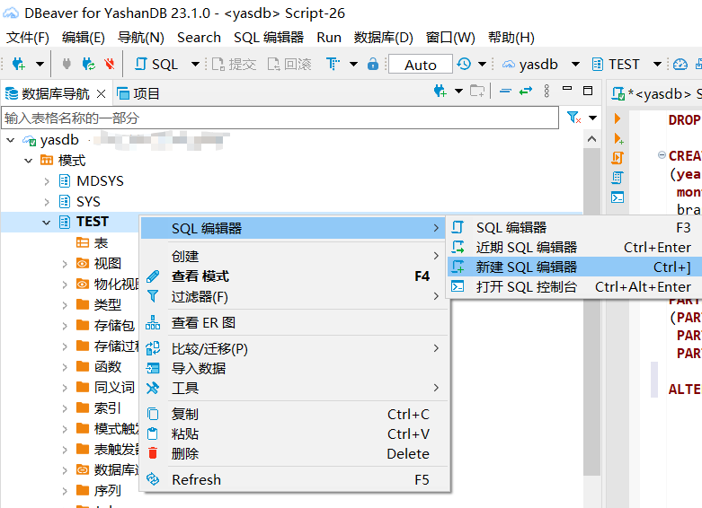
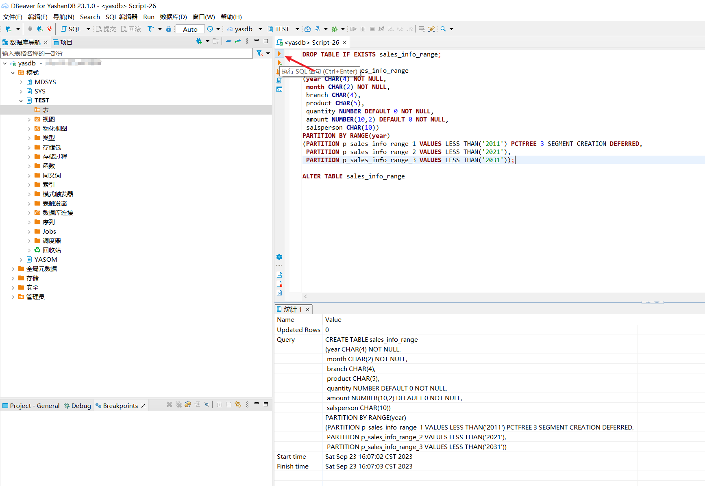
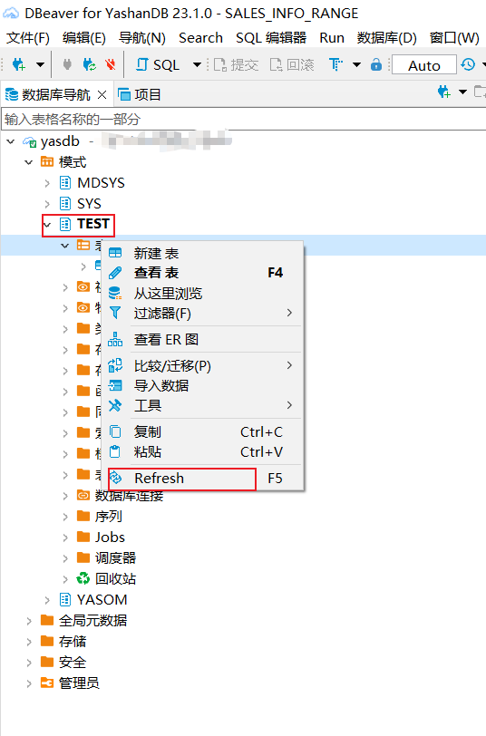
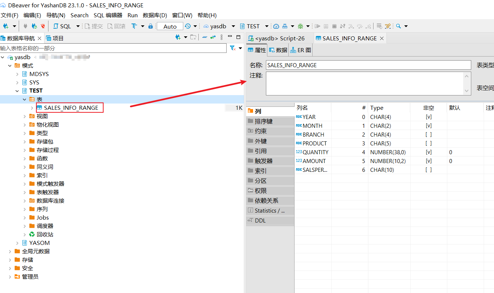
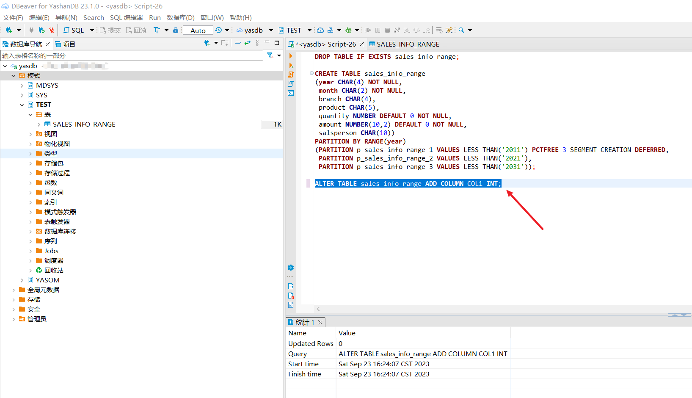
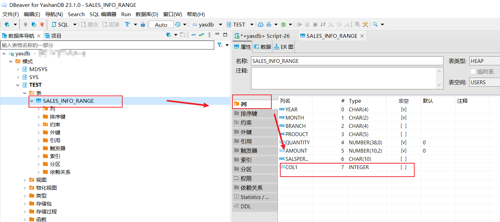
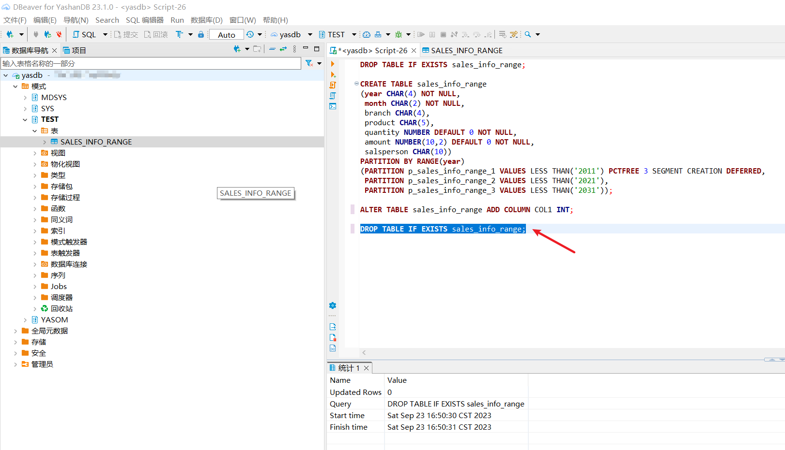
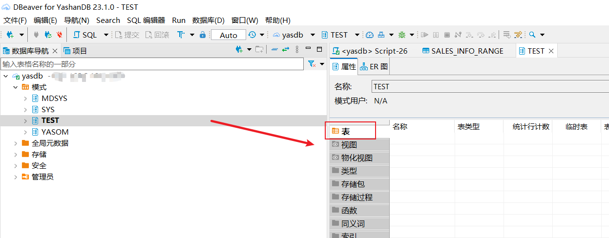

本文档以表操作展示通过SQL编辑器执行常见的DDL。

## CREATE TABLE

这里参考YashanDB文档给的创建分区表的示例。 [YashanDB Doc (yasdb.com)](https://cod-doc.yasdb.com/yashandb/alpha/zh/开发手册/SQL参考手册/SQL语句/CREATE TABLE.html#table-partition-description) 

```sql
DROP TABLE IF EXISTS sales_info_range;

CREATE TABLE sales_info_range
(year CHAR(4) NOT NULL,
 month CHAR(2) NOT NULL,
 branch CHAR(4),
 product CHAR(5),
 quantity NUMBER DEFAULT 0 NOT NULL,
 amount NUMBER(10,2) DEFAULT 0 NOT NULL,
 salsperson CHAR(10))
PARTITION BY RANGE(year)
(PARTITION p_sales_info_range_1 VALUES LESS THAN('2011') PCTFREE 3 SEGMENT CREATION DEFERRED,
 PARTITION p_sales_info_range_2 VALUES LESS THAN('2021'),
 PARTITION p_sales_info_range_3 VALUES LESS THAN('2031'));
```

在数据库导航中，选择需要建表的Schema，右键选择



在右侧编辑器窗口，将SQL语句填入，选中行，点击左侧黄色按钮（或者使用快捷键ALT+ENTER）执行SQL语句。返回值在下方统计可以查看。



在左侧数据库导航，右键点击Schema，选择刷新，即可看到表已成功展现。





## ALTER TABLE
基于上面创建的表，展示执行给表增加列的SQL。

```sql
ALTER TABLE sales_info_range ADD COLUMN COL1 INT;
```

执行此语句，刷新Shcema，双击表，可以看到列已成功增加。




## DROP TABLE

基于上面创建的表，展示删除表的SQL。

```sql
DROP TABLE IF EXISTS sales_info_range;
```

执行此语句，刷新Schema，可以看到表已经不存在了。



