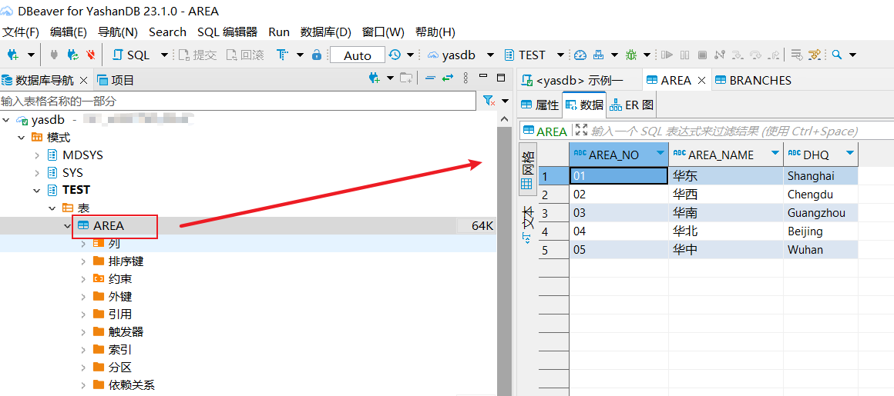
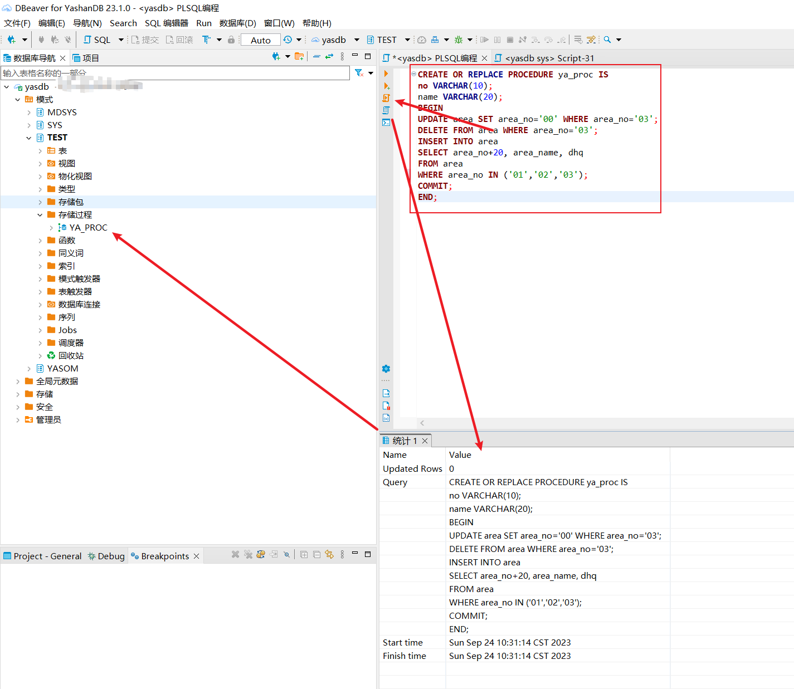
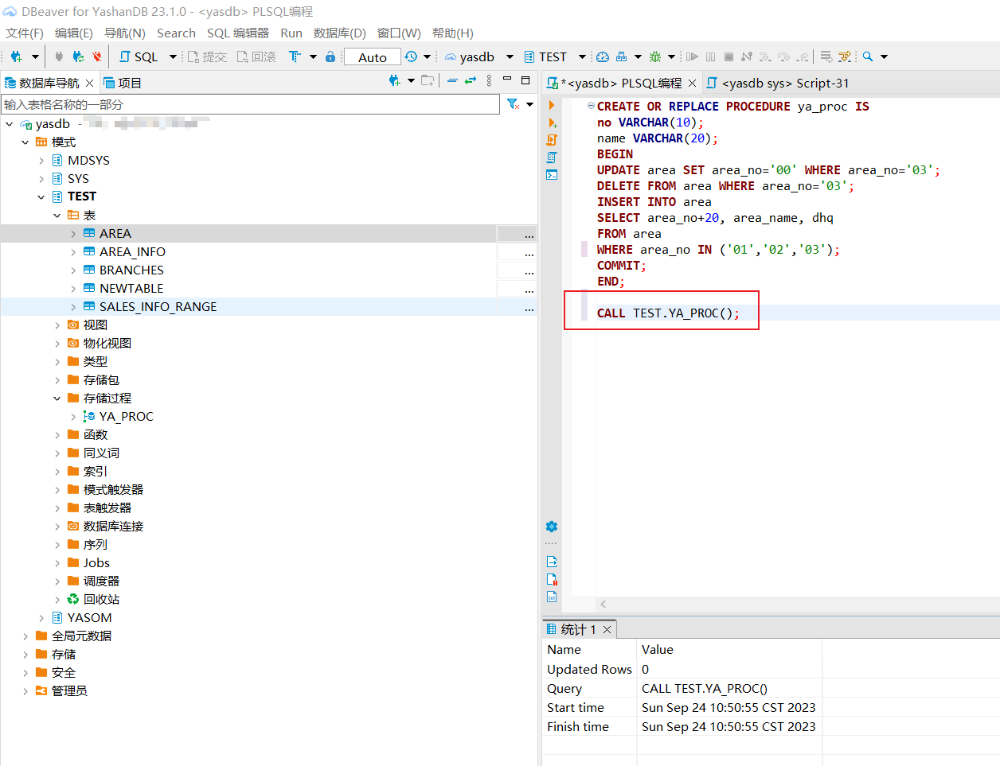
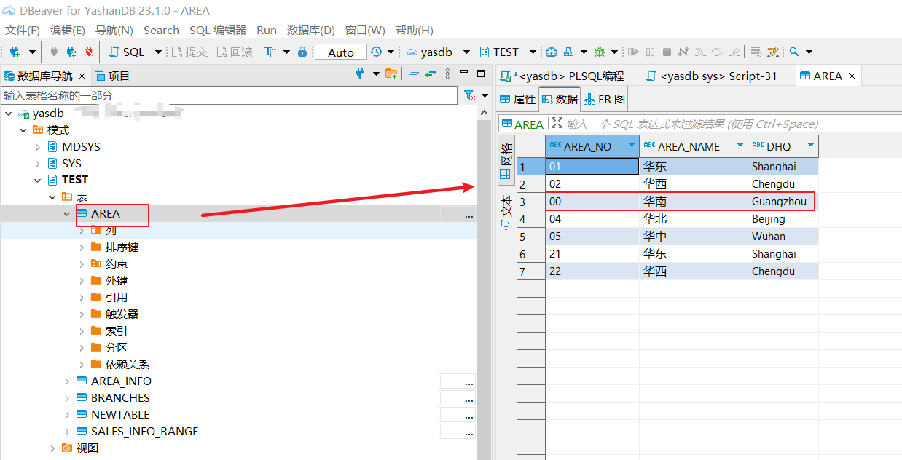

本文档介绍如何在DBeaver中进行PLSQL编程。

## 权限需求
在使用PLSQL编程前，确保使用的用户有如下权限：

| 权限                  | 说明                                                 |
| --------------------- | ---------------------------------------------------- |
| CREATE ANY PROCEDURE  | 在任意schema下创建过程体或函数（sys schema除外）     |
| ALTER ANY PROCEDURE   | 修改任意schema下过程体或函数的属性（sys schema除外） |
| DROP ANY PROCEDURE    | 删除任意过程体或函数（sys schema除外）               |
| EXECUTE ANY PROCEDURE | 执行任意过程体或函数（sys schema除外）               |

DBeaver For YashanDB不支持将DBMS_OUTPUT等输出文本至结果栏。


准备表和数据如下：

```sql
--区域信息表
CREATE TABLE area
(area_no CHAR(2) NOT NULL PRIMARY KEY,
 area_name VARCHAR2(60),
 DHQ VARCHAR2(20) DEFAULT 'ShenZhen' NOT NULL);
INSERT INTO area VALUES ('01','华东','Shanghai');
INSERT INTO area VALUES ('02','华西','Chengdu');
INSERT INTO area VALUES ('03','华南','Guangzhou');
INSERT INTO area VALUES ('04','华北','Beijing');
INSERT INTO area VALUES ('05','华中','Wuhan');
```

将上面语句复制到编辑器，选中后点击左侧 执行SQL脚本 按钮，执行SQL语句。

刷新Schema后可以看到表已创建，数据已插入。



我们创建一个存储过程如下：

```sql
CREATE OR REPLACE PROCEDURE ya_proc IS
no VARCHAR(10);
name VARCHAR(20);
BEGIN
UPDATE area SET area_no='00' WHERE area_no='03';  
DELETE FROM area WHERE area_no='03'; 
INSERT INTO area 
SELECT area_no+20, area_name, dhq 
FROM area 
WHERE area_no IN ('01','02','03');
COMMIT;      
END;
```
这个存储过程演示了在存储过程中使用DML语句。
将上面的SQL语句复制到编辑器，成功执行，刷新左侧Schema，可以看到存储过程目录下已存在创建好的存储过程。



调用此存储过程：



刷新Schema，查看AREA表的数据，可以看到原AREA_NO为03的行，值已更改为00。

