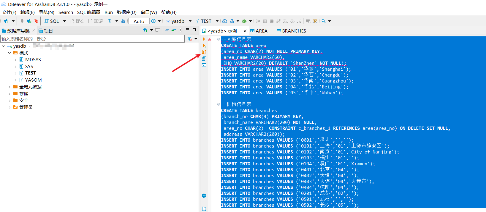
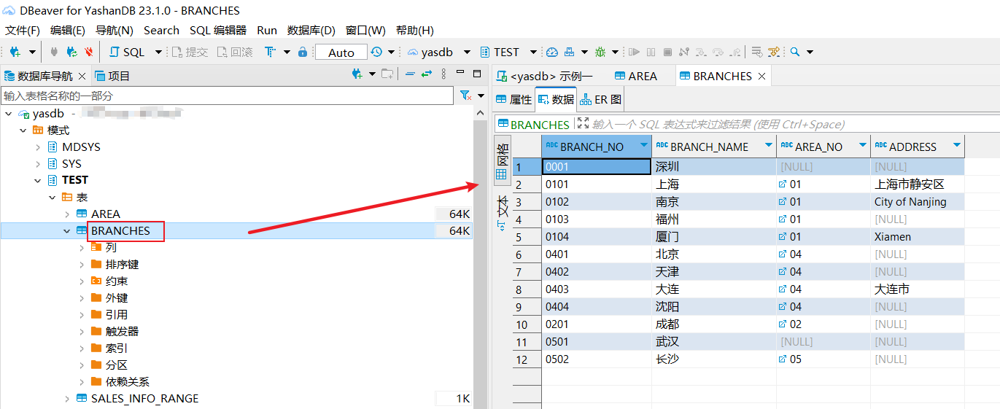
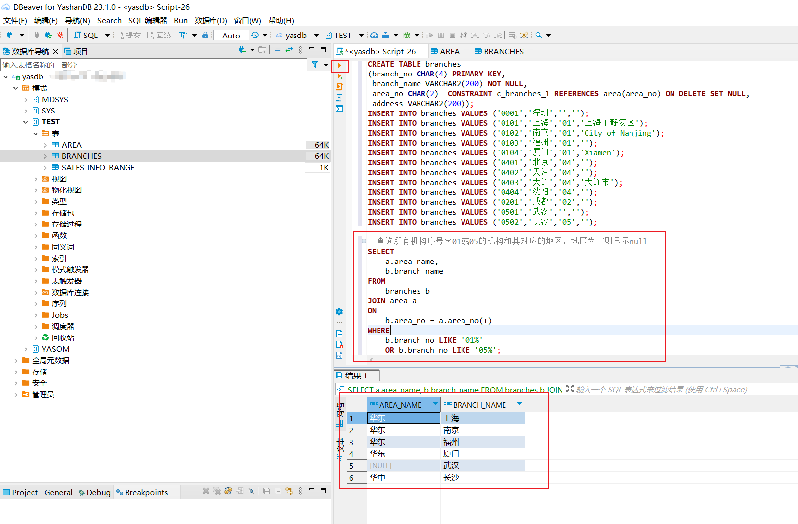
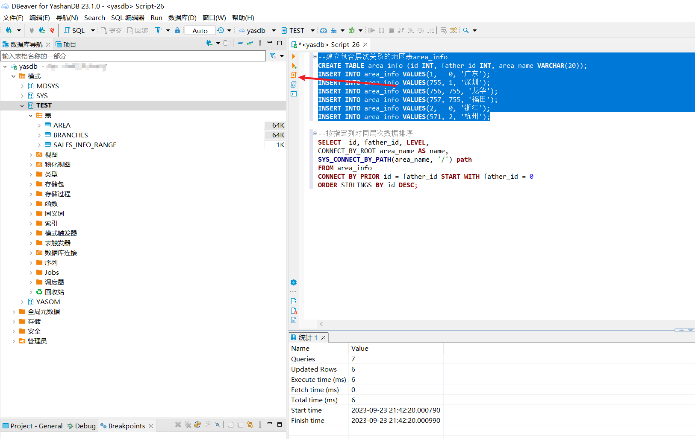
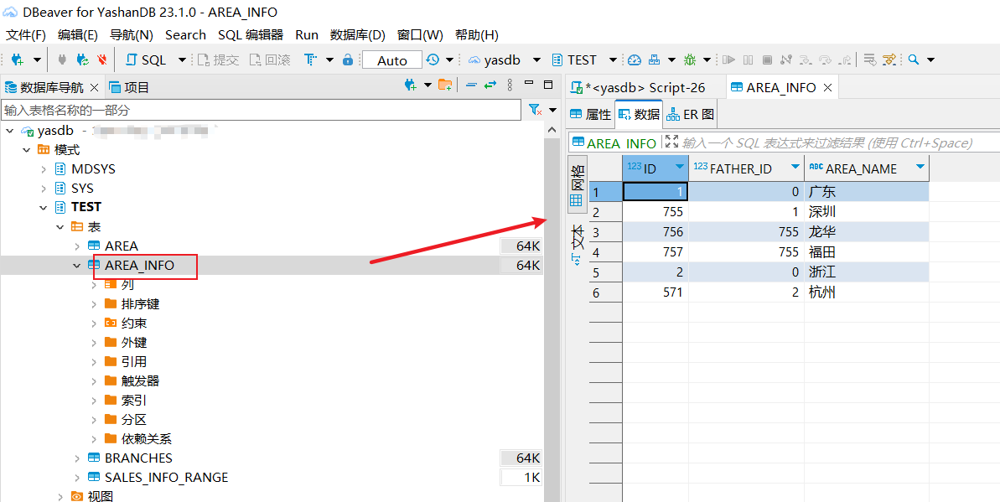
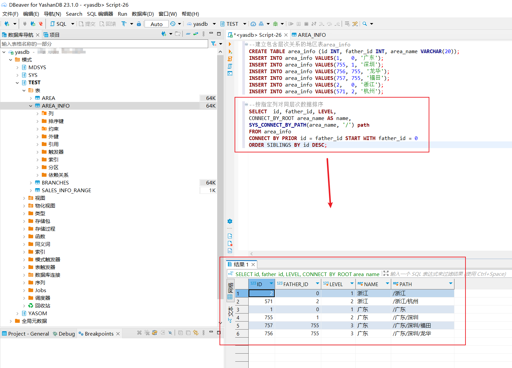

本文档展示使用DBeaver for YashanDB执行复杂的查询语句。

## 示例1
首先准备两张表和数据如下代码所示：

```sql
--区域信息表
CREATE TABLE area
(area_no CHAR(2) NOT NULL PRIMARY KEY,
 area_name VARCHAR2(60),
 DHQ VARCHAR2(20) DEFAULT 'ShenZhen' NOT NULL);
INSERT INTO area VALUES ('01','华东','Shanghai');
INSERT INTO area VALUES ('02','华西','Chengdu');
INSERT INTO area VALUES ('03','华南','Guangzhou');
INSERT INTO area VALUES ('04','华北','Beijing');
INSERT INTO area VALUES ('05','华中','Wuhan');
  
--机构信息表
CREATE TABLE branches
(branch_no CHAR(4) PRIMARY KEY,
 branch_name VARCHAR2(200) NOT NULL,
 area_no CHAR(2)  CONSTRAINT c_branches_1 REFERENCES area(area_no) ON DELETE SET NULL,
 address VARCHAR2(200));
INSERT INTO branches VALUES ('0001','深圳','','');
INSERT INTO branches VALUES ('0101','上海','01','上海市静安区');
INSERT INTO branches VALUES ('0102','南京','01','City of Nanjing');
INSERT INTO branches VALUES ('0103','福州','01','');
INSERT INTO branches VALUES ('0104','厦门','01','Xiamen');
INSERT INTO branches VALUES ('0401','北京','04','');
INSERT INTO branches VALUES ('0402','天津','04','');
INSERT INTO branches VALUES ('0403','大连','04','大连市');
INSERT INTO branches VALUES ('0404','沈阳','04','');
INSERT INTO branches VALUES ('0201','成都','02','');
INSERT INTO branches VALUES ('0501','武汉','','');
INSERT INTO branches VALUES ('0502','长沙','05','');
```

将上面语句复制到编辑器，选中后点击左侧 执行SQL脚本 按钮，执行SQL语句。


刷新Schema后可以看到表已创建，数据已插入。





我们需要查询所有机构序号含01或05的机构和其对应的地区，地区为空则显示null。

这里可以使用YashanDB的 (+)操作符指定外连接 。

```sql
SELECT a.area_name, b.branch_name
FROM branches b
JOIN area a
ON b.area_no = a.area_no(+)
WHERE b.branch_no LIKE '01%' OR b.branch_no LIKE '05%';
```

在编辑器中执行此查询语句可以看到结果如下：



## 示例2


首先准备表和数据如下：

```sql
--建立包含层次关系的地区表area_info
CREATE TABLE area_info (id INT, father_id INT, area_name VARCHAR(20));
INSERT INTO area_info VALUES(1,   0, '广东');
INSERT INTO area_info VALUES(755, 1, '深圳');
INSERT INTO area_info VALUES(756, 755, '龙华');
INSERT INTO area_info VALUES(757, 755, '福田');
INSERT INTO area_info VALUES(2,   0, '浙江');
INSERT INTO area_info VALUES(571, 2, '杭州');
```

将上面语句复制到编辑器，选中后点击左侧 执行SQL脚本 按钮，执行SQL语句。



刷新Schema后可以看到表已创建，数据已插入。



我们需要查询得到各地区所在层次，展示出其所在路径。
这里需要用到YashanDB的虚拟列：LEVEL、CONNECT_BY_ROOT和层次查询专用函数SYS_CONNECT_BY_PATH。

```sql
--按指定列对同层次数据排序  
SELECT  id, father_id, LEVEL,
CONNECT_BY_ROOT area_name AS name, 
SYS_CONNECT_BY_PATH(area_name, '/') path    
FROM area_info  
CONNECT BY PRIOR id = father_id START WITH father_id = 0  
ORDER SIBLINGS BY id DESC;  
```

执行查询语句，可以得到结果如下：

