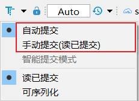
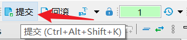
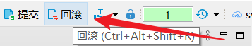
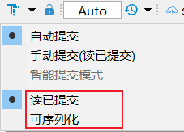
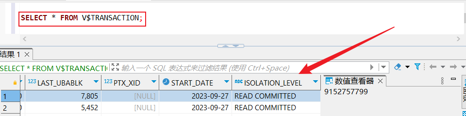

本文档介绍如何在DBeaver中管理事务模式。

## 事务模式
YashanDB提供两种事务模式供用户选择，分别是自动提交模式和手动提交模式。



在手动提交模式，需要执行：
```sql
COMMIT;
```
或点击**提交**按钮对事务进行提交。



还可以通过执行**ROLLBACK**语句或点击**回滚**按钮对事物进行回滚。



## 事务隔离级别
YahsanDB提供两种事务隔离级别在DBeaver中使用，分别是读已提交和可序列化。



可以在编辑器中通过语句：
```sql
SELECT * FROM V$TRANSACTION;
```
查询事务隔离级别。

