本文档介绍如何在DBeaver中管理数据库。

## 新建数据库连接

以下步骤以Windows版本为例。

打开程序后，点击导航栏“**数据库 -> 新建数据库连接**”。

选择第一个图标 YashanDB数据库，点击 **Next**，填写数据库连接信息。

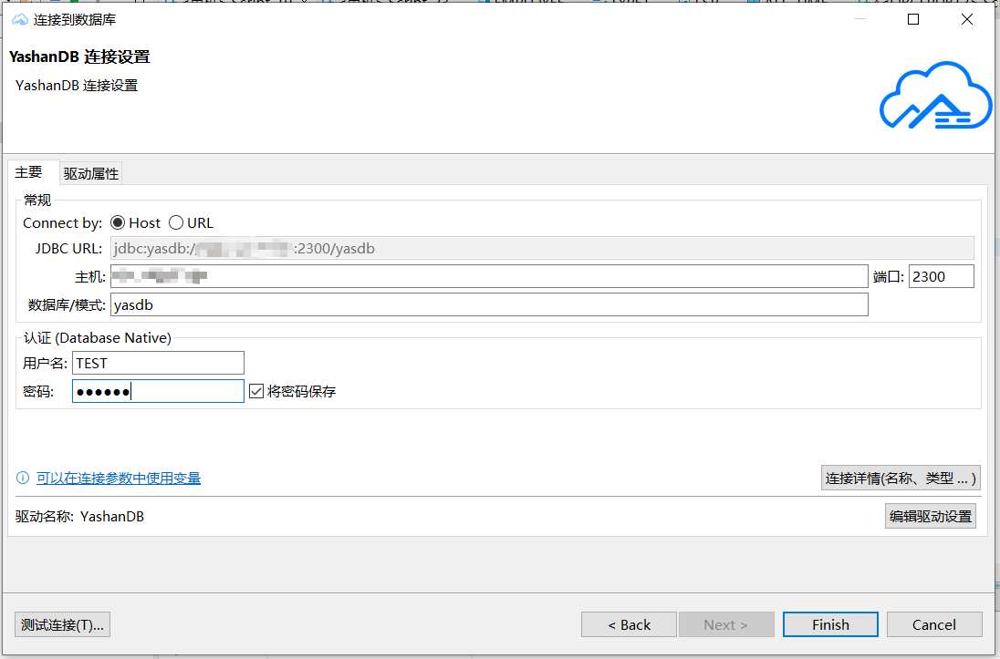

确认连接信息无误后，点击 **测试连接**，检验是否可以正常连接到数据库。

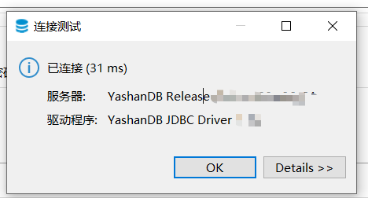

点击 OK 回到连接界面，点击右下角 **Finish**，即可完成数据源创建。创建好的数据源可以在左侧**数据库导航** 进行查看。

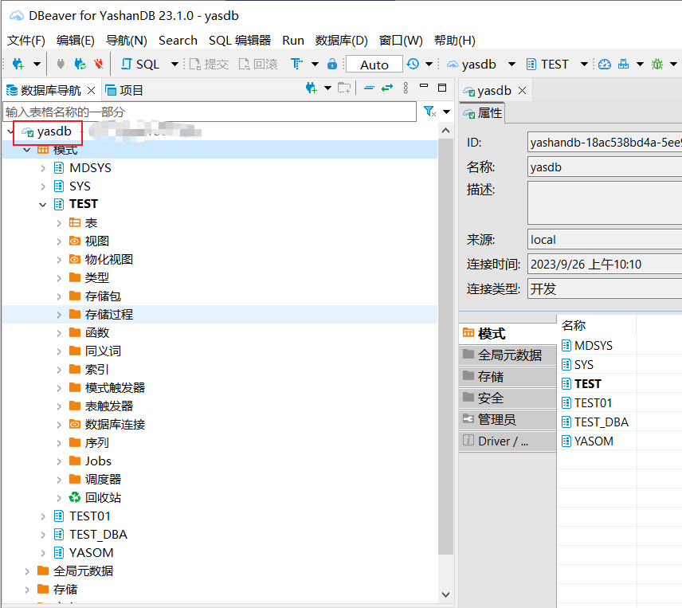

## 编辑数据库连接

右键点击数据库连接，选择 **编辑连接** 即可进行编辑。

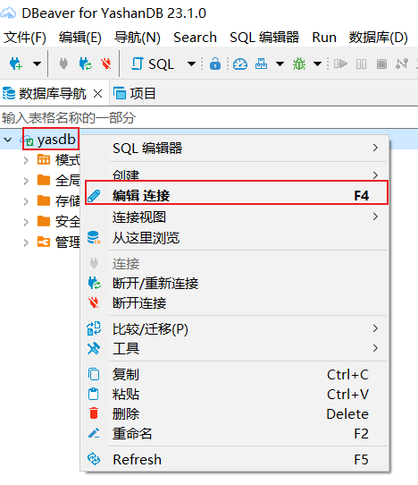

弹出窗口 **连接设置**，在这里可以编辑连接信息。

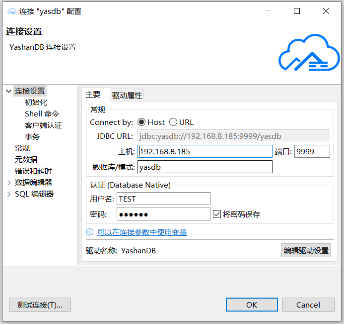

点击左侧 **初始化**，可以调整连接设置如**自动提交**、**默认模式**、**几秒后关闭空闲连接**。

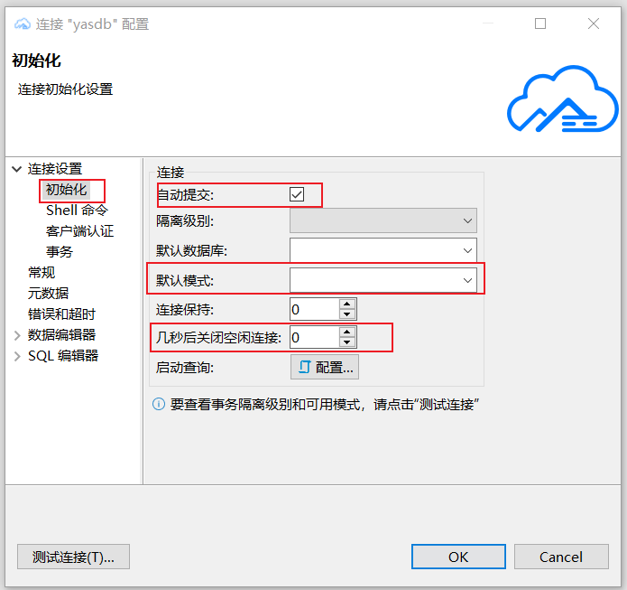

这里以 **几秒后关闭空闲连接**为例，这个参数可以让空闲的数据库连接在指定时间后自动关闭。默认为0，即不关闭空闲连接。
我们将其设置为 10，单位为秒。点击 **OK**。

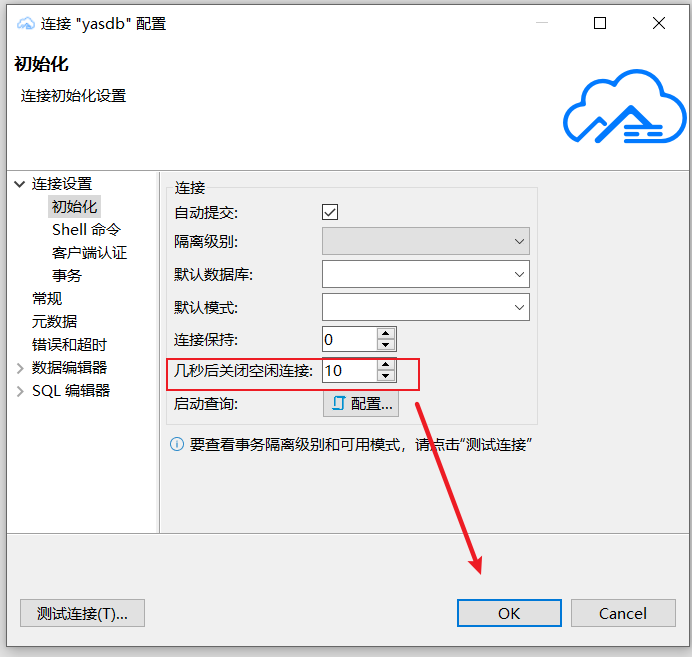

弹窗提示是否重新连接，选择 **YES**。

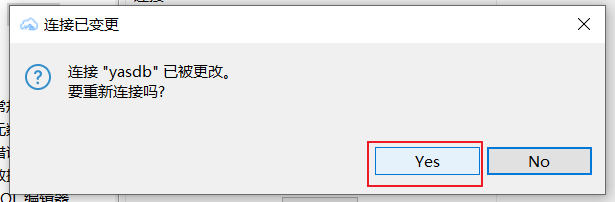

数据库连接处于正常连接状态时，图标右下角会有绿色的勾。

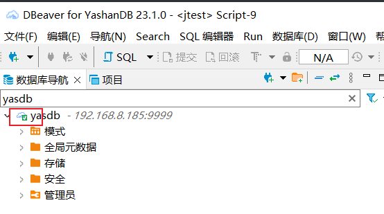

10秒后，此空闲数据库断开连接，如图所示：

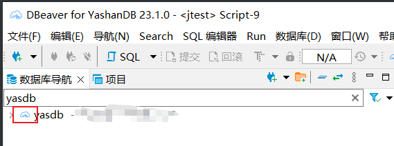

## 删除数据库连接

选择要删除的数据库连接，右键选择 **删除**。

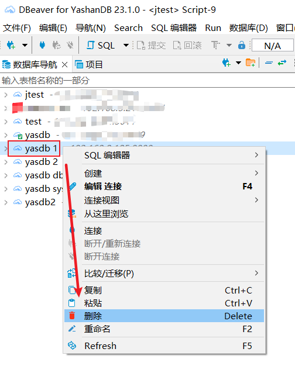

弹窗确认删除连接，选择 **YES**。

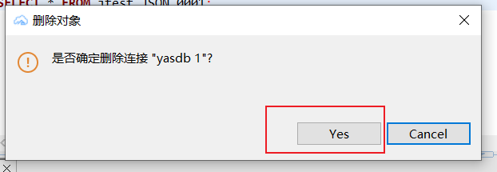