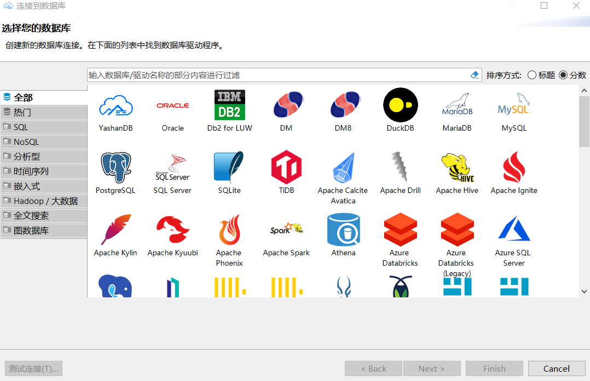

*查看，新建，编辑数据库*

## 新建数据库连接

以下步骤以Windows版本为例。

打开程序后，点击导航栏“数据库 -> 新建数据库连接”。

选择第一个图标 YashanDB数据库，点击 Next，填写数据库连接信息。

确认连接信息无误后，点击 测试连接，检验是否可以正常连接到数据库。

点击 OK 回到连接界面，点击右下角 Finish，即可完成数据源创建。创建好的数据源可以在左侧 数据库导航 进行查看。

*无图片*

右键点击数据源，选择 编辑连接 即可进行编辑。

*无图片*