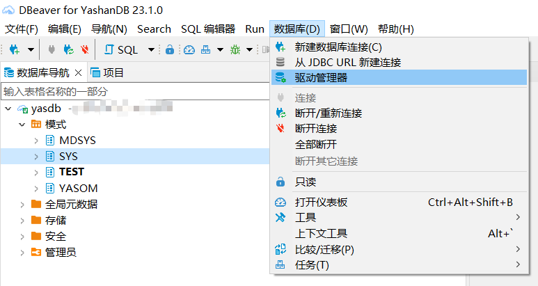
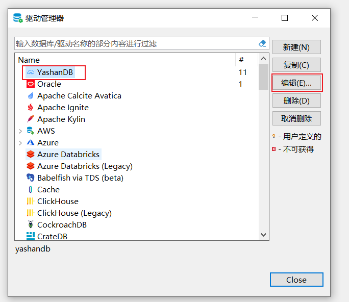
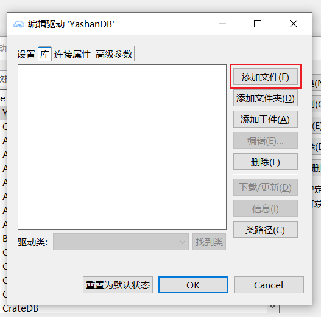
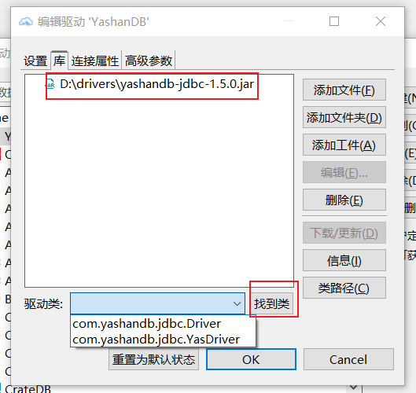
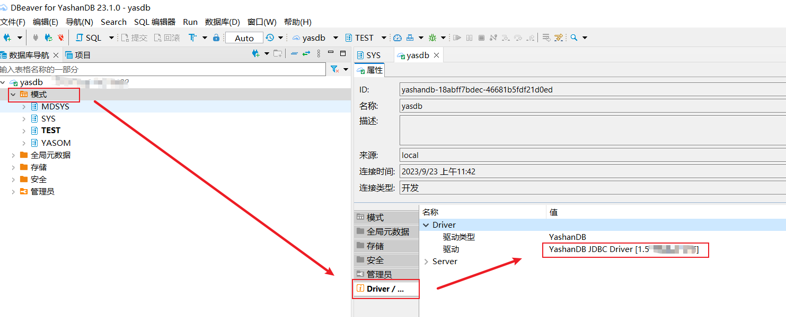

*修改，自定义驱动*

修改驱动前，请准备好新的驱动，放在本地文件夹内。这里操作以Windows系统为例。

## 删除旧驱动

点击导航栏 数据库，选择 驱动管理器。

弹出驱动管理器窗口，选择YashanDB，点击右侧 编辑 按钮。

点击 库， 选择旧驱动，点击右侧 删除按钮

## 添加新驱动
在 编辑驱动 的窗口，点击右侧 添加文件。

添加准备好的新驱动后，点击下方的 找到类，可以看到有Driver类显示，验证驱动可用，点击 OK完成添加。

双击左侧 数据库导航中的 模式，点击Driver，可以看到驱动已成功替换。

